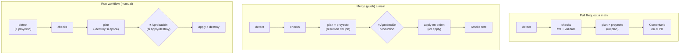
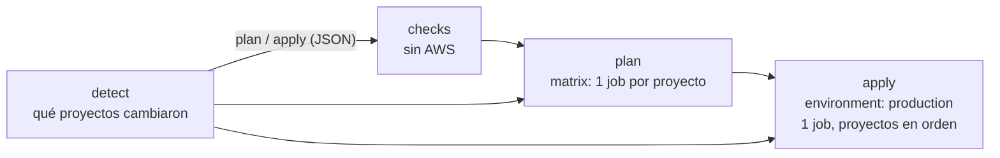

# 🤖 Pipeline CI/CD de Terraform (GitHub Actions)

Este directorio contiene el **pipeline que valida y despliega la plataforma de contenedores en AWS** ([`Serverless/ECS-Fargate/Terraform`](../Serverless/ECS-Fargate/Terraform/README.md)) desde GitHub.

Con el pipeline, **nadie ejecuta `terraform apply` desde su PC**. Los cambios entran por un **Pull Request**, el pipeline muestra qué va a cambiar en AWS (`plan`), una persona lo revisa y lo aprueba, y el pipeline lo aplica **en el orden correcto**.

Este documento sirve para **usarlo** (puesta en marcha, flujo diario, workflow manual) y para **mantenerlo** (cómo funciona cada job, el script de detección, los permisos y cómo probar cambios).

| 🧭 Ficha rápida | |
|---|---|
| **Qué despliega** | Los proyectos Terraform de la plataforma: VPC, ALB, cluster ECS, ECR y servicios (el Bastion, solo con el workflow manual) |
| **Cuándo se ejecuta** | En cada Pull Request a `main`, en cada merge a `main` y a mano (*Run workflow*) |
| **Credenciales de AWS** | **OIDC**, sin claves guardadas: rol de **plan** (solo lectura) y rol de **apply** (solo con aprobación). Los crea [`GitHub-OIDC-module`](../Serverless/ECS-Fargate/Terraform/GitHub-OIDC-module/README.md) |
| **Aprobación** | Environment de GitHub **`production`**, con revisores obligatorios |
| **Archivos** | [`workflows/terraform.yml`](workflows/terraform.yml) y [`scripts/terraform-changed-projects.sh`](scripts/terraform-changed-projects.sh) |
| **Nunca aplica** | El bucket del state (`S3-tfstate-backend-module`) ni sus propios permisos (`GitHub-OIDC-module`) |

> 🗺️ Vista general de la plataforma: [README de Terraform](../Serverless/ECS-Fargate/Terraform/README.md).

---

## Índice

1. 💡 [¿Qué es y para qué sirve?](#qué-es-y-para-qué-sirve)
2. 📚 [Conceptos básicos](#conceptos-básicos)
3. 🗺️ [Diagrama](#diagrama)
4. 📁 [Archivos del pipeline](#archivos-del-pipeline)
5. 🎯 [Disparadores](#disparadores)
6. 🔍 [Los jobs en detalle](#los-jobs-en-detalle)
7. 📖 [El workflow comentado, paso a paso](#el-workflow-comentado-paso-a-paso)
8. 🧮 [Detección de proyectos](#detección-de-proyectos)
9. 🔒 [Seguridad y permisos](#seguridad-y-permisos)
10. ⚙️ [Configuración](#configuración)
11. 🚀 [Puesta en marcha (una sola vez)](#puesta-en-marcha-una-sola-vez)
12. 📲 [Flujo diario](#flujo-diario)
13. 🖐️ [Workflow manual](#workflow-manual)
14. 🛠️ [Mantenimiento](#mantenimiento)
15. 🧪 [Cómo probar cambios del pipeline](#cómo-probar-cambios-del-pipeline)
16. ⚠️ [Limitaciones conocidas](#limitaciones-conocidas)
17. 🧰 [Problemas frecuentes](#problemas-frecuentes)

---

## ¿Qué es y para qué sirve?

El pipeline aplica el modelo **GitOps**: **git es la única fuente de verdad**. Lo que está en la rama `main` es lo que debe existir en AWS.

| Paso | Qué ocurre | Por qué |
|---|---|---|
| 1. **Rama + Pull Request** | Haces el cambio en una rama y abres un PR a `main` | `main` siempre refleja lo desplegado |
| 2. **Validación y `plan`** | El pipeline comprueba el formato, valida el código y comenta en el PR el `plan` de cada proyecto cambiado | Ver qué va a pasar en AWS **antes** de tocar nada |
| 3. **Revisión y merge** | Alguien revisa el código y el plan (por ejemplo, "`17 to add, 0 to destroy`") | Cuatro ojos: nadie despliega solo |
| 4. **Aprobación** | Tras el merge, el pipeline **espera** a que una persona autorizada pulse *Approve* | Último control humano antes de cambiar AWS |
| 5. **Apply en orden** | Aplica los proyectos cambiados: VPC → ALB → cluster → ECR → servicios | Respeta las dependencias entre proyectos |
| 6. **Smoke test** | Comprueba con `curl` que cada servicio aplicado responde | Confirmar que el despliegue funciona de verdad |

> 💡 **Analogía:** es como una obra con permisos.
> - El PR es la **solicitud con los planos**.
> - El `plan` es el **informe del revisor técnico**: qué se construye y qué se derriba.
> - La aprobación es la **firma del responsable**.
> - El pipeline es la **constructora**: solo trabaja con la firma, y en el orden correcto (primero los cimientos, luego las paredes).

---

## Conceptos básicos

| Término | Qué significa en palabras simples |
|---|---|
| **Workflow** | Un archivo YAML en `.github/workflows/` que describe una automatización. Aquí: `terraform.yml`. |
| **Job** | Un bloque de trabajo del workflow que corre en su propia máquina. Aquí: `detect`, `checks`, `plan` y `apply`. |
| **Step** | Un paso dentro de un job: un comando o una *action* reutilizable. |
| **Runner** | La máquina temporal (Ubuntu) que GitHub crea para cada job y destruye al terminar. |
| **Action** | Un paso reutilizable publicado por terceros, por ejemplo `hashicorp/setup-terraform` (instala Terraform). |
| **`needs` / `outputs`** | `needs` hace que un job espere a otro; `outputs` le pasa datos, por ejemplo la lista de proyectos cambiados. |
| **Matrix** | Repite un job una vez por cada elemento de una lista: un `plan` por proyecto, en paralelo. |
| **Environment** | Una etapa de GitHub (`production`) que puede exigir **revisores**: el job que la usa espera la aprobación. |
| **OIDC** | GitHub firma un token por cada job. AWS lo cambia por credenciales temporales de un rol, sin claves guardadas. El campo **`sub`** del token dice de dónde viene: PR, rama o environment. |
| **`plan` / `apply`** | `plan` muestra qué cambiaría en AWS sin tocar nada; `apply` lo ejecuta. |
| **`concurrency`** | Regla que impide que dos ejecuciones del mismo grupo corran a la vez. |
| **Variables del repositorio** | Valores de configuración (no secretos) que usa el workflow: `vars.AWS_REGION`, etc. |

---

## Diagrama

**Los tres caminos del workflow:**



**Cómo se conectan los jobs:**



---

## Archivos del pipeline

```text
Sr-Labs/
├── .github/
│   ├── README.md                               # este documento
│   ├── workflows/
│   │   └── terraform.yml                       # el workflow: detect → checks → plan → apply
│   └── scripts/
│       └── terraform-changed-projects.sh       # qué proyectos cambiaron y en qué orden
└── Serverless/ECS-Fargate/Terraform/
    ├── S3-tfstate-backend-module/              # bucket del state (a mano, antes que todo)
    ├── GitHub-OIDC-module/                     # proveedor OIDC + roles plan/apply (a mano)
    └── <módulos>/manifests/                    # lo que el pipeline valida, planifica y aplica
```

| Archivo | Qué hace |
|---|---|
| [`workflows/terraform.yml`](workflows/terraform.yml) | Define cuándo se ejecuta, los 4 jobs, sus permisos y el orden de despliegue |
| [`scripts/terraform-changed-projects.sh`](scripts/terraform-changed-projects.sh) | Recibe los archivos cambiados (`git diff`) y devuelve los proyectos a planificar y aplicar, ordenados. Ver [Detección de proyectos](#detección-de-proyectos) |
| [`GitHub-OIDC-module`](../Serverless/ECS-Fargate/Terraform/GitHub-OIDC-module/README.md) | Crea los roles IAM que asume el pipeline. **No** lo aplica el pipeline |

---

## Disparadores

```yaml
on:
  pull_request:  { branches: [main], paths: [...] }
  push:          { branches: [main], paths: [...] }
  workflow_dispatch: { inputs: { project, service_name, action } }
```

**Filtro de rutas (`paths`):** el workflow solo se dispara si el PR o el push cambia algo en:
- `Serverless/ECS-Fargate/Terraform/**`;
- `.github/workflows/terraform.yml`;
- `.github/scripts/terraform-changed-projects.sh`.

Los cambios en otros laboratorios del repositorio no lo activan.

| Evento | `detect` | `checks` | `plan` | `apply` |
|---|---|---|---|---|
| **Pull Request** a `main` | ✅ | ✅ si hay proyectos | ✅ por proyecto + comentario en el PR | — |
| **Push / merge** a `main` | ✅ | ✅ si hay proyectos | ✅ por proyecto (resumen) | ✅ tras la aprobación, si hay proyectos aplicables |
| **Manual** `action = plan` | ✅ (1 proyecto) | ✅ | ✅ | — |
| **Manual** `action = apply` / `destroy` | ✅ (1 proyecto) | ✅ | ✅ (`-destroy` si aplica) | ✅ tras la aprobación |

> ℹ️ Si un PR solo cambia documentación (`README.md`) o scripts que no son de Terraform, el workflow se dispara (la ruta coincide), pero `detect` no encuentra proyectos y los demás jobs se saltan.

---

## Los jobs en detalle

> 📖 Para ver el código de cada job con comentarios línea a línea, ve a [El workflow comentado, paso a paso](#el-workflow-comentado-paso-a-paso).

### `detect` – Detectar proyectos

| | |
|---|---|
| **Corre** | Siempre |
| **Permisos** | `contents: read` (sin AWS) |
| **Outputs** | `plan`, `apply` (listas JSON de `{name, dir}`), `has_plan`, `has_apply` |

1. `actions/checkout` con `fetch-depth: 0` (historia completa, necesaria para el `git diff`).
2. **Proyectos afectados:**
   - **PR:** `git diff --name-only <base del PR> <commit>` → script de detección.
   - **Push:** `git diff` entre el commit anterior de `main` (`github.event.before`) y el nuevo. En el primer push de una rama compara con el árbol vacío.
   - **Manual:** construye la lista con el proyecto elegido (valida `service_name` con `^[a-z0-9-]{1,20}$` y que exista su `manifests/`).
   - Escribe la lista en el resumen del job.
3. **Avisos** (anotaciones `::warning::`):
   - faltan las variables del repositorio, así que se omiten `plan` y `apply`;
   - se borró el directorio de un servicio (sus recursos pueden seguir en AWS);
   - en un merge cambió el Bastion, que no se aplica automáticamente.

### `checks` – fmt + validate

| | |
|---|---|
| **Corre** | Si `has_plan == 'true'` |
| **Permisos** | `contents: read` (sin AWS) |

1. Instala Terraform `1.16.5` (`hashicorp/setup-terraform`, sin *wrapper*).
2. `terraform fmt -check -recursive -diff` en todo `Serverless/ECS-Fargate/Terraform`.
3. Para cada proyecto de la lista `plan`: `terraform init -backend=false` + `terraform validate` (no necesita AWS ni el bucket).

### `plan` – plan por proyecto

| | |
|---|---|
| **Corre** | Si `has_plan == 'true'` **y** existe la variable `AWS_PLAN_ROLE_ARN` |
| **Necesita** | `detect` y `checks` |
| **Matrix** | Un job por proyecto de la lista `plan`, en paralelo (`fail-fast: false`: si uno falla, los demás siguen) |
| **Permisos** | `contents: read`, `id-token: write` (OIDC), `pull-requests: write` (comentar) |
| **Rol de AWS** | `AWS_PLAN_ROLE_ARN` (solo lectura) |

1. Credenciales temporales con `aws-actions/configure-aws-credentials` (sesión `gha-plan-<run_id>`).
2. `terraform init` (backend S3) y `terraform plan -lock-timeout=5m -detailed-exitcode -out=tfplan`. En el workflow manual con `destroy` añade `-destroy`.
   - Código **0**: sin cambios. Código **2**: hay cambios. Código **1**: error; el job falla.
3. Resumen del job: la línea `Plan: …` y el plan completo plegado (hasta 60 000 caracteres).
4. **Solo en PR:** comenta el plan en el PR con `actions/github-script`.
   - Cada proyecto tiene un comentario identificado con el marcador oculto `<!-- tf-plan:<proyecto> -->`. En cada push nuevo se **actualiza** ese comentario en lugar de crear otro.
   - Icono: ✅ sin cambios, 📝 con cambios, ❌ error.

### `apply` – apply con aprobación

| | |
|---|---|
| **Corre** | Si `has_apply == 'true'`, existe `AWS_APPLY_ROLE_ARN` y: es un **push a `main`**, o es el **workflow manual** con `action` `apply` o `destroy` |
| **Necesita** | `detect` y `plan` (todos los `plan` de la matrix deben terminar bien) |
| **Environment** | `production`: el job **espera la aprobación** de un revisor antes de empezar |
| **Permisos** | `contents: read`, `id-token: write` |
| **Rol de AWS** | `AWS_APPLY_ROLE_ARN` (solo se puede asumir desde este environment) |

1. Recorre la lista `apply` **en orden**, en un solo job. Para cada proyecto:
   1. `terraform init`;
   2. `terraform plan -detailed-exitcode -out=tfplan` (con `-destroy` si corresponde);
   3. si hay cambios (código 2), `terraform apply tfplan`;
   4. si el `plan` falla (código 1), **se detiene** y no aplica los siguientes.
   
   Cada proyecto se **vuelve a planificar justo antes de aplicarlo**, para que vea los outputs que el proyecto anterior acaba de aplicar.
2. El resumen del job lista cada proyecto como "aplicado" o "sin cambios".
3. **Smoke test:** para cada servicio aplicado (no en `destroy`) lee `terraform output -raw url` y hace `curl` cada 10 s, hasta 30 intentos (5 min), esperando **HTTP 200**. Si no llega, el job falla.

### `concurrency`

```yaml
group: terraform-${{ pull_request ? 'pr-<número>' : 'deploy' }}
cancel-in-progress: ${{ es un pull_request }}
```

- **PR:** un push nuevo **cancela** la ejecución anterior del mismo PR (solo hacen `plan`).
- **Merge y manual:** comparten el grupo `deploy`. Se ejecutan **de uno en uno** y **nunca se cancela** un `apply` en curso; el siguiente espera.

---

## El workflow comentado, paso a paso

Esta sección recorre [`workflows/terraform.yml`](workflows/terraform.yml) **de arriba abajo**, en bloques, con comentarios en español que explican qué hace cada línea y por qué (`#` en YAML y bash, `//` en JavaScript). El propio archivo lleva estos mismos comentarios y, además, una cabecera con el resumen de todo el pipeline: puedes leerlo directamente en el editor.

> ℹ️ El archivo real manda. Si cambias el workflow, actualiza también esta sección.

### 1. Nombre y disparadores

Cuándo se ejecuta el workflow. El filtro `paths` hace que **solo** reaccione a cambios de la plataforma Terraform o del propio pipeline.

```yaml
name: "Terraform"                      # nombre que aparece en la pestaña Actions

on:
  pull_request:                        # 1) al abrir o actualizar un Pull Request...
    branches: [main]                   #    ...que va hacia main
    paths:                             #    ...y solo si toca alguno de estos archivos
      - "Serverless/ECS-Fargate/Terraform/**"
      - ".github/workflows/terraform.yml"
      - ".github/scripts/terraform-changed-projects.sh"
  push:                                # 2) al hacer merge (push) a main, con el mismo filtro
    branches: [main]
    paths:
      - "Serverless/ECS-Fargate/Terraform/**"
      - ".github/workflows/terraform.yml"
      - ".github/scripts/terraform-changed-projects.sh"
  workflow_dispatch:                   # 3) a mano: Actions → Terraform → Run workflow
    inputs:                            #    formulario que se muestra al lanzarlo
      project:                         #    qué proyecto tocar (lista desplegable)
        description: "Proyecto"
        type: choice
        required: true
        options:
          - VPC-module
          - ALB-module
          - ECS-cluster-module
          - EC2-bastion-host-module      # el Bastion solo se puede aplicar por esta vía
          - ECR-module
          - service                      # un servicio: su nombre va en service_name
      service_name:
        description: "Nombre del servicio (solo si proyecto = service), p. ej. nginx-1"
        type: string
        required: false
        default: ""
      action:                          #    qué hacer con ese proyecto
        description: "Acción"
        type: choice
        required: true
        default: plan                    # por defecto solo mira, no cambia nada
        options:
          - plan
          - apply
          - destroy
```

### 2. Permisos, concurrencia y variables comunes

Valores que afectan a **todos** los jobs.

```yaml
permissions:                           # permisos del token de GitHub para TODOS los jobs...
  contents: read                       # ...solo leer el código. Cada job pide más si lo necesita

# Grupo de concurrencia:
#  - en un PR, el grupo es "terraform-pr-<número>" y un push nuevo cancela la ejecución anterior;
#  - en merge y manual, el grupo es "terraform-deploy": van de uno en uno y nunca se cancelan.
concurrency:
  group: terraform-${{ github.event_name == 'pull_request' && format('pr-{0}', github.event.pull_request.number) || 'deploy' }}
  cancel-in-progress: ${{ github.event_name == 'pull_request' }}

env:                                   # variables de entorno disponibles en todos los jobs
  TF_VERSION: "1.16.5"                 # versión de Terraform que se instala
  TF_ROOT: Serverless/ECS-Fargate/Terraform   # carpeta raíz de los proyectos
  TF_IN_AUTOMATION: "true"             # salida de Terraform sin sugerencias interactivas
  TF_INPUT: "false"                    # Terraform nunca pregunta nada: falla en vez de esperar
```

### 3. Job `detect`: qué proyectos cambiaron

Decide **qué proyectos** hay que validar, planificar y aplicar, y se lo pasa a los demás jobs como `outputs`. No usa AWS.

```yaml
jobs:
  detect:
    name: Detectar proyectos
    runs-on: ubuntu-latest             # máquina Ubuntu temporal, creada para este job
    outputs:                           # lo que este job pasa a los siguientes (needs.detect.outputs.*)
      plan: ${{ steps.changes.outputs.plan }}            # proyectos a planificar (JSON)
      apply: ${{ steps.changes.outputs.apply }}          # proyectos que se pueden aplicar (JSON)
      has_plan: ${{ steps.changes.outputs.has_plan }}    # "true" si hay algo que planificar
      has_apply: ${{ steps.changes.outputs.has_apply }}  # "true" si hay algo que aplicar
    steps:
      - uses: actions/checkout@3d3c42e5aac5ba805825da76410c181273ba90b1 # v7.0.1
        with:
          fetch-depth: 0               # descarga TODA la historia: hace falta para el git diff
          persist-credentials: false   # no deja el token de GitHub guardado en .git

      - name: Proyectos afectados
        id: changes                    # id para leer sus outputs: steps.changes.outputs.*
        env:                           # los datos del evento entran por env (evita inyección de comandos)
          EVENT: ${{ github.event_name }}                     # pull_request | push | workflow_dispatch
          PR_BASE: ${{ github.event.pull_request.base.sha }}  # commit base del PR
          PUSH_BEFORE: ${{ github.event.before }}             # commit de main antes del merge
          PROJECT: ${{ inputs.project }}                      # entradas del workflow manual
          SERVICE: ${{ inputs.service_name }}
        run: |
          if [[ "$EVENT" == "workflow_dispatch" ]]; then
            # Manual: un único proyecto, el elegido en el formulario (aquí sí se permite el Bastion)
            if [[ "$PROJECT" == "service" ]]; then
              # el nombre del servicio solo puede tener minúsculas, números y guiones (1-20)
              [[ "$SERVICE" =~ ^[a-z0-9-]{1,20}$ ]] || { echo "::error::service_name inválido: '$SERVICE'"; exit 1; }
              rel="ECS-services-module/services/$SERVICE"
            else
              rel="$PROJECT"
            fi
            # el proyecto debe existir en el repositorio
            [[ -d "$TF_ROOT/$rel/manifests" ]] || { echo "::error::No existe $TF_ROOT/$rel/manifests"; exit 1; }
            # lista JSON con un solo proyecto: [{"name":"ALB-module","dir":".../ALB-module/manifests"}]
            json="[{\"name\":\"${rel##*/}\",\"dir\":\"$TF_ROOT/$rel/manifests\"}]"
            # outputs del step (GITHUB_OUTPUT) y copia en changes.json para el resumen
            { echo "plan=$json"; echo "apply=$json"; echo "has_plan=true"; echo "has_apply=true"; } >> "$GITHUB_OUTPUT"
            echo "{\"plan\":$json,\"apply\":$json,\"removed\":[]}" | tee changes.json
          else
            # PR: compara con la base del PR. Push: con el commit anterior de main
            base="$PR_BASE"
            [[ "$EVENT" == "push" ]] && base="$PUSH_BEFORE"
            # primer push de una rama (before = 000…): compara con el árbol vacío
            if [[ -z "$base" || "$base" =~ ^0+$ ]]; then base=$(git hash-object -t tree /dev/null); fi
            # archivos cambiados → script de detección → outputs (GITHUB_OUTPUT) y changes.json
            git diff --name-only "$base" "$GITHUB_SHA" | .github/scripts/terraform-changed-projects.sh | tee changes.json
          fi
          # muestra la lista en el resumen del job (pestaña Summary del run)
          {
            echo "### Proyectos Terraform afectados"
            echo '```json'; cat changes.json; echo '```'
          } >> "$GITHUB_STEP_SUMMARY"

      - name: Avisos                   # anotaciones amarillas en el run; no hacen fallar el job
        env:
          EVENT: ${{ github.event_name }}
          HAS_REMOVED: ${{ steps.changes.outputs.has_removed }}   # ¿se borró algún servicio?
          REMOVED: ${{ steps.changes.outputs.removed }}
          BASTION: ${{ steps.changes.outputs.bastion_changed }}   # ¿cambió el Bastion?
          PLAN_ROLE: ${{ vars.AWS_PLAN_ROLE_ARN }}                # variable del repositorio
        run: |
          # sin variables del repositorio no hay credenciales de AWS: plan y apply se saltarán
          if [[ -z "$PLAN_ROLE" ]]; then
            msg="Faltan las variables del repositorio AWS_PLAN_ROLE_ARN / AWS_APPLY_ROLE_ARN / AWS_REGION: se omiten plan y apply. Ver la puesta en marcha del pipeline en el README."
            echo "::warning::$msg"; echo "> ⚠️ $msg" >> "$GITHUB_STEP_SUMMARY"
          fi
          # un directorio de servicio borrado no destruye sus recursos en AWS
          if [[ "$HAS_REMOVED" == "true" ]]; then
            echo "::warning::Se borraron directorios de servicios ($REMOVED). Sus recursos pueden seguir en AWS: restaura el directorio y ejecuta 'destroy' con el workflow manual antes de borrarlo."
          fi
          # tras un merge, el Bastion no se aplica solo: se avisa
          if [[ "$BASTION" == "true" && "$EVENT" == "push" ]]; then
            echo "::warning::Cambió EC2-bastion-host-module: no se aplica automáticamente. Aplícalo desde tu PC o con el workflow manual."
          fi
```

### 4. Job `checks`: formato y validación (sin AWS)

Comprueba que el código está bien formateado y es válido. No necesita credenciales ni el bucket del state.

```yaml
  checks:
    name: fmt + validate
    needs: detect                      # espera a detect para conocer la lista de proyectos
    if: needs.detect.outputs.has_plan == 'true'   # solo si cambió algún proyecto
    runs-on: ubuntu-latest
    steps:
      - uses: actions/checkout@3d3c42e5aac5ba805825da76410c181273ba90b1 # v7.0.1
        with:
          persist-credentials: false
      - uses: hashicorp/setup-terraform@dfe3c3f87815947d99a8997f908cb6525fc44e9e # v4.0.1
        with:
          terraform_version: ${{ env.TF_VERSION }}   # instala exactamente la 1.16.5
          terraform_wrapper: false     # sin wrapper: los códigos de salida de terraform llegan tal cual
      - name: terraform fmt
        # falla si algún .tf no está formateado; -diff muestra qué habría que cambiar
        run: terraform fmt -check -recursive -diff "$TF_ROOT"
      - name: terraform validate (sin backend)
        env:
          PROJECTS: ${{ needs.detect.outputs.plan }}   # JSON con los proyectos cambiados
        run: |
          # jq extrae el "dir" de cada proyecto de la lista
          for dir in $(jq -r '.[].dir' <<<"$PROJECTS"); do
            echo "::group::validate $dir"               # agrupa el log (plegable en GitHub)
            # -backend=false: descarga providers y módulos sin conectar con el bucket S3
            terraform -chdir="$dir" init -backend=false -input=false
            terraform -chdir="$dir" validate
            echo "::endgroup::"
          done
```

### 5. Job `plan`: un plan por proyecto (rol de solo lectura)

Para cada proyecto cambiado calcula el `plan` con credenciales **de solo lectura**. En un PR lo publica como comentario.

```yaml
  plan:
    name: plan · ${{ matrix.project.name }}   # un job por proyecto: "plan · ALB-module", ...
    needs: [detect, checks]            # solo si fmt + validate pasaron
    # solo si hay proyectos y está configurada la variable del rol de plan
    if: needs.detect.outputs.has_plan == 'true' && vars.AWS_PLAN_ROLE_ARN != ''
    runs-on: ubuntu-latest
    permissions:
      contents: read
      id-token: write       # pedir el token OIDC → credenciales del rol de plan (solo lectura)
      pull-requests: write  # publicar el plan como comentario en el PR
    strategy:
      fail-fast: false                 # si un plan falla, los de los demás proyectos siguen
      matrix:
        project: ${{ fromJSON(needs.detect.outputs.plan) }}   # repite el job por cada proyecto
    steps:
      - uses: actions/checkout@3d3c42e5aac5ba805825da76410c181273ba90b1 # v7.0.1
        with:
          persist-credentials: false
      - uses: hashicorp/setup-terraform@dfe3c3f87815947d99a8997f908cb6525fc44e9e # v4.0.1
        with:
          terraform_version: ${{ env.TF_VERSION }}
          terraform_wrapper: false
      - name: Credenciales temporales de AWS (rol de plan)
        # cambia el token OIDC de este job por credenciales de 1 hora del rol de plan
        uses: aws-actions/configure-aws-credentials@e1253824e5c10ff9df46874f81ed3ec929e19cfd # v6.3.0
        with:
          role-to-assume: ${{ vars.AWS_PLAN_ROLE_ARN }}
          aws-region: ${{ vars.AWS_REGION }}
          role-session-name: gha-plan-${{ github.run_id }}   # nombre visible en CloudTrail

      - name: terraform init + plan
        id: plan
        env:
          DIR: ${{ matrix.project.dir }}     # manifests/ del proyecto de esta repetición
          NAME: ${{ matrix.project.name }}
          # "true" solo en el workflow manual con action = destroy
          DESTROY: ${{ github.event_name == 'workflow_dispatch' && inputs.action == 'destroy' }}
        run: |
          # init con el backend S3: lee el state del proyecto desde el bucket
          terraform -chdir="$DIR" init -input=false
          extra=(); [[ "$DESTROY" == "true" ]] && extra=(-destroy)
          set +e                       # no cortar el script si plan devuelve 2 (= hay cambios)
          # -detailed-exitcode: 0 sin cambios, 1 error, 2 con cambios. -lock-timeout espera el bloqueo
          terraform -chdir="$DIR" plan "${extra[@]}" -lock-timeout=5m -no-color -detailed-exitcode -out=tfplan > plan.log 2>&1
          code=$?
          set -e
          cat plan.log                 # el plan completo, visible en el log del job
          if [[ $code -eq 0 || $code -eq 2 ]]; then
            # versión legible del plan guardado, para el resumen y el comentario del PR
            terraform -chdir="$DIR" show -no-color tfplan > plan.txt
          else
            cp plan.log plan.txt       # si falló, se publica el error
          fi
          # línea de resumen: "Plan: 1 to add, ..." o "No changes."
          summary=$(grep -E '^(Plan:|No changes\.)' plan.log | tail -n 1)
          [[ -z "$summary" ]] && summary="ERROR: el plan falló (ver el log del job)"
          # outputs del step: los usa el step que comenta el PR
          { echo "exitcode=$code"; echo "summary=$summary"; } >> "$GITHUB_OUTPUT"
          # resumen del job con el plan plegado (máximo 60 000 caracteres)
          {
            echo "### plan · $NAME"
            echo "**$summary**"
            echo '<details><summary>Ver plan</summary>'; echo; echo '```'; head -c 60000 plan.txt; echo '```'; echo '</details>'
          } >> "$GITHUB_STEP_SUMMARY"
          [[ $code -ne 1 ]]            # el job falla solo si el plan dio error (código 1)
```

**El comentario del plan en el PR.** Se ejecuta incluso si el plan falló (`always()`), para que el error también aparezca en el PR. Busca un comentario anterior del mismo proyecto por su marcador oculto y lo **actualiza**; si no existe, crea uno nuevo.

```yaml
      - name: Comentar el plan en el Pull Request
        # siempre (incluso si el plan falló), solo en PRs y solo si el plan llegó a ejecutarse
        if: always() && github.event_name == 'pull_request' && steps.plan.outputs.exitcode != ''
        uses: actions/github-script@3a2844b7e9c422d3c10d287c895573f7108da1b3 # v9.0.0
        env:
          PROJECT: ${{ matrix.project.name }}
          SUMMARY: ${{ steps.plan.outputs.summary }}
          EXITCODE: ${{ steps.plan.outputs.exitcode }}
        with:
          script: |
            const fs = require('fs');
            // marcador oculto que identifica el comentario de ESTE proyecto
            const marker = `<!-- tf-plan:${process.env.PROJECT} -->`;
            let plan = fs.readFileSync('plan.txt', 'utf8');
            // GitHub limita el tamaño de los comentarios: se recorta el plan si es muy largo
            if (plan.length > 60000) plan = plan.slice(0, 60000) + '\n... (plan truncado, ver el job)';
            // ❌ error, 📝 con cambios, ✅ sin cambios
            const icon = process.env.EXITCODE === '1' ? '❌' : (process.env.EXITCODE === '2' ? '📝' : '✅');
            // texto del comentario: título, resumen, plan plegado y enlace al run
            const body = [
              marker,
              `### ${icon} Terraform plan · \`${process.env.PROJECT}\``,
              `**${process.env.SUMMARY}**`,
              '',
              '<details><summary>Ver el plan completo</summary>',
              '',
              '```hcl', plan, '```',
              '</details>',
              '',
              `_Run [#${context.runNumber}](${context.serverUrl}/${context.repo.owner}/${context.repo.repo}/actions/runs/${context.runId}) · commit ${context.sha.slice(0, 7)}_`,
            ].join('\n');
            // busca entre los comentarios del PR uno anterior con el mismo marcador
            const { data: comments } = await github.rest.issues.listComments({
              ...context.repo, issue_number: context.issue.number, per_page: 100,
            });
            const previous = comments.find(c => c.body && c.body.includes(marker));
            if (previous) {
              // ya existía: se actualiza (un solo comentario por proyecto)
              await github.rest.issues.updateComment({ ...context.repo, comment_id: previous.id, body });
            } else {
              // primera vez: se crea
              await github.rest.issues.createComment({ ...context.repo, issue_number: context.issue.number, body });
            }
```

### 6. Job `apply`: aplicar en orden, con aprobación

Solo en un **merge a `main`** o en el **workflow manual** con `apply` o `destroy`. Antes de empezar, **espera la aprobación** del environment `production`; solo con ella obtiene el rol de apply.

```yaml
  apply:
    # nombre del job: "apply (con aprobación)", o "destroy (con aprobación)" en el manual
    name: ${{ github.event_name == 'workflow_dispatch' && inputs.action || 'apply' }} (con aprobación)
    needs: [detect, plan]              # todos los plan de la matrix deben haber terminado bien
    # hay algo aplicable + variable del rol de apply + (merge a main, o manual que no sea "plan")
    if: >-
      needs.detect.outputs.has_apply == 'true' && vars.AWS_APPLY_ROLE_ARN != '' &&
      ((github.event_name == 'push' && github.ref == 'refs/heads/main') ||
       (github.event_name == 'workflow_dispatch' && inputs.action != 'plan'))
    runs-on: ubuntu-latest
    environment: production # tiene revisores obligatorios: el job ESPERA la aprobación antes de empezar
    permissions:
      contents: read
      id-token: write # token OIDC → rol de apply (que solo confía en este environment)
    steps:
      - uses: actions/checkout@3d3c42e5aac5ba805825da76410c181273ba90b1 # v7.0.1
        with:
          persist-credentials: false
      - uses: hashicorp/setup-terraform@dfe3c3f87815947d99a8997f908cb6525fc44e9e # v4.0.1
        with:
          terraform_version: ${{ env.TF_VERSION }}
          terraform_wrapper: false
      - name: Credenciales temporales de AWS (rol de apply)
        # el rol de apply solo acepta tokens con sub "environment:production" (este job, aprobado)
        uses: aws-actions/configure-aws-credentials@e1253824e5c10ff9df46874f81ed3ec929e19cfd # v6.3.0
        with:
          role-to-assume: ${{ vars.AWS_APPLY_ROLE_ARN }}
          aws-region: ${{ vars.AWS_REGION }}
          role-session-name: gha-apply-${{ github.run_id }}

      - name: terraform apply en orden
        env:
          PROJECTS: ${{ needs.detect.outputs.apply }}   # ya viene ordenada: VPC → ALB → … → servicios
          DESTROY: ${{ github.event_name == 'workflow_dispatch' && inputs.action == 'destroy' }}
        run: |
          extra=(); [[ "$DESTROY" == "true" ]] && extra=(-destroy)
          : > applied-services.txt     # aquí se anotan los servicios aplicados (para el smoke test)
          # jq -c '.[]' entrega un proyecto por línea, en el orden de la lista
          jq -c '.[]' <<<"$PROJECTS" | while read -r p; do
            name=$(jq -r '.name' <<<"$p"); dir=$(jq -r '.dir' <<<"$p")
            echo "::group::$name"
            terraform -chdir="$dir" init -input=false
            set +e
            # plan nuevo justo antes de aplicar: así ve los outputs que el proyecto anterior acaba de crear
            terraform -chdir="$dir" plan "${extra[@]}" -lock-timeout=5m -no-color -detailed-exitcode -out=tfplan
            code=$?
            set -e
            # plan con error: se detiene y no se aplica ningún proyecto más
            if [[ $code -eq 1 ]]; then echo "::error::El plan de $name falló: se detiene el despliegue"; exit 1; fi
            if [[ $code -eq 2 ]]; then
              # hay cambios: aplica exactamente ese plan (sin preguntar, porque ya se aprobó el job)
              terraform -chdir="$dir" apply -lock-timeout=5m -no-color tfplan
              echo "- **$name**: aplicado" >> "$GITHUB_STEP_SUMMARY"
              # si es un servicio (y no se está destruyendo), se probará en el smoke test
              if [[ "$dir" == */ECS-services-module/services/* && "$DESTROY" != "true" ]]; then
                echo "$dir" >> applied-services.txt
              fi
            else
              echo "- **$name**: sin cambios" >> "$GITHUB_STEP_SUMMARY"
            fi
            echo "::endgroup::"
          done
```

### 7. Smoke test: ¿responden los servicios?

Último paso del job `apply`. Para cada servicio aplicado pide su URL por el ALB hasta recibir **HTTP 200**.

```yaml
      - name: Smoke test (los servicios responden a través del ALB)
        run: |
          # si no se aplicó ningún servicio, no hay nada que probar
          [[ -s applied-services.txt ]] || { echo "No se aplicó ningún servicio."; exit 0; }
          while read -r dir; do
            url=$(terraform -chdir="$dir" output -raw url)   # http://<dns del ALB>/<ruta>/
            echo "Probando $url"
            # hasta 30 intentos cada 10 s (5 minutos): las tareas tardan en arrancar
            for i in $(seq 1 30); do
              code=$(curl -s -o /dev/null -w '%{http_code}' --max-time 10 "$url" || true)
              [[ "$code" == "200" ]] && { echo "OK $url -> 200"; break; }
              # último intento sin 200: el job falla y el run queda en rojo
              [[ $i -eq 30 ]] && { echo "::error::$url no respondió 200 en 5 minutos (último código: $code)"; exit 1; }
              sleep 10
            done
          done < applied-services.txt
```

---

---

## Detección de proyectos

[`scripts/terraform-changed-projects.sh`](scripts/terraform-changed-projects.sh) decide **qué proyectos** tocar y **en qué orden**.

**Entrada:** lista de archivos cambiados, por stdin o como argumentos.

**Salida:** JSON por stdout. Dentro de GitHub Actions escribe además en `$GITHUB_OUTPUT`: `plan`, `apply`, `removed`, `has_plan`, `has_apply`, `has_removed` y `bastion_changed`.

**Reglas:**

| Regla | Detalle |
|---|---|
| Qué archivos cuentan | Solo `.tf`, `.tfvars` y `.terraform.lock.hcl` dentro de `Serverless/ECS-Fargate/Terraform/<proyecto>/manifests/` |
| Módulo común de servicios | Un cambio en `ECS-services-module/modules/**` marca **todos** los servicios existentes |
| Proyectos ignorados | `S3-tfstate-backend-module` y `GitHub-OIDC-module`: siempre a mano |
| Bastion | `EC2-bastion-host-module` va en `plan` pero **no** en `apply` |
| Servicios borrados | Si cambió un archivo de `services/<x>/manifests/` y ese directorio ya no existe, va a `removed` (aviso) |
| Orden | `VPC-module` → `ALB-module` → `ECS-cluster-module` → `EC2-bastion-host-module` → `ECR-module` → servicios (alfabético) |

**Ejemplo:**

```bash
cd ~/Sr-Labs
printf '%s\n' \
  Serverless/ECS-Fargate/Terraform/ECR-module/manifests/ecr.auto.tfvars \
  Serverless/ECS-Fargate/Terraform/VPC-module/manifests/vpc.auto.tfvars \
  | .github/scripts/terraform-changed-projects.sh
```

```json
{"plan":[{"name":"VPC-module","dir":"Serverless/ECS-Fargate/Terraform/VPC-module/manifests"},
         {"name":"ECR-module","dir":"Serverless/ECS-Fargate/Terraform/ECR-module/manifests"}],
 "apply":[ "...los mismos..." ],
 "removed":[]}
```

**Ver qué tocaría tu rama:** `git diff --name-only main | .github/scripts/terraform-changed-projects.sh`.

Variables opcionales: `TF_ROOT` (por defecto `Serverless/ECS-Fargate/Terraform`) y `REPO_ROOT` (por defecto `.`).

---

## Seguridad y permisos

| Control | Cómo se implementa |
|---|---|
| **Sin claves de AWS en GitHub** | OIDC: cada job pide credenciales **temporales** (1 h) de un rol. No hay secretos que robar ni rotar |
| **Dos roles** | **plan:** `ReadOnlyAccess` + leer el state + crear y borrar el bloqueo `*.tflock`. **apply:** `PowerUserAccess` + IAM acotado a `*-stag-*` + escribir el state. Detalle en [`GitHub-OIDC-module`](../Serverless/ECS-Fargate/Terraform/GitHub-OIDC-module/README.md#cómo-funciona) |
| **Quién puede asumir cada rol** (`sub` del token) | **plan:** `repo:adrianjsosag/Sr-Labs:pull_request` y `…:ref:refs/heads/main`. **apply:** **solo** `…:environment:production` |
| **El apply exige aprobación** | El job `apply` usa `environment: production`, con revisores obligatorios. Sin aprobación, ni siquiera obtiene el token con `environment:production` |
| **El pipeline no cambia sus permisos** | Nunca aplica `GitHub-OIDC-module`, y el rol de apply tiene un `Deny` explícito sobre sus propios roles |
| **Token de GitHub mínimo** | `permissions: contents: read` por defecto. `id-token: write` solo en `plan` y `apply`; `pull-requests: write` solo en `plan` |
| **Actions fijadas por SHA** | `actions/checkout`, `hashicorp/setup-terraform`, `aws-actions/configure-aws-credentials` y `actions/github-script` usan el SHA del commit, con la versión en un comentario. Un tag se puede mover; un SHA no |
| **Sin credenciales en el checkout** | `persist-credentials: false`: el token de GitHub no queda en `.git` del runner |
| **Sin inyección de comandos** | Las entradas del usuario (`project`, `service_name`) y los datos del evento se pasan a los scripts por `env:`, nunca interpolados con `${{ }}` dentro de `run:` |
| **Un despliegue a la vez** | `concurrency` del grupo `deploy` |

---

## Configuración

**Variables del repositorio** (*Settings → Secrets and variables → Actions → Variables*):

| Variable | Valor | La usa |
|---|---|---|
| `AWS_REGION` | `us-east-1` | `plan` y `apply` |
| `AWS_PLAN_ROLE_ARN` | Output `plan_role_arn` de `GitHub-OIDC-module` | `plan`. Si está vacía, `plan` y `apply` se saltan con un aviso |
| `AWS_APPLY_ROLE_ARN` | Output `apply_role_arn` de `GitHub-OIDC-module` | `apply`. Si está vacía, `apply` se salta |

**Environment `production`:** revisores obligatorios y, como rama permitida, solo `main`. Su nombre **debe coincidir** con `github_environment` de `GitHub-OIDC-module`.

**Variables del workflow** (bloque `env:` de `terraform.yml`):

| Variable | Valor | Para qué |
|---|---|---|
| `TF_VERSION` | `1.16.5` | Versión de Terraform que se instala |
| `TF_ROOT` | `Serverless/ECS-Fargate/Terraform` | Raíz de los proyectos (también la usa el script) |
| `TF_IN_AUTOMATION` | `true` | Salida de Terraform más compacta, sin sugerencias interactivas |
| `TF_INPUT` | `false` | Terraform nunca pregunta nada (fallaría en vez de quedarse esperando) |

---

## Puesta en marcha (una sola vez)

1. **Bucket del state:** aplica [`S3-tfstate-backend-module`](../Serverless/ECS-Fargate/Terraform/S3-tfstate-backend-module/README.md), si aún no existe.
2. **Accesos del pipeline:** aplica [`GitHub-OIDC-module`](../Serverless/ECS-Fargate/Terraform/GitHub-OIDC-module/README.md) y anota sus outputs:
   ```bash
   cd ~/Sr-Labs/Serverless/ECS-Fargate/Terraform/GitHub-OIDC-module/manifests
   terraform init && terraform apply           # 8 to add
   terraform output
   ```
3. **Environment con aprobación.** En GitHub: *Settings → Environments → New environment* → `production`.
   - Activa *Required reviewers* (tú o tu equipo).
   - En *Deployment branches and tags*, permite solo `main`.
   > ⚠️ Sin revisores, el apply se ejecuta sin esperar a nadie.
4. **Variables del repositorio:** crea `AWS_REGION`, `AWS_PLAN_ROLE_ARN` y `AWS_APPLY_ROLE_ARN` (ver [Configuración](#configuración)). Mientras no existan, el workflow solo ejecuta `fmt` y `validate`.
5. **Proteger `main`.** *Settings → Rules → Rulesets → New branch ruleset* sobre `main`:
   - *Require a pull request before merging*, con al menos 1 aprobación.
   - *Block force pushes*.
   - *(Opcional)* *Require status checks to pass*: `fmt + validate`.
     > ⚠️ Si lo marcas como obligatorio, los PR que **no** tocan Terraform quedan bloqueados: el workflow no se dispara para ellos y el check nunca aparece. Márcalo solo si todos los PR del repo pasan por Terraform, o restringe el ruleset.

✅ **Comprobación:** abre un PR que cambie, por ejemplo, `desired_count` en `Serverless/ECS-Fargate/Terraform/ECS-services-module/services/nginx-2/manifests/service.auto.tfvars`.
1. El PR debe recibir el comentario del plan (`1 to change`).
2. Tras el merge, el job `apply` pide aprobación, aplica y el smoke test pasa.

---

## Flujo diario

```bash
cd ~/Sr-Labs
git switch main && git pull
git switch -c cambio-nginx-2                  # 1. rama nueva
# 2. edita los .tf / .tfvars
git add . && git commit -m "nginx-2: 3 tareas"
git push -u origin cambio-nginx-2             # 3. sube la rama
```

4. **Abre el Pull Request** a `main` y espera el comentario del plan de cada proyecto.
5. **Revisa el plan:**

   | Icono | Significado | Qué hacer |
   |---|---|---|
   | ✅ | `No changes`: el proyecto ya coincide con AWS | Nada |
   | 📝 | Hay cambios | Abre *Ver el plan completo*: `+` crea, `~` modifica, **`-` destruye**, `-/+` reemplaza |
   | ❌ | El plan falló | Lee el error en el comentario o en el log del job |

   > ⚠️ **Fíjate en `to destroy` y en `must be replaced`.** Si aparecen sin esperarlo, no hagas merge hasta entender por qué.
6. **Haz merge.**
7. **Aprueba:** *Actions → el run del merge → Review deployments → production → Approve and deploy*.
8. Revisa el resumen del job `apply` y el smoke test.

**Publicar una versión nueva de una aplicación:**
1. Sube la imagen **desde tu PC** con `ECR-module/push-image.sh <repo> <tag-nuevo> ...`.
2. PR cambiando `image_tag` en el `service.auto.tfvars` del servicio.

El pipeline no sube imágenes: si el tag no existe, el `plan` del servicio falla con `couldn't find resource`.

**Añadir un servicio nuevo:** sigue la [guía de la plataforma](../Serverless/ECS-Fargate/Terraform/README.md#guía-desplegar-mi-aplicación). No olvides cambiar la `key` de su `backend.tf`. El pipeline lo detecta solo, sin cambiar nada del workflow.

🧹 **Eliminar un servicio:**
1. **Primero** `destroy` con el [workflow manual](#workflow-manual).
2. **Después**, un PR que borre su directorio.

Si borras el directorio primero, el pipeline solo avisa y los recursos se quedan en AWS.

---

## Workflow manual

*Actions → Terraform → Run workflow*, desde la rama `main` (el rol de plan solo confía en `main` y en los PR):

| Entrada | Valores |
|---|---|
| `project` | `VPC-module`, `ALB-module`, `ECS-cluster-module`, `EC2-bastion-host-module`, `ECR-module` o `service` |
| `service_name` | Solo si `project = service`: el nombre del directorio, por ejemplo `nginx-1` |
| `action` | `plan` (solo mirar), `apply` o `destroy` |

Siempre muestra primero el plan (con `-destroy` si la acción es `destroy`). Para `apply` y `destroy` espera la aprobación del environment `production`.

**Cuándo usarlo:**
- **Bastion:** es la única forma de aplicarlo desde GitHub. Ten en cuenta que su `.pem` se escribe en el runner y se pierde (la llave sigue en el state), y que el provisioner SSH necesita que el runner pueda llegar al puerto 22.
- **Destruir** un servicio o un módulo.
- **Volver a aplicar** un proyecto sin cambios de código, por ejemplo para corregir un cambio hecho a mano en la consola (*drift*).

---

## Mantenimiento

### Añadir un proyecto Terraform nuevo a la plataforma
Por ejemplo, un `RDS-module`:
1. **Script:** añádelo al array `ORDER` de `terraform-changed-projects.sh`, en la posición que le corresponda según sus dependencias.
2. **Workflow:** añádelo a las `options` de la entrada `project` de `workflow_dispatch`.
3. **Permisos:** si crea recursos IAM con otro patrón de nombre, o servicios que `PowerUserAccess` no cubre, amplía `GitHub-OIDC-module` (a mano).

Los **servicios nuevos** (`ECS-services-module/services/<x>`) no requieren cambios: el script los detecta por su ruta.

### Actualizar las actions
Las actions están fijadas por SHA. Para obtener el SHA de la última versión de una action:

```bash
r=actions/checkout
tag=$(curl -s https://api.github.com/repos/$r/releases/latest | jq -r .tag_name)
curl -s https://api.github.com/repos/$r/git/ref/tags/$tag | jq -r '.object | "\(.type) \(.sha)"'
# si el tipo es "tag" (anotado), el SHA del commit es:
#   curl -s https://api.github.com/repos/$r/git/tags/<sha> | jq -r .object.sha
```

Sustituye `uses: <action>@<sha> # <versión>` en todos los jobs.

> 💡 **Recomendado:** activa Dependabot para que abra PRs con las versiones nuevas. Crea `.github/dependabot.yml` con `package-ecosystem: github-actions`.

### Cambiar la versión de Terraform
1. Cambia `TF_VERSION` en `terraform.yml`.
2. Si cambia la versión mínima, actualiza también `required_version` en los `versions.tf`.
3. Prueba primero en un PR: los `plan` deben seguir diciendo `No changes` donde no hubo cambios.

### Añadir escáneres de seguridad
Es una [mejora pendiente](../Serverless/ECS-Fargate/Terraform/README.md#oportunidades-de-mejora-devsecops). Se añaden como steps del job `checks`, que no necesita AWS:
- **tflint:** action `terraform-linters/setup-tflint` + `tflint --recursive`.
- **checkov:** action `bridgecrewio/checkov-action` con `directory: Serverless/ECS-Fargate/Terraform`. Empieza con `soft_fail: true`, porque el laboratorio tiene hallazgos conocidos.
- **gitleaks:** busca secretos en los commits del PR.

---

## Cómo probar cambios del pipeline

Antes de subir cambios a `terraform.yml` o al script:

```bash
cd ~/Sr-Labs
actionlint                                             # sintaxis y expresiones del workflow
shellcheck .github/scripts/terraform-changed-projects.sh

# Casos del script con listas de archivos ficticias (no tocan nada)
X=Serverless/ECS-Fargate/Terraform
printf '%s\n' "$X/ECS-services-module/modules/ecs-service/main.tf" | .github/scripts/terraform-changed-projects.sh   # → todos los servicios
printf '%s\n' "$X/EC2-bastion-host-module/manifests/x.tf"          | .github/scripts/terraform-changed-projects.sh   # → plan sí, apply no
printf '%s\n' "$X/README.md"                                       | .github/scripts/terraform-changed-projects.sh   # → nada
```

> ℹ️ `actionlint` y `shellcheck` no vienen con Ubuntu: descárgalos de sus páginas de *Releases* en GitHub o instálalos con `apt`/`snap`.

**Prueba real sin riesgo:**
1. Abre un PR desde una rama: solo hace `plan`, con el rol de solo lectura.
2. Antes de hacer merge, comprueba en el run que `detect` eligió los proyectos esperados y que los `plan` son correctos.
3. Si no quieres que el merge aplique nada, el `apply` sigue esperando tu aprobación: puedes rechazarla.

---

## Limitaciones conocidas

| Limitación | Detalle | Alternativa |
|---|---|---|
| **No sube imágenes Docker** | `push-image.sh` necesita Docker y se ejecuta desde tu PC | Subir la imagen antes del merge. A futuro: un pipeline de *build* por aplicación |
| **El Bastion no se aplica en el merge** | Sus provisioners se conectan por SSH desde quien aplica y el `.pem` se escribe en ese equipo | Aplicarlo desde tu PC o con el workflow manual. Mejor aún: SSM Session Manager en lugar de SSH |
| **Se vuelve a planificar antes del apply** | El `apply` no usa el plan del job `plan` (el que viste), sino uno nuevo calculado justo antes. Así cada proyecto ve los outputs del anterior, pero si alguien cambia AWS entre medias, el apply incluirá esos cambios | Revisar el resumen del job `apply`. A futuro: aplicar el plan guardado cuando solo cambia un proyecto |
| **Un solo entorno** | Todo despliega en `stag`, en una cuenta | Al crear más entornos: un environment de GitHub y un par de roles por entorno |
| **Sin escáneres de seguridad** | Solo `fmt` y `validate` | Ver [Añadir escáneres](#añadir-escáneres-de-seguridad) |

---

## Problemas frecuentes

| Síntoma | Causa probable | Solución |
|---|---|---|
| Aviso "se omiten plan y apply" | Faltan las variables del repositorio `AWS_PLAN_ROLE_ARN`, `AWS_APPLY_ROLE_ARN` o `AWS_REGION` | Ver [Configuración](#configuración) |
| `Not authorized to perform sts:AssumeRoleWithWebIdentity` | El `sub` del token no coincide con la *trust policy*: otro repositorio u owner, workflow lanzado desde otra rama, o environment con otro nombre | Compara `terraform output github_oidc_subjects` (en `GitHub-OIDC-module`) con el repositorio, la rama y el environment reales |
| El job `apply` se queda en *Waiting* | Espera la aprobación del environment `production` | *Review deployments → Approve and deploy* |
| El `apply` no espera aprobación | El environment `production` no tiene revisores | *Settings → Environments → production → Required reviewers* |
| `Error acquiring the state lock` | Otro `plan`/`apply` usa ese state, o uno anterior se interrumpió | Espera (el workflow espera hasta 5 min). Si nadie lo usa: `terraform force-unlock <LOCK_ID>` desde tu PC |
| `AccessDenied` al crear un rol IAM | El nombre del rol no contiene `-stag-` | Usa la convención `<división>-<entorno>-…` o amplía los permisos en `GitHub-OIDC-module` |
| `plan` de un servicio: `couldn't find resource` | El `image_tag` no está subido al ECR | Súbelo con `push-image.sh` y relanza el job (*Re-run failed jobs*) |
| `NoSuchBucket` en `terraform init` | No existe el bucket del state | Aplica `S3-tfstate-backend-module` |
| El smoke test falla por timeout | Las tareas no pasan el health check: imagen, puerto o ruta de salud incorrectos | Eventos del servicio en ECS y logs en CloudWatch (ver [servicios](../Serverless/ECS-Fargate/Terraform/ECS-services-module/README.md#problemas-frecuentes)) |
| Un PR no dispara el workflow | No toca `Serverless/ECS-Fargate/Terraform/**` ni los archivos del pipeline, o no va contra `main` | Es lo esperado |
| `detect` no encuentra el proyecto que cambié | Cambiaste un archivo que no cuenta (README, script) o un proyecto ignorado (bucket, OIDC) | Ver las [reglas de detección](#detección-de-proyectos) |
| En Windows, `git status` muestra el script como modificado (`old mode 100755 / new mode 100644`) | Git para Windows no ve el permiso de ejecución en esa unidad | **No hagas commit** de ese cambio. Para ocultarlo: `git config core.fileMode false` en el repositorio |
