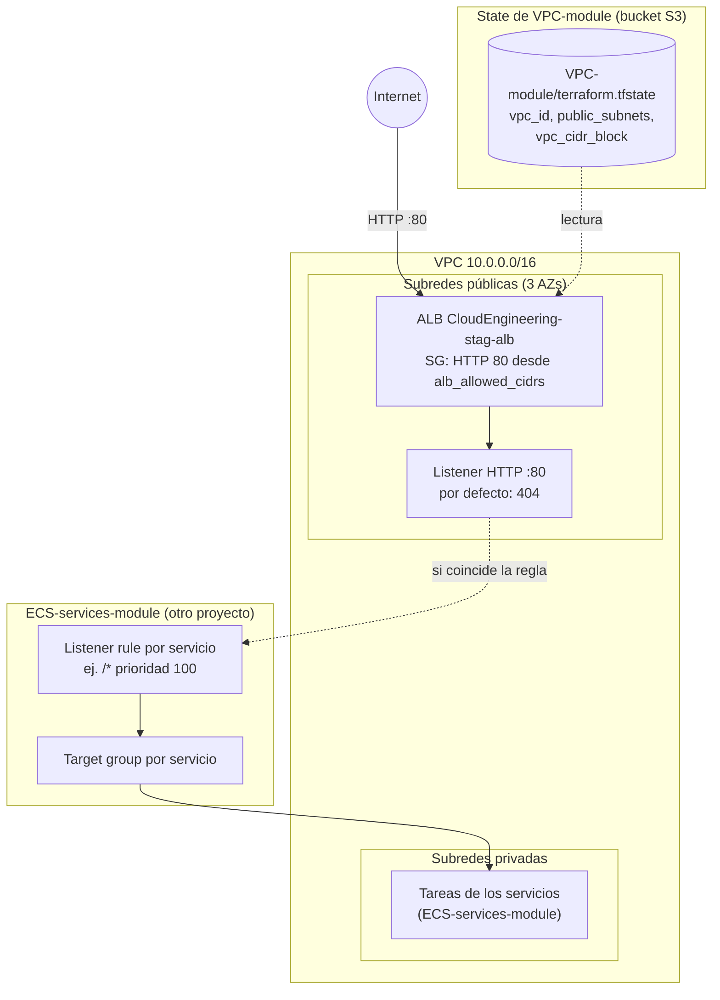

# ⚖️ AWS Application Load Balancer (balanceador) – Terraform

Este proyecto crea el **Application Load Balancer (ALB)** público de la plataforma: la **puerta de entrada web** por la que llegan las peticiones de Internet a tus aplicaciones en ECS.

El ALB se despliega en las **subredes públicas** de la VPC creada por [`VPC-module`](../VPC-module/README.md), cuyos IDs lee automáticamente de su state. **No conoce a ningún servicio:** cada servicio de [`ECS-services-module`](../ECS-services-module/README.md) se "engancha" a él creando su propio target group y su propia regla. Así, añadir una aplicación nueva **no requiere tocar este módulo**.

| 🧭 Ficha rápida | |
|---|---|
| **Paso en el despliegue** | **2** ([guía](../README.md#guía-de-despliegue-paso-a-paso)) |
| **Depende de** | Bucket del state ([`S3-tfstate-backend-module`](../S3-tfstate-backend-module/README.md)) y [`VPC-module`](../VPC-module/README.md) |
| **Lo usan** | [`ECS-services-module`](../ECS-services-module/README.md): cada servicio crea su regla y su target group |
| **Recursos (`plan`)** | 5 |
| **Tiempo de despliegue** | 2–4 min |
| **Costo principal** | El ALB: por hora y por uso (LCU), más sus IPv4 públicas |

> ⚠️ **Antes de desplegar este módulo debe existir el bucket S3 del state** ([`S3-tfstate-backend-module`](../S3-tfstate-backend-module/README.md)): su `backend.tf` guarda el state ahí. Si no existe, `terraform init` falla con `NoSuchBucket`.

> 🗺️ Vista general de toda la plataforma: [README de Terraform](../README.md).

---

## Índice

1. 📦 [¿Qué se crea?](#qué-se-crea)
2. 📚 [Conceptos básicos](#conceptos-básicos)
3. 🗺️ [Diagrama](#diagrama)
4. 🔍 [Cómo funciona](#cómo-funciona)
5. 🔗 [¿De qué depende? (remote state)](#de-qué-depende-remote-state)
6. 📁 [Estructura de archivos](#estructura-de-archivos)
7. 🏷️ [Versiones](#versiones)
8. ⚙️ [Variables](#variables)
9. 📤 [Outputs](#outputs)
10. 🧪 [Cómo probarlo sin crear nada (plan)](#cómo-probarlo-sin-crear-nada-plan)
11. 🚀 [Cómo desplegarlo paso a paso](#cómo-desplegarlo-paso-a-paso)
12. 🔒 [Seguridad](#seguridad)
13. 💰 [Costos](#costos)
14. 🛠️ [Problemas frecuentes](#problemas-frecuentes)

---

## ¿Qué se crea?

Un balanceador público llamado `CloudEngineering-stag-alb`, repartido en las 3 AZs, que escucha en **HTTP puerto 80**. Mientras no haya servicios, responde `404` a todo.

| Recurso | Cantidad | ¿Para qué sirve? |
|---|---|---|
| **Application Load Balancer** | 1 | Recibe las peticiones HTTP de Internet y las reparte entre las tareas de tus servicios |
| **Security Group** del ALB | 1 | Firewall: deja entrar HTTP (80) desde `alb_allowed_cidrs` y solo deja salir hacia la VPC |
| **Reglas del Security Group** | 2 | 1 de entrada por cada CIDR permitido + 1 de salida hacia la VPC |
| **Listener HTTP :80** | 1 | "Escucha" el puerto 80. Si ninguna regla de servicio coincide, responde `404` |

> 💡 **Analogía:** el ALB es la **recepción** de un edificio de oficinas.
> - Los visitantes (peticiones) llegan a recepción.
> - El recepcionista (listener) mira a qué departamento van (la ruta, por ejemplo `/` o `/api`).
> - Los envía al departamento correcto (el target group del servicio).
> - Si nadie atiende esa ruta, responde "no existe" (`404`).

---

## Conceptos básicos

| Término | Qué significa en palabras simples |
|---|---|
| **ALB** (Application Load Balancer) | Un balanceador de carga de AWS para tráfico web (HTTP/HTTPS). Reparte las peticiones entre varias copias de tu aplicación y deja de enviar a las que fallan. |
| **Listener** | El "oído" del ALB en un puerto y protocolo (aquí, HTTP :80). |
| **Acción por defecto** | Lo que hace el listener si ninguna regla coincide. Aquí responde un `404` fijo. |
| **Listener rule** (regla) | "Si la ruta es `/api/*`, envíalo al target group X". Tiene una **prioridad**: el número más bajo se evalúa primero. **Las crea cada servicio.** |
| **Target group** | El grupo de destinos (las IPs de las tareas de un servicio) al que el ALB envía las peticiones. Incluye un **health check**. **Lo crea cada servicio.** |
| **Health check** | El ALB pide periódicamente una ruta (por ejemplo `/`) a cada tarea. Si no responde `200`, deja de enviarle tráfico. |
| **DNS del ALB** | La dirección pública del balanceador, por ejemplo `CloudEngineering-stag-alb-123456789.us-east-1.elb.amazonaws.com`. Es la URL de tus aplicaciones. |

---

## Diagrama



👀 **Cómo leerlo:**
- **Este proyecto** crea el ALB y el listener.
- **El proyecto de servicios** añade sus reglas y target groups encima del listener, sin modificar este proyecto. Para eso usa el output `http_listener_arn`.

---

## Cómo funciona

[`alb.tf`](manifests/alb.tf) usa el módulo oficial `terraform-aws-modules/alb/aws`:

```hcl
module "alb" {
  source  = "terraform-aws-modules/alb/aws"
  version = "10.5.1"

  name    = local.alb_name                                      # CloudEngineering-stag-alb
  vpc_id  = data.terraform_remote_state.vpc.outputs.vpc_id
  subnets = data.terraform_remote_state.vpc.outputs.public_subnets

  security_group_ingress_rules = { for cidr in var.alb_allowed_cidrs : ... => { from_port = 80, ... } }
  security_group_egress_rules  = { vpc = { ip_protocol = "-1", cidr_ipv4 = <vpc_cidr_block> } }

  listeners = {
    http = {
      port = 80, protocol = "HTTP"
      fixed_response = { status_code = "404", message_body = "404: no hay ningun servicio en esta ruta", ... }
    }
  }
}
```

- **Remote state:** los datos de la VPC salen de su state. Ver [¿De qué depende?](#de-qué-depende-remote-state).
- **Una regla de entrada por CIDR:** si en `alb_allowed_cidrs` pones varias IPs, se crea una regla para cada una.
- **Salida solo hacia la VPC:** el ALB solo necesita hablar con las tareas, que están dentro de la VPC.
- **Sin target groups:** a propósito. Cada servicio crea el suyo. Ver [ECS-services-module](../ECS-services-module/README.md).
- **`enable_deletion_protection = false`:** así `terraform destroy` puede borrarlo en el laboratorio. En producción, ponlo en `true`.

---

## ¿De qué depende? (remote state)

Guarda su state en el [bucket S3](../S3-tfstate-backend-module/README.md) (`ALB-module/terraform.tfstate`) y lee el de la VPC con `terraform_remote_state` ([`remote-state-datasource.tf`](manifests/remote-state-datasource.tf)):

| State | Clave en el bucket S3 | Valores que usa |
|---|---|---|
| VPC | `VPC-module/terraform.tfstate` | `vpc_id`, `public_subnets`, `vpc_cidr_block` |

El nombre del bucket se calcula solo (`<división>-<entorno>-tfstate-<cuenta>`); la variable `state_bucket` permite cambiarlo.

Después, **cada servicio** de [`ECS-services-module`](../ECS-services-module/README.md) lee el state del ALB para obtener `http_listener_arn`, `alb_security_group_id` y `alb_dns_name`.

---

## Estructura de archivos

```
ALB-module/
├── README.md
└── manifests/
    ├── versions.tf                  # Terraform + provider AWS
    ├── backend.tf                   # State en el bucket S3 (clave ALB-module/terraform.tfstate)
    ├── generic-variables.tf         # región, entorno, división
    ├── local-values.tf              # name, common_tags, alb_name
    ├── terraform.tfvars             # us-east-1 / stag / CloudEngineering
    ├── remote-state-datasource.tf   # Lectura del state de la VPC
    ├── alb-variables.tf             # Variables del ALB
    ├── alb.auto.tfvars              # Valores del ALB
    ├── alb.tf                       # Módulo ALB (SG + listener :80)
    └── alb-outputs.tf               # DNS, URL, SG, ARN del listener...
```

---

## Versiones

| Componente | Versión |
|---|---|
| Terraform | `>= 1.16` (probado con v1.16.5) |
| Provider `hashicorp/aws` | `~> 6.67` |
| Módulo `terraform-aws-modules/alb/aws` | `10.5.1` |

---

## Variables

| Variable | Tipo | Valor actual | Descripción |
|---|---|---|---|
| `aws_region` / `environment` / `business_divsion` | texto | `us-east-1` / `stag` / `CloudEngineering` | Generales; deben coincidir con los otros proyectos |
| `alb_allowed_cidrs` | lista | `["0.0.0.0/0"]` | Quién puede abrir la web. Para pruebas privadas usa tu IP, por ejemplo `["203.0.113.10/32"]` |
| `alb_enable_deletion_protection` | sí/no | `false` | `true` impide borrar el ALB (también con `terraform destroy`) |
| `alb_idle_timeout` | número | `60` | Segundos que una conexión puede estar inactiva |
| `state_bucket` | texto | `null` → `cloudengineering-stag-tfstate-<account_id>` | Bucket S3 con el state de la VPC. Solo hace falta si el bucket tiene otro nombre |
| `remote_state_local_dir` | texto | `null` | **Solo pruebas:** carpeta con states ficticios (`VPC-module.tfstate`) que se leen en lugar del bucket |

---

## Outputs

| Output | Descripción | ¿Quién lo usa? |
|---|---|---|
| `alb_url` | `http://<dns del ALB>` | Tú, para abrir tus aplicaciones en el navegador |
| `alb_dns_name` | DNS público del ALB | `ECS-services-module` (para construir las URLs) |
| `http_listener_arn` | ARN del listener :80 | `ECS-services-module` (crea sus reglas en él) |
| `alb_security_group_id` | SG del ALB | `ECS-services-module` (las tareas solo aceptan tráfico de este SG) |
| `alb_arn` / `alb_zone_id` | ARN y zona DNS | Para un futuro registro en Route 53 o HTTPS |

---

## Cómo probarlo sin crear nada (plan)

```bash
cd Serverless/ECS-Fargate/Terraform/ALB-module/manifests
terraform init
terraform validate
terraform plan        # necesita el bucket del state y el state de la VPC en él
```

Si el bucket o la VPC todavía no existen, puedes probarlo con un `backend_override.tf` local y un **state ficticio** `VPC-module.tfstate` que tenga los outputs `vpc_id`, `public_subnets` y `vpc_cidr_block`. Ver [cómo hacerlo](../README.md#probar-sin-crear-nada):

```bash
terraform plan -var remote_state_local_dir=/ruta/a/states-ficticios
```

✅ **Resultado verificado** (state de la VPC simulado): `Plan: 5 to add, 0 to change, 0 to destroy.`
- `module.alb.aws_lb.this[0]`
- `module.alb.aws_lb_listener.this["http"]`
- `module.alb.aws_security_group.this[0]`
- `module.alb.aws_vpc_security_group_ingress_rule.this["http_0_0_0_0_0"]`
- `module.alb.aws_vpc_security_group_egress_rule.this["vpc"]`

---

## Cómo desplegarlo paso a paso

### Requisitos previos

1. **El bucket del state y la VPC ya deben estar creados** ([`S3-tfstate-backend-module`](../S3-tfstate-backend-module/README.md) y `VPC-module`): el ALB lee el state de la VPC desde el bucket.
2. **Credenciales de AWS** (perfil `default` o `AWS_PROFILE`). Compruébalas con `aws sts get-caller-identity`.
3. *(Recomendado)* Pon tu IP en `alb_allowed_cidrs` dentro de `alb.auto.tfvars`. Puedes averiguarla con `curl -s https://checkip.amazonaws.com`.

### Pasos

```bash
cd Serverless/ECS-Fargate/Terraform/ALB-module/manifests
terraform init
terraform plan                  # 5 to add
terraform apply                 # escribe "yes"
terraform output alb_url
curl -i "$(terraform output -raw alb_url)"   # sin servicios: HTTP/1.1 404 ... "no hay ningun servicio en esta ruta"
```

> ℹ️ El ALB tarda unos 2–3 minutos en estar activo después del `apply`.

### Eliminar

Primero los servicios (`ECS-services-module`) y después el ALB:

```bash
terraform destroy
```

Si el ALB tiene reglas de servicios todavía enganchadas, AWS no deja borrar el listener.

---

## Seguridad

- **Solo HTTP (sin cifrar).** Es suficiente para el laboratorio. Para producción, añade HTTPS con un certificado de ACM y un dominio propio (ver [próximos pasos](../README.md#próximos-pasos-recomendados)).
- **Restringe `alb_allowed_cidrs`** a tu IP mientras pruebas.
- **El ALB solo puede salir hacia la VPC,** y las tareas solo aceptan tráfico que venga del SG del ALB. Así nadie puede saltarse el balanceador.

---

## Costos

| Recurso | Costo aproximado |
|---|---|
| ALB | Se cobra **por hora** que existe (aunque no reciba tráfico) + por uso (LCU) |
| IPv4 públicas del ALB | AWS cobra cada IPv4 pública por hora (el ALB usa una por AZ) |
| Security Group / listener | Gratis |

Para no pagar de más: `terraform destroy` al terminar el laboratorio.

---

## Problemas frecuentes

| Síntoma | Causa probable | Solución |
|---|---|---|
| `Unable to find remote state` | La VPC no está aplicada, o el bucket no es el esperado | Aplica `VPC-module`. Si el bucket tiene otro nombre, pásalo con `state_bucket` |
| `NoSuchBucket` / `S3 bucket does not exist` en `terraform init` | Aún no existe el bucket del state, o el `bucket` de `backend.tf` no coincide | Aplica antes [`S3-tfstate-backend-module`](../S3-tfstate-backend-module/README.md) |
| `curl` responde `404: no hay ningun servicio en esta ruta` | Es normal si no hay servicios o la ruta no coincide con ninguna regla | Despliega `ECS-services-module` o revisa `path_patterns` |
| `503 Service Temporarily Unavailable` | Hay una regla, pero su target group no tiene tareas sanas | Revisa el servicio (ver problemas de [ECS-services-module](../ECS-services-module/README.md#problemas-frecuentes)) |
| `curl` se queda colgado (timeout) | Tu IP no está en `alb_allowed_cidrs` | Añade tu IP o usa `0.0.0.0/0` |
| `destroy` falla con `ResourceInUse` del listener | Aún hay reglas de servicios enganchadas | Destruye antes `ECS-services-module` |
| `OperationNotPermitted: deletion protection` | `alb_enable_deletion_protection = true` | Ponlo en `false`, `apply` y luego `destroy` |
