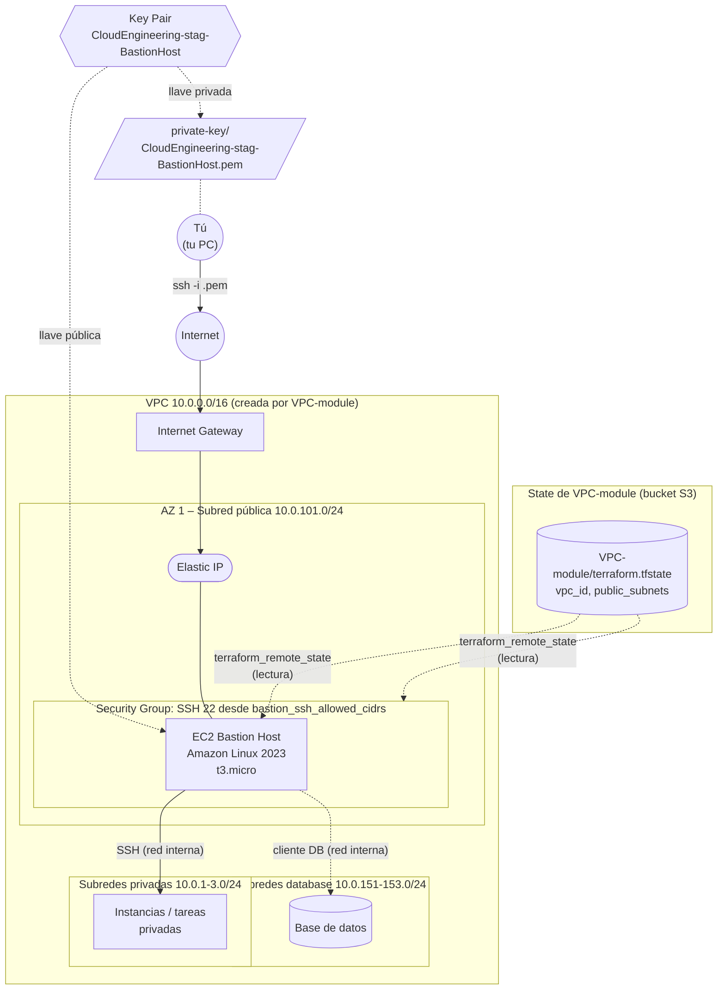

# 🛡️ AWS EC2 Bastion Host (acceso SSH) – Terraform

Este proyecto crea un **Bastion Host**: un servidor pequeño en AWS que sirve como **única puerta de entrada por SSH** a la red privada del laboratorio de ECS Fargate.
El Bastion se despliega **dentro de la VPC creada por el proyecto [`VPC-module`](../VPC-module/README.md)**.
Para saber en qué VPC y en qué subred crearse, **lee automáticamente el archivo de estado (state) de la VPC**, así que no hace falta copiar IDs a mano.
Además, **genera su propia llave SSH (key pair)**, con el mismo nombre que el Bastion, así que no necesitas crear ninguna llave de antemano.

| 🧭 Ficha rápida | |
|---|---|
| **Paso en el despliegue** | **6** – opcional, en cualquier momento después de la VPC ([guía](../README.md#guía-de-despliegue-paso-a-paso)) |
| **Depende de** | Bucket del state ([`S3-tfstate-backend-module`](../S3-tfstate-backend-module/README.md)) y [`VPC-module`](../VPC-module/README.md) |
| **Lo usan** | Tú, para entrar por SSH a recursos privados (por ejemplo, las instancias del cluster en modo EC2) |
| **Recursos (`plan`)** | 9 |
| **Tiempo de despliegue** | 2–3 min |
| **Costo principal** | La instancia EC2 `t3.micro` y su Elastic IP, por hora |

> ⚠️ **Antes de desplegar este módulo debe existir el bucket S3 del state** ([`S3-tfstate-backend-module`](../S3-tfstate-backend-module/README.md)): su `backend.tf` guarda el state ahí. Si no existe, `terraform init` falla con `NoSuchBucket`.

> 🗺️ Vista general de toda la plataforma: [README de Terraform](../README.md).

---

## Índice

1. 📦 [¿Qué se crea?](#qué-se-crea)
2. 📚 [Conceptos básicos](#conceptos-básicos)
3. 🗺️ [Diagrama](#diagrama)
4. 🔍 [Cómo funciona](#cómo-funciona)
5. 🔗 [¿De qué depende? (remote state)](#de-qué-depende-remote-state)
6. 📁 [Estructura de archivos](#estructura-de-archivos)
7. 🏷️ [Versiones](#versiones)
8. ⚙️ [Variables](#variables)
9. 📤 [Outputs](#outputs)
10. 🧪 [Cómo probarlo sin crear nada (plan)](#cómo-probarlo-sin-crear-nada-plan)
11. 🚀 [Cómo desplegarlo paso a paso](#cómo-desplegarlo-paso-a-paso)
12. 🔌 [Cómo conectarse al Bastion](#cómo-conectarse-al-bastion)
13. 🔒 [Seguridad](#seguridad)
14. 💰 [Costos](#costos)
15. 🛠️ [Problemas frecuentes](#problemas-frecuentes)

---

## ¿Qué se crea?

Se crea un servidor Linux (Amazon Linux 2023, `t3.micro`) en la **primera subred pública** de la VPC.
Tiene una **IP pública fija**, un **firewall** que solo deja entrar conexiones SSH y una **llave SSH nueva** creada por el propio proyecto.
Al terminar, Terraform guarda la llave privada en tu PC y también la copia al Bastion, para que desde ahí puedas saltar a los servidores privados.

| Recurso | Cantidad | ¿Para qué sirve? |
|---|---|---|
| **Key Pair** | 1 | La llave SSH del Bastion. Se llama igual que el Bastion (`CloudEngineering-stag-BastionHost`) |
| **Archivo `.pem` local** | 1 | La llave privada guardada en `manifests/private-key/CloudEngineering-stag-BastionHost.pem` |
| **Instancia EC2 (Bastion)** | 1 | El servidor al que te conectas por SSH |
| **Elastic IP** | 1 | La IP pública fija del Bastion. No cambia si se reinicia el servidor |
| **Security Group** | 1 (+ reglas) | El firewall: permite SSH (puerto 22) de entrada y todo el tráfico de salida |
| **Provisioners** (`terraform_data`) | 1 | Copia la llave `.pem` al Bastion y registra la creación en un archivo local |

> 💡 **Analogía:** si la VPC es un edificio de oficinas, el Bastion Host es la **portería**.
> Nadie entra directamente a las oficinas (subredes privadas) ni a la bóveda (base de datos).
> Primero te identificas en la portería con tu llave (SSH + key pair) y desde ahí te dejan pasar.

---

## Conceptos básicos

| Término | Qué significa en palabras simples |
|---|---|
| **Bastion Host** | Servidor expuesto a Internet cuya única función es servir de "puente" seguro hacia recursos privados. |
| **EC2** | El servicio de AWS para crear servidores virtuales (instancias). |
| **SSH** | Protocolo para conectarse a la terminal de un servidor Linux de forma cifrada. Usa el puerto 22. |
| **Key Pair (par de llaves)** | Una llave pública, que guarda AWS, y una llave privada (`.pem`), que guardas tú. Funciona como una llave física: sin el `.pem` no puedes entrar. |
| **ED25519** | El tipo de llave que se genera. Es moderno, seguro y más corto que el clásico RSA. |
| **Provider `tls` / `local`** | Plugins de Terraform. `tls` **genera** la llave privada y `local` la **guarda** como archivo en tu PC. |
| **AMI** | La "imagen" del sistema operativo con la que arranca el servidor. Aquí usamos la más reciente de Amazon Linux 2023. |
| **Security Group** | El firewall de la instancia: define qué tráfico puede entrar y salir. |
| **Elastic IP** | IP pública fija que se asocia a la instancia. |
| **State (`terraform.tfstate`)** | El archivo donde Terraform anota todo lo que creó: IDs, IPs, etc. Es la "memoria" de un proyecto. Se guarda en un bucket S3 (ver [`S3-tfstate-backend-module`](../S3-tfstate-backend-module/README.md)). |
| **`terraform_remote_state`** | Un *data source* que permite a un proyecto **leer los outputs del state de otro proyecto**. Así el Bastion conoce la VPC sin escribir sus IDs a mano. |
| **Data source** | Una consulta de solo lectura: Terraform *lee* información existente, pero no crea nada. |
| **Provisioner** | Instrucciones que Terraform ejecuta después de crear un recurso: copiar archivos, ejecutar comandos, etc. |

---

## Diagrama



👀 **Cómo leerlo:**
- **Flechas sólidas:** el camino de tu conexión SSH. Sale de tu PC, pasa por Internet y el Internet Gateway, y llega a la Elastic IP del Bastion. Desde el Bastion puedes saltar a los recursos privados.
- **Flechas punteadas desde `terraform.tfstate`:** no son tráfico de red. Indican que este proyecto **lee** del state de la VPC el ID de la VPC (para el Security Group) y el ID de la subred pública (para la instancia).
- **Flechas punteadas desde el Key Pair:** la llave pública se instala en el Bastion y la llave privada se guarda en tu PC como `.pem`. Con ese archivo te conectas.
- **Flecha punteada hacia la base de datos:** es opcional. Para llegar a una base de datos desde el Bastion, el Security Group de la base de datos debe permitirlo.

---

## Cómo funciona

El Bastion se crea con el módulo oficial `terraform-aws-modules/ec2-instance/aws` en [`ec2bastion-instance.tf`](manifests/ec2bastion-instance.tf): una instancia Amazon Linux 2023 en la primera subred pública, con su Elastic IP y su Security Group. Lo que más conviene entender es cómo se genera su llave SSH y por dónde viaja el tráfico:

### ¿Cómo se crea la llave SSH? (key pair)

La llave se crea en [`ec2bastion-keypair.tf`](manifests/ec2bastion-keypair.tf) con el módulo oficial `terraform-aws-modules/key-pair/aws`:

```hcl
module "key_pair" {
  source  = "terraform-aws-modules/key-pair/aws"
  version = "3.0.1"

  key_name              = local.bastion_name   # CloudEngineering-stag-BastionHost
  create_private_key    = true                 # Terraform genera la llave
  private_key_algorithm = "ED25519"
}

resource "local_sensitive_file" "bastion_private_key" {
  content         = module.key_pair.private_key_openssh
  filename        = "${path.module}/private-key/${module.key_pair.key_pair_name}.pem"
  file_permission = "0400"                     # solo lectura para ti
}
```

🪜 **Qué pasa, paso a paso:**
1. Terraform **genera** un par de llaves nuevo (pública + privada) con el provider `tls`.
2. Sube la **llave pública** a AWS como key pair llamado `CloudEngineering-stag-BastionHost`.
3. Guarda la **llave privada** en tu PC, en `manifests/private-key/CloudEngineering-stag-BastionHost.pem`, con permisos `0400`.
4. La instancia EC2 se crea con ese key pair (`key_name = module.key_pair.key_pair_name`). AWS instala la llave pública dentro del servidor.
5. Los provisioners usan la misma llave privada para conectarse y copiarla al Bastion.

🤔 **¿Por qué el mismo nombre que el Bastion?** El nombre sale de un único valor, `local.bastion_name`, definido en [`local-values.tf`](manifests/local-values.tf):

```hcl
bastion_name = "${local.name}-BastionHost"   # CloudEngineering-stag-BastionHost
```

Lo usan la instancia, el key pair y el archivo `.pem`. Así es evidente qué llave abre qué servidor. Si cambias `environment` o `business_divsion`, los tres nombres cambian juntos.

📌 **Detalles importantes:**
- **Ciclo de vida:** `terraform destroy` borra el key pair de AWS **y** el archivo `.pem` local. Si vuelves a crear todo con `apply`, se genera una llave **nueva**; la anterior deja de servir.
- **Copia de la llave:** la llave privada también queda guardada en el state (en el bucket S3). Si pierdes el `.pem`, se puede regenerar con `terraform apply`, siempre que el state siga existiendo. Ver [Seguridad](#seguridad).

### ¿Cómo viaja el tráfico?

| Dirección | Regla del Security Group | Qué significa |
|---|---|---|
| **Entrada** | TCP 22 (SSH) desde cada CIDR de `bastion_ssh_allowed_cidrs` | Solo se puede entrar por SSH, y solo desde las IPs permitidas. Todo lo demás se bloquea. |
| **Salida** | Todo el tráfico hacia `0.0.0.0/0` | El Bastion puede salir a Internet (por ejemplo, para actualizaciones) y hablar con cualquier recurso de la VPC. |

El Bastion está en una **subred pública**, así que sale a Internet directamente por el Internet Gateway, sin NAT.

---

## ¿De qué depende? (remote state)

El proyecto `VPC-module` guarda su state en el [bucket S3](../S3-tfstate-backend-module/README.md), con la clave `VPC-module/terraform.tfstate`. Ese archivo contiene los **outputs** de la VPC: `vpc_id`, `public_subnets`, `private_subnets`, etc. El Bastion guarda el suyo en `EC2-bastion-host-module/terraform.tfstate`.

En [`remote-state-datasource.tf`](manifests/remote-state-datasource.tf) este proyecto lee el state de la VPC:

```hcl
data "terraform_remote_state" "vpc" {
  backend = local.remote_state_backend         # "s3" (o "local" en pruebas)
  config  = local.remote_state_config["vpc"]   # { bucket = "cloudengineering-stag-tfstate-<cuenta>",
                                               #   key = "VPC-module/terraform.tfstate", region = "us-east-1" }
}
```

El nombre del bucket se calcula solo (`<división>-<entorno>-tfstate-<cuenta>`). Para pruebas sin AWS, la variable `remote_state_local_dir` hace que lea un archivo local `VPC-module.tfstate` en su lugar.

Y luego usa sus valores así:

| Dónde | Valor leído | Para qué |
|---|---|---|
| [`ec2bastion-securitygroups.tf`](manifests/ec2bastion-securitygroups.tf) | `data.terraform_remote_state.vpc.outputs.vpc_id` | Crear el Security Group dentro de la VPC correcta |
| [`ec2bastion-instance.tf`](manifests/ec2bastion-instance.tf) | `data.terraform_remote_state.vpc.outputs.public_subnets[0]` | Colocar el Bastion en la primera subred pública (AZ 1) |
| [`ec2bastion-provisioners.tf`](manifests/ec2bastion-provisioners.tf) | `data.terraform_remote_state.vpc.outputs.vpc_id` | Registrar en un archivo local en qué VPC se creó |

📌 **Detalles importantes:**
- El `[0]` significa "el primer elemento de la lista". Las listas en Terraform empiezan en 0.
- **Solo se pueden leer outputs.** Si necesitas otro dato de la VPC, primero hay que añadirlo como `output` en `VPC-module/manifests/vpc-outputs.tf` y volver a aplicar la VPC.
- **La lectura es de solo lectura:** este proyecto nunca modifica la VPC ni su state.
- **Si la VPC cambia, el Bastion se entera:** si se vuelve a crear la VPC, la próxima vez que ejecutes `terraform plan` aquí se leerán los nuevos IDs.

---

## Estructura de archivos

```
EC2-bastion-host-module/
├── README.md                          # Este documento
└── manifests/
    ├── versions.tf                    # Versiones de Terraform y providers (aws, tls, local)
    ├── backend.tf                     # State en el bucket S3 (clave EC2-bastion-host-module/terraform.tfstate)
    ├── generic-variables.tf           # Variables generales: región, entorno, división
    ├── local-values.tf                # Valores calculados: nombres (incluido el del Bastion) y etiquetas
    ├── remote-state-datasource.tf     # Lectura del state de la VPC
    ├── ami-datasource.tf              # Búsqueda de la AMI más reciente de Amazon Linux 2023
    ├── ec2bastion-variables.tf        # Variables del Bastion: tipo, IPs permitidas, bucket del state
    ├── ec2bastion-keypair.tf          # Creación del key pair y del archivo .pem
    ├── ec2bastion-securitygroups.tf   # Firewall (Security Group y sus reglas)
    ├── ec2bastion-instance.tf         # La instancia EC2 (módulo oficial)
    ├── ec2bastion-elasticip.tf        # La IP pública fija
    ├── ec2bastion-provisioners.tf     # Copia de la llave y registro local
    ├── ec2bastion-outputs.tf          # Datos que se muestran al terminar
    ├── terraform.tfvars               # Valores reales de las variables generales
    ├── ec2bastion.auto.tfvars         # Valores reales de las variables del Bastion
    └── private-key/
        └── CloudEngineering-stag-BastionHost.pem   # Generado por Terraform (¡no subir a git!)
```

| Archivo | Explicación |
|---|---|
| [`versions.tf`](manifests/versions.tf) | Define las versiones de Terraform y de los providers `aws`, `tls` y `local`. Las credenciales salen de la cadena por defecto de AWS: `AWS_PROFILE`, variables de entorno o el perfil `default` de `~/.aws/credentials`. |
| [`generic-variables.tf`](manifests/generic-variables.tf) / [`local-values.tf`](manifests/local-values.tf) | Mismo patrón que en `VPC-module`, para que los nombres y etiquetas sean coherentes (`CloudEngineering-stag-...`). `local-values.tf` define además `bastion_name`. |
| [`ec2bastion-keypair.tf`](manifests/ec2bastion-keypair.tf) | Genera la llave, la registra en AWS y guarda el `.pem` en `private-key/`. Ver [sección de la llave](#cómo-se-crea-la-llave-ssh-key-pair). |
| [`remote-state-datasource.tf`](manifests/remote-state-datasource.tf) | Lee los outputs de la VPC. Ver [¿De qué depende?](#de-qué-depende-remote-state). |
| [`ami-datasource.tf`](manifests/ami-datasource.tf) | Busca en AWS la imagen **más reciente** de Amazon Linux 2023 (x86_64). Así siempre arranca con parches recientes. |
| [`ec2bastion-securitygroups.tf`](manifests/ec2bastion-securitygroups.tf) | Crea el Security Group y sus reglas. Crea una regla SSH por cada CIDR permitido (`for_each`). |
| [`ec2bastion-instance.tf`](manifests/ec2bastion-instance.tf) | Crea la instancia con el módulo oficial `terraform-aws-modules/ec2-instance/aws`. Usa `create_security_group = false` para que el módulo no cree un segundo firewall y use el nuestro. |
| [`ec2bastion-elasticip.tf`](manifests/ec2bastion-elasticip.tf) | Reserva una Elastic IP y la asocia al Bastion. |
| [`ec2bastion-provisioners.tf`](manifests/ec2bastion-provisioners.tf) | Cuando el Bastion está listo, Terraform se conecta por SSH y realiza tres acciones (ver la lista siguiente). Si el Bastion se recrea, estas acciones se repiten. |
| [`ec2bastion-outputs.tf`](manifests/ec2bastion-outputs.tf) | Muestra al final la IP, el ID, el comando SSH, etc. |

Las tres acciones que realizan los provisioners son:
1. Copia la llave privada a `/tmp/CloudEngineering-stag-BastionHost.pem` dentro del Bastion.
2. Le pone permisos `400` (solo lectura para el dueño), porque SSH lo exige.
3. En tu PC, añade una línea con la fecha y el VPC ID en `local-exec-output-files/creation-time-vpc-id.txt`.

---

## Versiones

| Componente | Versión | Comentario |
|---|---|---|
| Terraform | `>= 1.16` | Probado con v1.16.5 |
| Provider `hashicorp/aws` | `~> 6.67` | Igual que `VPC-module` |
| Provider `hashicorp/tls` | `~> 4.4` | Genera la llave privada |
| Provider `hashicorp/local` | `~> 2.9` | Guarda el `.pem` en disco |
| Módulo `terraform-aws-modules/ec2-instance/aws` | `6.4.1` | Versión fija |
| Módulo `terraform-aws-modules/key-pair/aws` | `3.0.1` | Versión fija |
| Sistema operativo | Amazon Linux 2023 | Amazon Linux 2 dejó de recibir soporte el 30-06-2026 |

> ℹ️ No se usa el provider `null`: los provisioners usan `terraform_data`, que viene incluido en Terraform.

---

## Variables

Los valores **por defecto** están en los archivos `*-variables.tf`. Los valores **que realmente se usan** están en `terraform.tfvars` y `ec2bastion.auto.tfvars`, que tienen prioridad.

### Generales (`generic-variables.tf`)

| Variable | Tipo | Por defecto | Valor actual (`.tfvars`) | Descripción |
|---|---|---|---|---|
| `aws_region` | texto | `us-east-1` | `us-east-1` | Región. **Debe ser la misma que la de la VPC** |
| `environment` | texto | `dev` | `stag` | Entorno. Se usa en nombres y etiquetas |
| `business_divsion` | texto | `DevOps` | `CloudEngineering` | Área responsable. Se usa en nombres y etiquetas |

### Bastion (`ec2bastion-variables.tf`)

| Variable | Tipo | Valor actual | Descripción |
|---|---|---|---|
| `instance_type` | texto | `t3.micro` | Tamaño del servidor. `t3.micro` es suficiente para un bastion |
| `bastion_ssh_allowed_cidrs` | lista | `["0.0.0.0/0"]` | IPs que pueden conectarse por SSH. **Recomendado: solo tu IP**, por ejemplo `["203.0.113.10/32"]` |
| `state_bucket` | texto | `null` → `cloudengineering-stag-tfstate-<account_id>` | Bucket S3 con el state de la VPC. Solo hace falta si el bucket tiene otro nombre |
| `remote_state_local_dir` | texto | `null` | **Solo pruebas:** carpeta con states ficticios (`VPC-module.tfstate`) que se leen en lugar del bucket |

> ℹ️ El nombre de la llave **no es una variable**: siempre es igual al nombre del Bastion (`local.bastion_name`).

### Nombres y etiquetas

| Recurso | Nombre |
|---|---|
| Instancia | `CloudEngineering-stag-BastionHost` |
| Key Pair | `CloudEngineering-stag-BastionHost` (igual que la instancia) |
| Archivo de llave privada | `private-key/CloudEngineering-stag-BastionHost.pem` |
| Security Group | `CloudEngineering-stag-public-bastion-sg` |
| Elastic IP | `CloudEngineering-stag-bastion-eip` |

Todos llevan además las etiquetas `owners` y `environment`, igual que la VPC.

---

## Outputs

| Output | Descripción | ¿Para qué lo necesitas? |
|---|---|---|
| `ssh_command` | Comando listo para copiar y pegar | Conectarte al Bastion |
| `key_pair_name` | Nombre del key pair (igual que el Bastion) | Buscarlo en la consola de AWS (EC2 → Key Pairs) |
| `private_key_path` | Ruta local del `.pem` | Saber qué archivo usar con `ssh -i` |
| `ec2_bastion_eip` | IP pública fija del Bastion | Conectarte o darla de alta en otro firewall |
| `ec2_bastion_private_ip` | IP privada dentro de la VPC | Permitir el acceso desde el Bastion en otros Security Groups |
| `ec2_bastion_public_instance_ids` | ID de la instancia (`i-xxxx`) | Buscarla en la consola de AWS |
| `ec2_bastion_availability_zone` | AZ donde quedó | Confirmar la ubicación |
| `bastion_security_group_id` | ID del Security Group | Usarlo como origen permitido en el SG de una base de datos o servicio privado |
| `vpc_id` | VPC leída del remote state | Confirmar que se usó la VPC correcta |

---

## Cómo probarlo sin crear nada (plan)

```bash
cd Serverless/ECS-Fargate/Terraform/EC2-bastion-host-module/manifests
terraform init
terraform validate
terraform plan        # necesita el bucket del state y el state de la VPC en él
```

Si el bucket o la VPC todavía no existen, puedes probarlo con un `backend_override.tf` local y un **state ficticio** `VPC-module.tfstate` que tenga los outputs `vpc_id` y `public_subnets`. Ver [cómo hacerlo](../README.md#probar-sin-crear-nada):

```bash
terraform plan -var remote_state_local_dir=/ruta/a/states-ficticios
```

✅ **Resultado verificado** (state de la VPC simulado): `Plan: 9 to add, 0 to change, 0 to destroy.`

> ℹ️ El `plan` no genera la llave ni se conecta por SSH: eso solo ocurre durante el `apply`.

---

## Cómo desplegarlo paso a paso

> 🤖 **El pipeline no aplica el Bastion automáticamente:** sus provisioners se conectan por SSH desde quien aplica, y el `.pem` quedaría en el runner y se perdería. En un Pull Request solo se muestra su `plan`. Aplícalo a mano con estos pasos, o con el [workflow manual](../../../../.github/README.md#workflow-manual) si aceptas perder el `.pem` local (la llave sigue en el state).

### Requisitos previos

1. **El bucket del state y la VPC ya deben estar creados** ([`S3-tfstate-backend-module`](../S3-tfstate-backend-module/README.md) y `VPC-module`). Sin el state de la VPC en el bucket, este proyecto no puede saber dónde crearse.
2. **Terraform 1.16 o superior.** En este equipo está instalado en WSL; compruébalo con `terraform version`.
3. **Credenciales de AWS** (perfil `default` o `AWS_PROFILE`). Compruébalas con `aws sts get-caller-identity`.
4. *(Recomendado)* Pon tu IP pública en `bastion_ssh_allowed_cidrs` dentro de `ec2bastion.auto.tfvars`. Puedes averiguarla con `curl -s https://checkip.amazonaws.com`.

### Pasos

Abre una terminal de WSL y ve a la carpeta `manifests/`:

```bash
cd Serverless/ECS-Fargate/Terraform/EC2-bastion-host-module/manifests
```

| # | Comando | Qué hace |
|---|---|---|
| 1 | `terraform init` | Descarga los providers (`aws`, `tls`, `local`) y los módulos EC2 y key-pair, y conecta con el state en S3 (`EC2-bastion-host-module/terraform.tfstate`) |
| 2 | `terraform validate` | Comprueba que el código no tenga errores |
| 3 | `terraform plan` | Lee el state de la VPC y **muestra** lo que se va a crear, sin crearlo |
| 4 | `terraform apply` | Crea los recursos. Escribe `yes` para confirmar |
| 5 | `terraform output` | Muestra la IP, el comando SSH, etc. |

🔎 **Qué deberías ver en el `plan`:**
- 1 llave generada (`module.key_pair.tls_private_key`) y 1 key pair en AWS (`module.key_pair.aws_key_pair`)
- 1 archivo local (`local_sensitive_file.bastion_private_key`)
- 1 instancia EC2 (`module.ec2_public`)
- 1 Security Group, 1 regla de entrada por cada CIDR permitido y 1 regla de salida
- 1 Elastic IP
- 1 `terraform_data` (provisioners)

> ⚠️ Durante el `apply`, los provisioners se conectan **por SSH (puerto 22) desde tu PC** al Bastion. Si tu IP no está en `bastion_ssh_allowed_cidrs`, o tu red bloquea la salida por el puerto 22, ese paso falla.

### Eliminar

El Bastion vive dentro de la VPC, así que **primero se destruye el Bastion y después la VPC**:

```bash
# 1. Bastion
cd Serverless/ECS-Fargate/Terraform/EC2-bastion-host-module/manifests && terraform destroy
# 2. VPC
cd ../../VPC-module/manifests && terraform destroy
```

Si destruyes primero la VPC, AWS no podrá borrarla mientras el Bastion siga dentro. Además, el state del Bastion apuntaría a recursos que ya no existen.

---

## Cómo conectarse al Bastion

```bash
# Desde EC2-bastion-host-module/manifests/
terraform output -raw ssh_command        # muestra el comando
ssh -i private-key/CloudEngineering-stag-BastionHost.pem ec2-user@<ec2_bastion_eip>
```

🔐 **Saltar a un servidor privado.** La llave ya fue copiada al Bastion, así que desde dentro del Bastion ejecuta:

```bash
ssh -i /tmp/CloudEngineering-stag-BastionHost.pem ec2-user@<IP-privada-del-servidor>
```

> ⚠️ Para esto, el servidor privado debe haberse creado con el **mismo key pair** (`CloudEngineering-stag-BastionHost`).

🔐 **Alternativa más segura (sin copiar la llave):** usa *SSH Agent Forwarding* o *ProxyJump* desde tu PC:

```bash
ssh -i private-key/CloudEngineering-stag-BastionHost.pem -J ec2-user@<ec2_bastion_eip> ec2-user@<IP-privada>
```

---

## Seguridad

- **Restringe el SSH.** El valor por defecto `0.0.0.0/0` permite intentos de conexión desde cualquier lugar de Internet. Cámbialo a tu IP con `/32`.
- **Nunca subas el `.pem` a git.** El `.gitignore` de la raíz del proyecto ya ignora `*.pem` y `private-key/`.
- **La llave privada queda guardada en el state.** Esto ocurre siempre que Terraform genera una llave. El state está en el bucket S3, cifrado (SSE-S3), pero quien pueda leer el bucket tiene acceso al Bastion: restringe ese acceso igual que el `.pem`. En producción:
  - Genera la llave fuera de Terraform y pasa solo la llave pública (`public_key`).
  - Cifra el bucket con una llave KMS propia y limita quién puede leerlo.
  - O, mejor, elimina las llaves y usa AWS Systems Manager Session Manager.
- **La llave queda copiada en el Bastion** (`/tmp/CloudEngineering-stag-BastionHost.pem`). Es cómodo para el laboratorio, pero cualquiera con acceso al Bastion podría usarla. En producción usa ProxyJump o AWS Systems Manager Session Manager.
- **El state contiene otros datos sensibles,** como IPs e IDs. Trata el bucket del state como información privada y nunca descargues un `.tfstate` a git (ya está en el `.gitignore`) ni a carpetas sincronizadas.
- **IMDSv2 está activado por defecto en el módulo EC2** (`http_tokens = required`). Esto protege los metadatos de la instancia.

---

## Costos

| Recurso | Costo aproximado |
|---|---|
| EC2 `t3.micro` | Se cobra por hora mientras está encendida. Entra en la capa gratuita si tu cuenta califica |
| Volumen EBS raíz | Se cobra por GB al mes |
| Elastic IP | AWS cobra todas las IPv4 públicas por hora, estén en uso o no |
| Security Group / Key Pair | Gratis |

Al terminar el laboratorio ejecuta `terraform destroy` para no seguir pagando.

---

## Problemas frecuentes

| Síntoma | Causa probable | Solución |
|---|---|---|
| `Unable to find remote state` | La VPC no está aplicada, o el bucket no es el esperado | Aplica `VPC-module` primero. Si el bucket tiene otro nombre, pásalo con `state_bucket` |
| `NoSuchBucket` / `S3 bucket does not exist` en `terraform init` | Aún no existe el bucket del state, o el `bucket` de `backend.tf` no coincide | Aplica antes [`S3-tfstate-backend-module`](../S3-tfstate-backend-module/README.md) |
| `Unsupported attribute: This object does not have an attribute named "..."` | Se intenta leer un output que la VPC no expone | Añade el output en `VPC-module/manifests/vpc-outputs.tf` y vuelve a aplicar la VPC |
| `InvalidKeyPair.Duplicate` | Ya existe en AWS un key pair con el nombre `CloudEngineering-stag-BastionHost`, creado fuera de este state | Bórralo en la consola (EC2 → Key Pairs) o cambia `environment`/`business_divsion` |
| Borraste el `.pem` local por error | El archivo se gestiona con Terraform | Ejecuta `terraform apply`: lo vuelve a escribir desde el state |
| Los provisioners quedan en `Still creating...` y fallan con `timeout` | Tu IP no está en `bastion_ssh_allowed_cidrs` | Revisa el CIDR (tu IP pública puede haber cambiado) |
| `UNPROTECTED PRIVATE KEY FILE` al hacer SSH | Los permisos del `.pem` son demasiado abiertos, algo que puede pasar si lo copias a otra carpeta o a Windows | `chmod 400 <ruta-del-pem>` |
| `Permission denied (publickey)` | Estás usando un `.pem` antiguo, de un despliegue anterior | Usa el que indica `terraform output private_key_path` |
| `InvalidGroup.NotFound` / errores de VPC | Se usa una región distinta a la de la VPC | `aws_region` debe coincidir en ambos proyectos |
