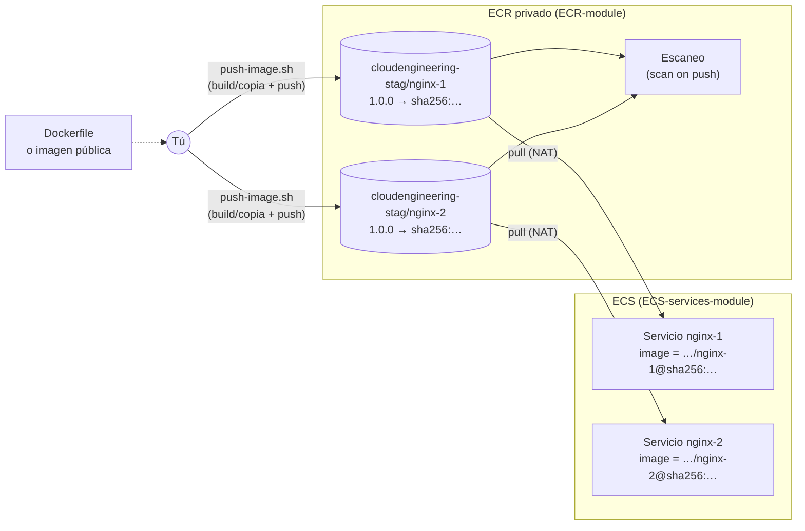
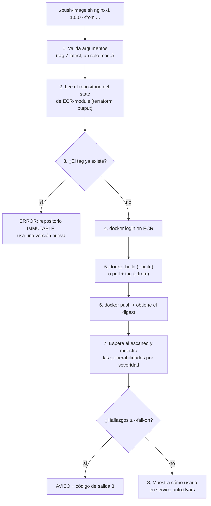

# 📦 AWS ECR (registro de imágenes) – Terraform

Este proyecto crea los **repositorios privados de Amazon ECR** donde guardas las **imágenes Docker** de tus aplicaciones. Los servicios del cluster ECS ([`ECS-services-module`](../ECS-services-module/README.md)) descargan de aquí las imágenes que despliegan.

Incluye el script [`push-image.sh`](push-image.sh), que **construye o copia, sube y escanea** una imagen y te dice cómo usarla en un servicio.

| 🧭 Ficha rápida | |
|---|---|
| **Paso en el despliegue** | **4** – crear y **subir las imágenes** antes de los servicios ([guía](../README.md#guía-de-despliegue-paso-a-paso)) |
| **Depende de** | Bucket del state ([`S3-tfstate-backend-module`](../S3-tfstate-backend-module/README.md)) |
| **Lo usan** | [`ECS-services-module`](../ECS-services-module/README.md) (servicios con `ecr_repository`) y el script `push-image.sh` |
| **Recursos (`plan`)** | 2 por repositorio (4 hoy) |
| **Tiempo de despliegue** | ~1 min + 1–2 min por imagen subida |
| **Costo principal** | Almacenamiento de imágenes por GB (mínimo) |

> ⚠️ **Antes de desplegar este módulo debe existir el bucket S3 del state** ([`S3-tfstate-backend-module`](../S3-tfstate-backend-module/README.md)): su `backend.tf` guarda el state ahí. Si no existe, `terraform init` falla con `NoSuchBucket`.

> 🗺️ Vista general de toda la plataforma: [README de Terraform](../README.md).

---

## Índice

1. 📦 [¿Qué se crea?](#qué-se-crea)
2. 📚 [Conceptos básicos](#conceptos-básicos)
3. 🗺️ [Diagrama](#diagrama)
4. 🔍 [Cómo funciona](#cómo-funciona)
5. 🔗 [¿De qué depende? (remote state)](#de-qué-depende-remote-state)
6. 📁 [Estructura de archivos](#estructura-de-archivos)
7. 🏷️ [Versiones](#versiones)
8. ⚙️ [Variables](#variables)
9. 📤 [Outputs](#outputs)
10. 🧪 [Cómo probarlo sin crear nada (plan)](#cómo-probarlo-sin-crear-nada-plan)
11. 🚀 [Cómo desplegarlo paso a paso](#cómo-desplegarlo-paso-a-paso)
12. 🐳 [Subir imágenes: comandos manuales](#subir-imágenes-comandos-manuales)
13. 🤖 [Subir imágenes: script push-image.sh](#subir-imágenes-script-push-imagesh)
14. 🧩 [Usar la imagen en un servicio](#usar-la-imagen-en-un-servicio)
15. 🔄 [Publicar una versión nueva de tu aplicación](#publicar-una-versión-nueva-de-tu-aplicación)
16. 🔒 [Seguridad](#seguridad)
17. 💰 [Costos](#costos)
18. 🛠️ [Problemas frecuentes](#problemas-frecuentes)

---

## ¿Qué se crea?

**Un repositorio privado por aplicación**, definido en [`ecr.auto.tfvars`](manifests/ecr.auto.tfvars). Hoy hay uno para cada servicio de prueba:

| Repositorio | Nombre completo en ECR | Lo usa |
|---|---|---|
| `nginx-1` | `cloudengineering-stag/nginx-1` | [`services/nginx-1`](../ECS-services-module/services/nginx-1/manifests/service.auto.tfvars) |
| `nginx-2` | `cloudengineering-stag/nginx-2` | [`services/nginx-2`](../ECS-services-module/services/nginx-2/manifests/service.auto.tfvars) |

Cada repositorio se crea con:

| Característica | Valor | ¿Para qué? |
|---|---|---|
| **Tags inmutables** | `IMMUTABLE` | Una versión publicada (por ejemplo `1.0.0`) **nunca** puede sobrescribirse con otra imagen |
| **Escaneo al subir** | `scan on push` | Cada imagen se revisa en busca de vulnerabilidades conocidas (CVE) del sistema operativo |
| **Cifrado** | `AES256` | Las imágenes se guardan cifradas |
| **Ciclo de vida** | Se borran las imágenes sin tag a los **7 días** y se conservan las **10** más recientes | No acumular imágenes viejas (ni pagar por ellas) |

El `plan` crea **2 recursos por repositorio**: el repositorio y su política de ciclo de vida. Hoy son **4**.

> 💡 **Analogía:** el ECR es el **almacén** de la empresa. Cada aplicación tiene su **estantería** (repositorio) y cada versión es una **caja sellada** con una etiqueta (tag).
> - Una caja etiquetada `1.0.0` no se puede volver a abrir ni cambiar (IMMUTABLE).
> - Cada caja tiene además un número de serie único (digest).
> - Al entrar al almacén, cada caja pasa por un control de seguridad (escaneo).

---

## Conceptos básicos

| Término | Qué significa en palabras simples |
|---|---|
| **Imagen Docker** | El paquete de tu aplicación con todo lo que necesita para ejecutarse. Se crea con un `Dockerfile`. |
| **Registro (registry)** | El servicio que guarda imágenes. Tu registro privado es `<cuenta>.dkr.ecr.us-east-1.amazonaws.com`. |
| **Repositorio** | Una "carpeta" del registro para una aplicación: `cloudengineering-stag/nginx-1`. |
| **Tag** | Etiqueta legible de una versión: `1.0.0`, `1.0.1`... |
| **Digest** | Huella única e inmutable del contenido de la imagen: `sha256:3f8a…`. Si cambia un solo byte, cambia el digest. |
| **IMMUTABLE** | Un tag, una vez subido, no se puede reutilizar para otra imagen. Evita que "la misma versión" cambie sin que nadie lo note. |
| **Scan on push** | ECR analiza cada imagen al subirla y reporta vulnerabilidades por severidad (CRITICAL, HIGH, MEDIUM...). |
| **Lifecycle policy** | Reglas automáticas para borrar imágenes antiguas o sin tag. |
| **Mirror** | Copiar una imagen de otro registro (por ejemplo, ECR Public) a tu registro privado. |

---

## Diagrama



**Flujo completo:**
1. **Subes la imagen** con `push-image.sh`. El script construye la imagen (o copia una existente), le pone un tag (`1.0.0`), la sube y espera el escaneo.
2. **El servicio la referencia** en su `service.auto.tfvars` con `ecr_repository` + `image_tag`.
3. **En el `plan` del servicio,** Terraform busca esa imagen en ECR y obtiene su **digest**. Si no existe, el `plan` **falla** antes de desplegar nada.
4. **ECS despliega la imagen fijada por su digest** (`…/nginx-1@sha256:…`). Las tareas la descargan desde las subredes privadas, a través del NAT Gateway.

> ℹ️ **No hace falta configurar permisos.** El rol de ejecución que crea el módulo de servicios ya puede descargar imágenes de cualquier repositorio ECR de la misma cuenta.

---

## Cómo funciona

[`ecr.tf`](manifests/ecr.tf) usa el módulo oficial `terraform-aws-modules/ecr/aws`, con **un módulo por repositorio** (`for_each`):

```hcl
module "ecr" {
  source   = "terraform-aws-modules/ecr/aws"
  version  = "3.2.0"
  for_each = var.repositories                                   # nginx-1, nginx-2, ...

  repository_name                 = "${local.repo_prefix}/${each.key}"   # cloudengineering-stag/nginx-1
  repository_image_tag_mutability = each.value.image_tag_mutability      # IMMUTABLE
  repository_image_scan_on_push   = true
  repository_encryption_type      = "AES256"
  repository_force_delete         = var.ecr_force_delete                 # true en el laboratorio
  create_repository_policy        = false                                # acceso por IAM (misma cuenta)
  repository_lifecycle_policy     = jsonencode({ rules = [ ...sin tag > 7 días..., ...conservar 10... ] })
}
```

📌 **Detalles importantes:**
- **Nombres en minúsculas:** ECR los exige, así que el prefijo es `lower("CloudEngineering-stag")` = `cloudengineering-stag`.
- **`create_repository_policy = false`:** no hace falta política del repositorio. Los usuarios y roles de la **misma cuenta** acceden por sus permisos IAM.
- **`repository_force_delete = true` (solo laboratorio):** permite que `terraform destroy` borre repositorios con imágenes dentro. En producción ponlo en `false` para protegerlas.

---

## ¿De qué depende? (remote state)

**Solo necesita el [bucket del state](../S3-tfstate-backend-module/README.md)**, donde guarda su state (`ECR-module/terraform.tfstate`): se puede crear en cualquier momento después de él. Lo que importa es el orden respecto a los servicios: el ECR debe estar aplicado **y con las imágenes subidas** antes de desplegar un servicio que use `ecr_repository`.

Lo usan:

| Quién | Qué lee |
|---|---|
| [`push-image.sh`](push-image.sh) | `registry_url` y `repository_names`, con `terraform output` |
| Servicios de [`ECS-services-module`](../ECS-services-module/README.md) con `ecr_repository` | `repository_urls` y `repository_names` de su state en S3 (`ECR-module/terraform.tfstate`), y en AWS la imagen y su digest |

---

## Estructura de archivos

```
ECR-module/
├── README.md
├── push-image.sh                # construir/copiar → tag → push → escaneo → cómo usarla
└── manifests/
    ├── versions.tf              # Terraform + provider AWS
    ├── backend.tf               # State en el bucket S3 (clave ECR-module/terraform.tfstate)
    ├── generic-variables.tf     # región, entorno, división
    ├── terraform.tfvars         # us-east-1 / stag / CloudEngineering
    ├── local-values.tf          # name, common_tags, repo_prefix (minúsculas)
    ├── ecr-variables.tf         # repositories + ciclo de vida + force_delete
    ├── ecr.auto.tfvars          # ← TUS REPOSITORIOS (uno por aplicación)
    ├── ecr.tf                   # módulo ECR por repositorio
    └── ecr-outputs.tf           # registry_url, repository_urls, repository_names, repository_arns
```

---

## Versiones

| Componente | Versión |
|---|---|
| Terraform | `>= 1.16` (probado con v1.16.5) |
| Provider `hashicorp/aws` | `~> 6.67` |
| Módulo `terraform-aws-modules/ecr/aws` | `3.2.0` |
| `push-image.sh` | bash 4+, AWS CLI v2, Docker (con `buildx` para `--platform`), Terraform |

---

## Variables

| Variable | Valor actual | Descripción |
|---|---|---|
| `aws_region` / `environment` / `business_divsion` | `us-east-1` / `stag` / `CloudEngineering` | Generales; deben coincidir con los otros módulos |
| `repositories` | `{ nginx-1 = {}, nginx-2 = {} }` | Un repositorio por clave. Opciones por repositorio: `image_tag_mutability` (`IMMUTABLE` por defecto) y `max_image_count` |
| `ecr_max_image_count` | `10` | Imágenes que se conservan por repositorio |
| `ecr_untagged_expire_days` | `7` | Días tras los que se borran las imágenes sin tag |
| `ecr_force_delete` | `true` (laboratorio) | `true`: `destroy` borra repositorios con imágenes. **Producción: `false`** |

**Añadir un repositorio:**
```hcl
repositories = {
  nginx-1 = {}
  nginx-2 = {}
  mi-api  = {}                         # nuevo
  # mi-worker = { max_image_count = 20 }
}
```
Después ejecuta `terraform apply` en `ECR-module/manifests`.

---

## Outputs

| Output | Ejemplo | ¿Quién lo usa? |
|---|---|---|
| `registry_url` | `373716886058.dkr.ecr.us-east-1.amazonaws.com` | `docker login` y `push-image.sh` |
| `repository_urls` | `{ nginx-1 = "…/cloudengineering-stag/nginx-1", … }` | `push-image.sh` y los servicios (para construir la URI de la imagen) |
| `repository_names` | `{ nginx-1 = "cloudengineering-stag/nginx-1", … }` | `push-image.sh` y los servicios (para buscar la imagen y su digest) |
| `repository_arns` | `{ nginx-1 = "arn:aws:ecr:…", … }` | Políticas IAM, pipelines |

---

## Cómo probarlo sin crear nada (plan)

```bash
cd ~/Sr-Labs/Serverless/ECS-Fargate/Terraform/ECR-module/manifests
terraform init
terraform validate
terraform plan
```

✅ **Resultado verificado** (sin `apply`):

| Prueba | Resultado |
|---|---|
| `ECR-module`: `fmt`, `validate`, `plan` | `Plan: 4 to add`: `cloudengineering-stag/nginx-1` y `/nginx-2`, `IMMUTABLE`, `scan_on_push = true`, `AES256`, lifecycle con reglas `untagged` y `any` |
| Repositorio con mayúsculas (`Nginx`) | **Falla** con la validación |
| `push-image.sh`: `--help`, sin tag, `latest`, sin modo, dos modos, tag inválido, `--fail-on` inválido, directorio inexistente | Cada caso termina con su mensaje de error |
| `push-image.sh` sin el ECR aplicado | Error: "aplica ECR-module primero" |
| Servicio con `ecr_repository` y la imagen sin subir | El `plan` **falla** (`reading ECR Images: couldn't find resource`): es lo esperado |
| Servicio con `image = "public.ecr.aws/…"` | `Plan: 17 to add`, sin leer el state de ECR |
| Servicio con `image` **y** `ecr_repository`, sin `image_tag` o con `image_tag = "latest"` | **Falla** con la validación |

> ⚠️ El camino completo (subir con el script y desplegar fijando el digest) solo puede probarse con el ECR aplicado y una imagen subida, es decir, haciendo `apply`. No se ejecutó en estas pruebas.

---

## Cómo desplegarlo paso a paso

> 🤖 **Con el pipeline** ([GitHub Actions](../README.md#pipeline-cicd-github-actions)): haz el cambio en una rama, abre un Pull Request a `main`, revisa el `plan` que se comenta en el PR, haz merge y aprueba el despliegue. El pipeline aplica este módulo por ti. Los pasos de abajo son para desplegarlo **a mano**.

### Requisitos previos

1. **El bucket del state creado** ([`S3-tfstate-backend-module`](../S3-tfstate-backend-module/README.md)): es lo primero que se despliega.
2. **Credenciales de AWS** (perfil `default` o `AWS_PROFILE`). Compruébalas con `aws sts get-caller-identity`.
3. **Para subir imágenes después:** Docker funcionando y los [permisos del script](#permisos-necesarios).

### Pasos

```bash
cd ~/Sr-Labs/Serverless/ECS-Fargate/Terraform/ECR-module/manifests
terraform init
terraform plan         # 4 to add (2 repositorios + 2 lifecycle policies)
terraform apply        # escribe "yes"
terraform output repository_urls
```

Después, **sube las imágenes** de tus aplicaciones, [con el script](#subir-imágenes-script-push-imagesh) o [a mano](#subir-imágenes-comandos-manuales).

### Eliminar

Destruye antes los servicios que usan las imágenes y después:

```bash
terraform destroy
```

Con `ecr_force_delete = true` (valor del laboratorio) se borran también las imágenes guardadas.

---

## Subir imágenes: comandos manuales

Es útil para entender qué hace el script. Desde la terminal de WSL/Ubuntu:

```bash
cd ~/Sr-Labs/Serverless/ECS-Fargate/Terraform/ECR-module

REGISTRY=$(terraform -chdir=manifests output -raw registry_url)
REPO_URL="$REGISTRY/cloudengineering-stag/nginx-1"
TAG=1.0.0

# 1. Login en ECR (el token dura 12 horas)
aws ecr get-login-password --region us-east-1 | docker login --username AWS --password-stdin "$REGISTRY"

# 2a. Construir tu propia imagen desde un Dockerfile...
docker build --platform linux/amd64 -t "$REPO_URL:$TAG" ./mi-aplicacion
# 2b. ...o copiar una imagen existente (mirror)
docker pull --platform linux/amd64 public.ecr.aws/nginx/nginx:stable-alpine
docker tag public.ecr.aws/nginx/nginx:stable-alpine "$REPO_URL:$TAG"

# 3. Subir
docker push "$REPO_URL:$TAG"

# 4. Ver el digest
aws ecr describe-images --repository-name cloudengineering-stag/nginx-1 --image-ids imageTag=$TAG \
  --query 'imageDetails[0].imageDigest' --output text

# 5. Esperar el escaneo y ver las vulnerabilidades por severidad
aws ecr wait image-scan-complete --repository-name cloudengineering-stag/nginx-1 --image-id imageTag=$TAG
aws ecr describe-image-scan-findings --repository-name cloudengineering-stag/nginx-1 --image-id imageTag=$TAG \
  --query 'imageScanFindings.findingSeverityCounts'
```

> ⚠️ **`--platform linux/amd64`:** Fargate ejecuta x86_64 por defecto. Si construyes en un equipo ARM (Mac M1/M2/M3…) sin esta opción, la tarea fallará con `exec format error`.

---

## Subir imágenes: script push-image.sh

[`push-image.sh`](push-image.sh) automatiza todo lo anterior y añade validaciones de seguridad.

📋 **Requisitos:**
- **Terminal:** WSL/Ubuntu (bash).
- **Herramientas:** AWS CLI v2 y Terraform.
- **Docker funcionando:** Docker Engine en WSL o Docker Desktop con la integración WSL activada.
- **ECR aplicado e inicializado en tu PC** (`terraform init` en `ECR-module/manifests`): el script lee los repositorios con `terraform output`, desde el state en S3.

### Permisos necesarios

**Permiso de ejecución del archivo.** Comprueba con `ls -l push-image.sh` que muestra `-rwxr-xr-x`. Si falta la `x` (pasa al editarlo o copiarlo desde Windows):

```bash
chmod +x push-image.sh        # o ejecútalo con: bash push-image.sh ...
```

No hace falta `sudo`, pero tu usuario debe poder usar Docker (`docker info` sin `sudo`).

**Permisos IAM** del usuario o rol de tus credenciales:

| Paso del script | Acción IAM |
|---|---|
| Comprobar que el tag no existe y leer el digest | `ecr:DescribeImages` |
| `docker login` en ECR | `ecr:GetAuthorizationToken` (solo funciona con `Resource: "*"`) |
| `docker push` | `ecr:BatchCheckLayerAvailability`, `ecr:InitiateLayerUpload`, `ecr:UploadLayerPart`, `ecr:CompleteLayerUpload`, `ecr:PutImage` |
| Esperar el escaneo y leer el resultado | `ecr:DescribeImageScanFindings` |

Política mínima, limitada a los repositorios del proyecto (cambia `<ACCOUNT_ID>`):

```json
{
  "Version": "2012-10-17",
  "Statement": [
    { "Sid": "EcrLogin", "Effect": "Allow", "Action": "ecr:GetAuthorizationToken", "Resource": "*" },
    {
      "Sid": "PushAndScanPlatformRepos",
      "Effect": "Allow",
      "Action": [
        "ecr:DescribeImages", "ecr:DescribeImageScanFindings",
        "ecr:BatchCheckLayerAvailability", "ecr:InitiateLayerUpload", "ecr:UploadLayerPart",
        "ecr:CompleteLayerUpload", "ecr:PutImage", "ecr:BatchGetImage", "ecr:GetDownloadUrlForLayer"
      ],
      "Resource": "arn:aws:ecr:us-east-1:<ACCOUNT_ID>:repository/cloudengineering-stag/*"
    }
  ]
}
```

> ℹ️ La descarga de la imagen de origen desde `public.ecr.aws` es anónima. `terraform output` lee el state del bucket S3: necesitas además `s3:ListBucket` en el bucket y `s3:GetObject` sobre `ECR-module/terraform.tfstate`. Si tu usuario tiene `AmazonEC2ContainerRegistryPowerUser` o es administrador, ya tiene todo lo necesario.

### Uso

```text
push-image.sh <repositorio> <tag> --build <directorio> [--dockerfile <archivo>] [opciones]
push-image.sh <repositorio> <tag> --from <imagen-origen> [opciones]

Modos:
  --build <directorio>     Construye la imagen con el Dockerfile de <directorio>
  --dockerfile <archivo>   Dockerfile a usar con --build (por defecto: <directorio>/Dockerfile)
  --from <imagen>          Copia (mirror) una imagen existente

Opciones:
  --platform <plataforma>  Por defecto: linux/amd64 (la de Fargate X86_64)
  --fail-on <nivel>        CRITICAL (por defecto) | HIGH | NONE
  -h, --help               Ayuda
```

| Argumento / opción | Descripción |
|---|---|
| `<repositorio>` | Nombre **corto** del repositorio, tal como está en `ecr.auto.tfvars` (por ejemplo `nginx-1`) |
| `<tag>` | Versión de la imagen, por ejemplo `1.0.0`. **No se permite `latest`** ni un tag que ya exista (repositorios IMMUTABLE) |
| `--build <dir>` | Construye la imagen desde el `Dockerfile` de ese directorio |
| `--from <imagen>` | Copia una imagen existente, por ejemplo de ECR Public o Docker Hub |
| `--fail-on` | Nivel de vulnerabilidad que hace que el script termine con **código 3**. La imagen queda subida, pero se avisa de que **no conviene desplegarla** |

### Ejemplos

```bash
cd ~/Sr-Labs/Serverless/ECS-Fargate/Terraform/ECR-module

# Copiar la imagen oficial de nginx a los repositorios de los servicios de prueba
./push-image.sh nginx-1 1.0.0 --from public.ecr.aws/nginx/nginx:stable-alpine
./push-image.sh nginx-2 1.0.0 --from public.ecr.aws/nginx/nginx:stable-alpine

# Construir tu aplicación
./push-image.sh mi-api 1.2.0 --build ~/proyectos/mi-api

# Con un Dockerfile concreto y siendo más estricto con las vulnerabilidades
./push-image.sh mi-api 1.2.1 --build ~/proyectos/mi-api --dockerfile ~/proyectos/mi-api/docker/Dockerfile.prod --fail-on HIGH
```

**Salida de ejemplo** (resumida):

```text
==> Leyendo los repositorios del state de Terraform
OK  Repositorio: 373716886058.dkr.ecr.us-east-1.amazonaws.com/cloudengineering-stag/nginx-1 (región us-east-1)
==> Login en ECR (373716886058.dkr.ecr.us-east-1.amazonaws.com)
OK  Login correcto
==> Copiando la imagen public.ecr.aws/nginx/nginx:stable-alpine (linux/amd64)
==> Subiendo 373716886058.dkr.ecr.us-east-1.amazonaws.com/cloudengineering-stag/nginx-1:1.0.0
OK  Imagen subida. Digest: sha256:3f8a…
==> Esperando el resultado del escaneo de vulnerabilidades (scan on push)
  SEVERIDAD       HALLAZGOS
  CRITICAL        0
  HIGH            0
  MEDIUM          2
  ...
OK  Escaneo sin vulnerabilidades de nivel CRITICAL o superior

Imagen publicada
  Por tag:   373716886058.dkr.ecr.us-east-1.amazonaws.com/cloudengineering-stag/nginx-1:1.0.0
  Por digest: 373716886058.dkr.ecr.us-east-1.amazonaws.com/cloudengineering-stag/nginx-1@sha256:3f8a…

Úsala en ECS-services-module/services/<servicio>/manifests/service.auto.tfvars:
  ecr_repository = "nginx-1"
  image_tag      = "1.0.0"
```

### Cómo funciona por dentro



| Paso | Qué hace | Si falla… |
|---|---|---|
| 1 | Valida los argumentos: exactamente un modo (`--build` o `--from`), tag con formato válido y distinto de `latest`, `--fail-on` válido | Error y código 1, sin tocar nada |
| 2 | Comprueba que estén instaladas las herramientas, que Docker responda y que exista el state de ECR. Resuelve el repositorio con `terraform output` | Muestra los repositorios disponibles |
| 3 | Comprueba en ECR que el tag **no exista** | Error: usa una versión nueva |
| 4 | `aws ecr get-login-password \| docker login` | Revisa tus credenciales de AWS |
| 5 | `docker build --platform …` o `docker pull` + `docker tag` | Error de Docker visible en pantalla |
| 6 | `docker push` y lectura del **digest** con `aws ecr describe-images` | — |
| 7 | `aws ecr wait image-scan-complete` y conteo de hallazgos por severidad | Si el escaneo no termina, avisa para revisarlo en la consola |
| 8 | Imprime la URI por tag y por digest, y las líneas para `service.auto.tfvars` | — |

📟 **Códigos de salida:**
- `0`: imagen subida, sin vulnerabilidades sobre el umbral.
- `1`: error de uso o de entorno. No se subió nada.
- `3`: imagen subida, pero con vulnerabilidades de nivel `--fail-on` o superior.

---

## Usar la imagen en un servicio

En el `service.auto.tfvars` del servicio, por ejemplo [`services/nginx-1`](../ECS-services-module/services/nginx-1/manifests/service.auto.tfvars):

```hcl
service = {
  name           = "nginx-1"
  ecr_repository = "nginx-1"   # repositorio de ECR-module (nombre corto)
  image_tag      = "1.0.0"     # tag subido con push-image.sh
  ...
}
```

Al hacer `terraform plan` en el servicio:
1. **Lee el state de ECR** para obtener la URL y el nombre del repositorio.
2. **Busca la imagen `1.0.0`** en ECR (`data "aws_ecr_image"`). Si no está subida, el `plan` **falla** con `couldn't find resource`.
3. **Despliega la imagen fijada por su digest:** `…/cloudengineering-stag/nginx-1@sha256:3f8a…`. Aunque alguien consiguiera cambiar el tag, el servicio seguiría ejecutando exactamente la imagen revisada.

> ℹ️ Un servicio también puede usar **cualquier otra imagen** con el campo `image = "…"`, en lugar de `ecr_repository` + `image_tag`. En ese caso no lee el state de ECR. Ver el [README de servicios](../ECS-services-module/README.md#cómo-se-define-un-servicio-serviceautotfvars).

---

## Publicar una versión nueva de tu aplicación

```bash
# 1. Subir la versión nueva (siempre un tag nuevo)
cd ~/Sr-Labs/Serverless/ECS-Fargate/Terraform/ECR-module
./push-image.sh mi-api 1.2.1 --build ~/proyectos/mi-api

# 2. Cambiar el tag en el servicio
#    ECS-services-module/services/mi-api/manifests/service.auto.tfvars → image_tag = "1.2.1"

# 3. Desplegar
cd ../ECS-services-module/services/mi-api/manifests
terraform plan        # debe mostrar un cambio en la task definition (nueva imagen) y en el servicio
terraform apply       # ECS reemplaza las tareas de forma gradual, sin cortar el servicio
```

**Volver a la versión anterior (rollback):** pon otra vez `image_tag = "1.2.0"` y ejecuta `terraform apply`. La imagen sigue en ECR, porque se conservan las 10 últimas.

---

## Seguridad

| Control | Estado |
|---|---|
| Repositorios **privados**, solo accesibles por IAM de la cuenta | ✅ |
| **Tags inmutables:** una versión no puede cambiar | ✅ |
| **Escaneo** de vulnerabilidades al subir y umbral `--fail-on` en el script | ✅ (básico: CVE del sistema operativo) |
| **Despliegue fijado por digest** en los servicios | ✅ |
| `latest` prohibido (script y servicios) | ✅ |
| Cifrado en reposo | ✅ AES256 (KMS con llave propia: mejora pendiente) |
| Escaneo **mejorado** (Amazon Inspector: continuo, librerías de lenguajes) | ⏳ Pendiente ([mejoras DevSecOps](../README.md#oportunidades-de-mejora-devsecops)) |
| **SBOM** y **firma de imágenes** (Cosign / AWS Signer) | ⏳ Pendiente |
| Subida desde un **pipeline CI/CD con OIDC**, sin credenciales locales | ⏳ Pendiente |

---

## Costos

| Concepto | Costo aproximado |
|---|---|
| Almacenamiento | Por GB al mes. Una imagen nginx-alpine ocupa unos 20–25 MB |
| Transferencia a ECS en la misma región | Sin costo de ECR (la descarga sí pasa por el NAT Gateway, que cobra por GB) |
| Escaneo básico al subir | Gratis |

La política de ciclo de vida (10 imágenes por repositorio y borrado de las imágenes sin tag) mantiene el almacenamiento bajo.

---

## Problemas frecuentes

| Síntoma | Causa probable | Solución |
|---|---|---|
| `ERROR ECR-module no está inicializado` | Falta `terraform init` en `ECR-module/manifests` (por ejemplo, en un clon nuevo del repositorio) | `terraform init` en `ECR-module/manifests` (y `terraform apply` si el ECR aún no existe) |
| `NoSuchBucket` / `S3 bucket does not exist` en `terraform init` | Aún no existe el bucket del state, o el `bucket` de `backend.tf` no coincide | Aplica antes [`S3-tfstate-backend-module`](../S3-tfstate-backend-module/README.md) |
| `ERROR No se pudo leer el output registry_url` | El state del ECR está vacío o incompleto (por ejemplo, un `apply` que falló) | Repite `terraform apply` en `ECR-module/manifests` |
| `ERROR El repositorio 'x' no existe en ECR-module` | Falta en `ecr.auto.tfvars` | Añádelo y ejecuta `terraform apply` |
| `ERROR El tag '1.0.0' ya existe … IMMUTABLE` | Esa versión ya se subió | Usa una versión nueva (`1.0.1`). Si quieres la misma imagen, reutiliza el tag existente en el servicio |
| `ERROR No se permite el tag 'latest'` | `latest` no identifica una versión | Usa una versión (`1.0.0`) |
| `ERROR Docker no responde` | Docker no está iniciado, o falta la integración con WSL | Inicia Docker (`sudo service docker start`) o activa *Docker Desktop → Settings → Resources → WSL integration* |
| `no basic auth credentials` / `denied` al hacer push | El login de ECR caducó (dura 12 h) o faltan permisos | Repite el login (el script lo hace solo) y revisa tus permisos IAM de `ecr:*` |
| La tarea falla con `exec format error` | La imagen se construyó para ARM y Fargate usa x86_64 | Usa `--platform linux/amd64` (valor por defecto del script) |
| El script termina con código **3** | El escaneo encontró vulnerabilidades ≥ `--fail-on` | Actualiza la imagen base o las dependencias y sube una versión nueva. Usa `--fail-on NONE` solo para pruebas |
| `plan` del servicio: `reading ECR Images: couldn't find resource` | El `image_tag` no está subido en ese repositorio | Súbelo con `push-image.sh` antes del `plan` |
| `plan` del servicio: `Unable to find remote state` (ECR) | El servicio usa `ecr_repository` pero el ECR no está aplicado | Aplica `ECR-module` |
| `destroy` falla con `RepositoryNotEmptyException` | `ecr_force_delete = false` y el repositorio tiene imágenes | Borra las imágenes o pon `ecr_force_delete = true` y aplica antes del `destroy` |
