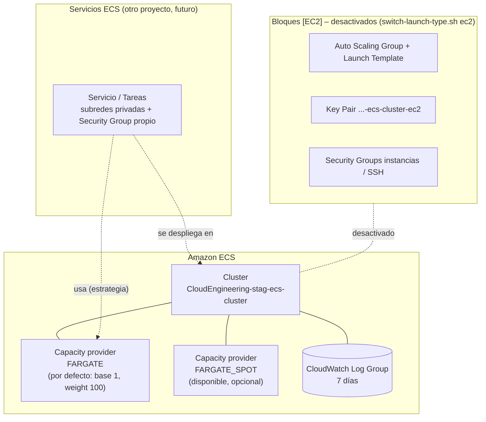
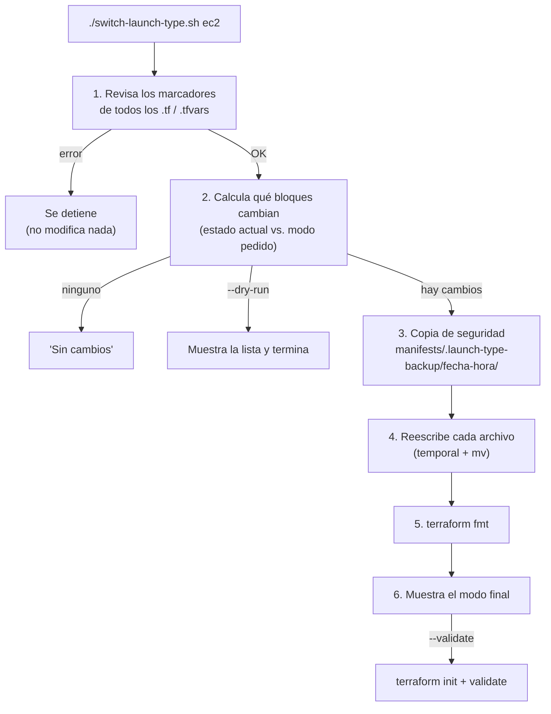

# 🚢 AWS ECS Cluster (Fargate / EC2) – Terraform

Este proyecto crea un **cluster de Amazon ECS** cuyos contenedores se ejecutan con **AWS Fargate**: AWS pone y administra los servidores, y tú solo defines los contenedores.

El código para usar **servidores EC2 propios** (Auto Scaling Group, key pair, firewalls...) **sigue en los archivos, pero comentado** dentro de bloques `# >>> [EC2]`. Puedes cambiar de modo en cualquier momento con el script [`switch-launch-type.sh`](switch-launch-type.sh). Ver [Cambiar entre Fargate y EC2](#cambiar-entre-fargate-y-ec2).

Tus aplicaciones se despliegan sobre este cluster con [`ECS-services-module`](../ECS-services-module/README.md).

| 🧭 Ficha rápida | |
|---|---|
| **Paso en el despliegue** | **3** ([guía](../README.md#guía-de-despliegue-paso-a-paso)) |
| **Depende de** | Nada en modo Fargate · [`VPC-module`](../VPC-module/README.md) en modo EC2 |
| **Lo usan** | [`ECS-services-module`](../ECS-services-module/README.md): los servicios se despliegan en este cluster |
| **Recursos (`plan`)** | 4 (Fargate) / 21 (EC2) |
| **Tiempo de despliegue** | ~1 min (Fargate) / 3–5 min (EC2) |
| **Costo principal** | Casi nada en Fargate (se pagan las tareas de los servicios) · las instancias `t3.medium` en EC2 |

> 🗺️ Vista general de toda la plataforma: [README de Terraform](../README.md).

---

## Índice

1. 📦 [¿Qué se crea?](#qué-se-crea)
2. 📚 [Conceptos básicos](#conceptos-básicos)
3. 🗺️ [Diagrama](#diagrama)
4. 🔍 [Cómo funciona](#cómo-funciona)
5. 🔗 [¿De qué depende? (remote state)](#de-qué-depende-remote-state)
6. 📁 [Estructura de archivos](#estructura-de-archivos)
7. 🏷️ [Versiones](#versiones)
8. ⚙️ [Variables](#variables)
9. 📤 [Outputs](#outputs)
10. 🧪 [Cómo probarlo sin crear nada (plan)](#cómo-probarlo-sin-crear-nada-plan)
11. 🚀 [Cómo desplegarlo paso a paso](#cómo-desplegarlo-paso-a-paso)
12. 🧩 [Cómo usar el cluster desde otro proyecto](#cómo-usar-el-cluster-desde-otro-proyecto)
13. 🔄 [Cambiar entre Fargate y EC2](#cambiar-entre-fargate-y-ec2)
14. 🤖 [El script switch-launch-type.sh: uso y funcionamiento](#el-script-switch-launch-typesh-uso-y-funcionamiento)
15. 🔒 [Seguridad](#seguridad)
16. 💰 [Costos](#costos)
17. 🛠️ [Problemas frecuentes](#problemas-frecuentes)

---

## ¿Qué se crea?

Se crea un cluster ECS vacío llamado `CloudEngineering-stag-ecs-cluster`, listo para ejecutar contenedores en **Fargate** o en **Fargate Spot**. **No se crea ningún servidor.**

| Recurso | Cantidad | ¿Para qué sirve? |
|---|---|---|
| **Cluster ECS** | 1 | El "orquestador" que agrupa y vigila tus servicios y tareas |
| **Capacity providers** `FARGATE` y `FARGATE_SPOT` | 2 (asociados) | Las dos formas de obtener capacidad sin servidores: normal y Spot (más barata) |
| **Estrategia por defecto** | 1 | Si un servicio no dice dónde ejecutarse, va a `FARGATE` |
| **CloudWatch Log Group** `/aws/ecs/CloudEngineering-stag-ecs-cluster` | 1 | Guarda el registro de las sesiones de **ECS Exec**, con 7 días de retención |

> 💡 **Analogía:** con EC2 eras dueño de las oficinas: tenías que comprar escritorios, mantenerlos y decidir cuántos hacían falta.
> Con Fargate **alquilas un escritorio por cada trabajo, solo mientras dura**. El edificio y el mantenimiento son problema de AWS.

---

## Conceptos básicos

| Término | Qué significa en palabras simples |
|---|---|
| **Contenedor** | Una aplicación empaquetada con todo lo que necesita (por ejemplo, una imagen Docker). |
| **ECS** (Elastic Container Service) | El servicio de AWS que ejecuta y vigila contenedores. |
| **Cluster** | Un grupo lógico donde viven tus servicios y tareas. Con Fargate es solo una "carpeta" y no tiene servidores visibles. |
| **Task (tarea)** | Uno o varios contenedores ejecutándose juntos. |
| **Service (servicio)** | Mantiene corriendo un número fijo de tareas y las reemplaza si fallan. |
| **Fargate** | Modo "sin servidores": AWS crea una pequeña máquina aislada para cada tarea, con la CPU y memoria que pidas. |
| **Fargate Spot** | Igual que Fargate, pero usando capacidad sobrante de AWS: **hasta ~70 % más barato**. Puede ser interrumpido con 2 minutos de aviso, así que úsalo para tareas que toleren reinicios. |
| **Capacity provider** | De dónde saca ECS la capacidad: `FARGATE`, `FARGATE_SPOT` o un grupo de EC2 propio. |
| **Capacity provider strategy** | La regla de reparto de tareas entre capacity providers (`base` y `weight`). |
| **`awsvpc`** | El modo de red de Fargate: **cada tarea recibe su propia IP privada y su propio Security Group** dentro de la VPC. |
| **ECS Exec** | Permite abrir una terminal **dentro de un contenedor en ejecución** (`aws ecs execute-command`). Con Fargate reemplaza al SSH, porque no hay servidores a los que entrar. |

---

## Diagrama



👀 **Cómo leerlo:**
- **Cluster:** tiene asociados los dos capacity providers de Fargate. `FARGATE` es el de por defecto.
- **Servicios:** se desplegarán desde **otro proyecto**. Cada uno indicará sus subredes privadas y su Security Group.
- **Bloques `[EC2]`:** muestran lo que existe en el código pero está **comentado**; hoy no se crea. Se activa con `./switch-launch-type.sh ec2`.

---

## Cómo funciona

```hcl
module "ecs_cluster" {
  source  = "terraform-aws-modules/ecs/aws//modules/cluster"
  version = "7.6.1"

  name = local.cluster_name                               # CloudEngineering-stag-ecs-cluster

  setting = [{ name = "containerInsights", value = var.ecs_container_insights }]

  # >>> [FARGATE] enabled
  cluster_capacity_providers = ["FARGATE", "FARGATE_SPOT"]
  default_capacity_provider_strategy = {
    FARGATE = { weight = 100, base = 1 }
  }
  # <<< [FARGATE]

  # >>> [EC2] disabled
  #   capacity_providers = { ec2 = { ... } }               # comentado
  #   default_capacity_provider_strategy = { ec2 = ... }
  # <<< [EC2]
  ...
}
```

- **`cluster_capacity_providers`:** asocia al cluster los dos capacity providers de Fargate. **Ya existen en AWS**, no hay que crearlos; solo se "enchufan" al cluster.
- **`default_capacity_provider_strategy`:**
  - **`base = 1`:** la primera tarea va siempre a `FARGATE`.
  - **`weight = 100`:** el resto también. Si un servicio quiere usar Spot, lo indica en su propia estrategia, por ejemplo `FARGATE = { base = 1, weight = 1 }` y `FARGATE_SPOT = { weight = 3 }`. Así 1 tarea queda en Fargate normal y el resto se reparte en proporción 1:3.
- **`setting` (Container Insights):** métricas detalladas en CloudWatch. Está en `disabled` para ahorrar.
- **ECS Exec, configurado automáticamente por el módulo:** el cluster se crea con `execute_command_configuration` en modo `logging = "OVERRIDE"`. Así, cada sesión de `aws ecs execute-command` queda registrada en el log group `/aws/ecs/CloudEngineering-stag-ecs-cluster`, para auditoría. El log group se borra solo a los 7 días (`cloudwatch_log_group_retention_in_days = 7`).
- **`create_security_group` / `create_infrastructure_iam_role = false`:** solo hacen falta para *ECS Managed Instances*. Con Fargate no se usan.

### Fargate vs. EC2: ¿qué cambió?

| Aspecto | Antes (EC2) | Ahora (Fargate) |
|---|---|---|
| Servidores | 1–3 `t3.medium` en un Auto Scaling Group | Ninguno visible; AWS crea uno aislado por tarea |
| Escalado de servidores | Managed scaling del capacity provider `ec2` | No aplica: cada tarea tiene su capacidad |
| Acceso SSH / key pair | Llave `CloudEngineering-stag-ecs-cluster-ec2` + SG de SSH | No hay servidores a los que entrar. Para depurar se usa **ECS Exec** |
| Firewall | Security Groups de las instancias en este proyecto | **Cada servicio** define el Security Group de sus tareas |
| Red | Puertos dinámicos (modo `bridge`) | Cada tarea tiene su IP (modo `awsvpc`) |
| Lectura del state de la VPC | Sí (subredes, CIDRs) | **No**. El cluster no necesita la red; la usarán los servicios |
| Costo | Pagas los servidores aunque estén vacíos | Pagas solo la CPU y memoria de las tareas mientras corren |
| Recursos en el `plan` | 21 | **4** |

---

## ¿De qué depende? (remote state)

Depende del **modo** del cluster:

| Modo | Lee el state de | Valores que usa |
|---|---|---|
| **fargate** (actual) | Ninguno | — |
| **ec2** | VPC: `vpc_state_path` → `../../VPC-module/manifests/terraform.tfstate` | `vpc_id`, `vpc_cidr_block`, `private_subnets`, `public_subnets_cidr_blocks` |

Después, **cada servicio** de [`ECS-services-module`](../ECS-services-module/README.md) lee el state del cluster para obtener `cluster_arn` y los capacity providers. Ver [Cómo usar el cluster desde otro proyecto](#cómo-usar-el-cluster-desde-otro-proyecto).

---

## Estructura de archivos

Los archivos marcados con **(solo EC2)** están completos dentro de un bloque `[EC2]`. En modo Fargate todo su contenido está comentado: Terraform los lee, pero no crean nada.

```
ECS-cluster-module/
├── README.md
├── switch-launch-type.sh            # Script para cambiar entre Fargate y EC2
└── manifests/
    ├── versions.tf                  # Terraform + providers (aws; tls y local los usa EC2)
    ├── generic-variables.tf         # región, entorno, división
    ├── local-values.tf              # name, common_tags, cluster_name  + bloque [EC2] ec2_key_name
    ├── terraform.tfvars             # us-east-1 / stag / CloudEngineering
    ├── ecs-variables.tf             # ecs_container_insights           + bloque [EC2] variables
    ├── ecs.auto.tfvars              # valores                          + bloque [EC2] valores
    ├── ecs-cluster.tf               # Cluster  + bloques [FARGATE] y [EC2] (capacity providers)
    ├── ecs-outputs.tf               # Outputs  + bloques [FARGATE] y [EC2]
    ├── remote-state-datasource.tf   # (solo EC2) lectura del state de la VPC
    ├── ecs-ami-datasource.tf        # (solo EC2) AMI ECS-optimized
    ├── ecs-keypair.tf               # (solo EC2) key pair + .pem
    ├── ecs-securitygroups.tf        # (solo EC2) SG de instancias y de SSH
    ├── ecs-autoscaling.tf           # (solo EC2) Auto Scaling Group + launch template + IAM
    ├── private-key/                 # vacía; la usa el key pair en modo EC2
    └── .launch-type-backup/         # copias de seguridad del script (se crea al usarlo; ignorada en git)
```

> ℹ️ Para ver todos los bloques y su estado: `./switch-launch-type.sh status`. En VS Code también puedes buscar `# >>> [` con `Ctrl+Shift+F`.

**Archivos que genera Terraform** (no los escribas a mano):

| Archivo | Cuándo aparece | ¿Se sube a git? |
|---|---|---|
| `.terraform/` | `terraform init` | No (ignorado por el `.gitignore` de la raíz) |
| `.terraform.lock.hcl` | `terraform init` | **Sí**: fija las versiones exactas de los providers |
| `terraform.tfstate` | Solo con `terraform apply` (`plan` no lo crea) | No |

---

## Versiones

| Componente | Versión | Comentario |
|---|---|---|
| Terraform | `>= 1.16` | Probado con v1.16.5 |
| Provider `hashicorp/aws` | `~> 6.67` | |
| Provider `hashicorp/tls` / `hashicorp/local` | `~> 4.4` / `~> 2.9` | Solo los usa el key pair `[EC2]`. Se descargan, pero no crean nada |
| Módulo `terraform-aws-modules/ecs/aws//modules/cluster` | `7.6.1` | |
| Módulo `terraform-aws-modules/autoscaling/aws` | `9.3.2` | Solo en modo EC2 (bloque `[EC2]`) |
| Módulo `terraform-aws-modules/key-pair/aws` | `3.0.1` | Solo en modo EC2 (bloque `[EC2]`) |
| `switch-launch-type.sh` | bash 4+, `awk` (gawk o mawk), herramientas GNU | Probado en Ubuntu 26.04 (WSL) con gawk y mawk. Ver [requisitos](#requisitos-del-script) |

---

## Variables

| Variable | Tipo | Valor actual | Descripción |
|---|---|---|---|
| `aws_region` | texto | `us-east-1` | Región |
| `environment` | texto | `stag` | Entorno (nombres y etiquetas) |
| `business_divsion` | texto | `CloudEngineering` | Área responsable (nombres y etiquetas) |
| `ecs_container_insights` | texto | `disabled` | `enabled` activa métricas detalladas (con costo) |

**Variables del bloque `[EC2]`**, comentadas en modo Fargate, en `ecs-variables.tf` y `ecs.auto.tfvars`: `ecs_instance_type`, `ecs_asg_min_size`, `ecs_asg_max_size`, `ecs_asg_desired_capacity`, `ecs_root_volume_size`, `ecs_target_capacity` y `vpc_state_path` (ruta al state de la VPC: `../../VPC-module/manifests/terraform.tfstate`).

---

## Outputs

| Output | Descripción | ¿Para qué lo necesitas? |
|---|---|---|
| `cluster_name` | `CloudEngineering-stag-ecs-cluster` | Para desplegar servicios en él |
| `cluster_arn` / `cluster_id` | Identificadores del cluster | Para referenciarlo desde el proyecto de servicios |
| `cluster_capacity_providers` | `["FARGATE", "FARGATE_SPOT"]` | Para la estrategia de capacidad de los servicios |

**Outputs del bloque `[EC2]`** (comentados en modo Fargate): ASG, Security Groups, rol IAM, AMI, key pair y ruta del `.pem`. En modo EC2 el output `cluster_capacity_providers` (bloque `[FARGATE]`) se reemplaza por `capacity_providers` (`["ec2"]`).

---

## Cómo probarlo sin crear nada (plan)

Estos comandos **solo leen** información de AWS. No crean, cambian ni borran nada, y tampoco generan `terraform.tfstate`:

```bash
cd Serverless/ECS-Fargate/Terraform/ECS-cluster-module/manifests
terraform init                  # descarga providers y módulos
terraform fmt -check -recursive # revisa el formato (sin salida = correcto)
terraform validate              # revisa la sintaxis y las referencias
terraform plan                  # muestra lo que se crearía
```

> ℹ️ El cluster Fargate **no lee ningún state** de otros proyectos, así que el `plan` funciona aunque la VPC o el Bastion no existan.

✅ **Resultado verificado** (Terraform v1.16.5, provider AWS 6.67.0, `us-east-1`):

| Paso | Resultado |
|---|---|
| `init` | OK |
| `fmt -check` | Sin cambios de formato |
| `validate` | `Success! The configuration is valid.` |
| `plan` | `Plan: 4 to add, 0 to change, 0 to destroy.` |

Durante el `plan`, el módulo solo **lee** 3 datos de AWS: la cuenta (`aws_caller_identity`), la región (`aws_region`) y la partición (`aws_partition`).

Extracto de lo que debe mostrar el `plan`:

```text
# module.ecs_cluster.aws_ecs_cluster.this[0] will be created
    name = "CloudEngineering-stag-ecs-cluster"
    setting { name = "containerInsights"  value = "disabled" }
    configuration { execute_command_configuration { logging = "OVERRIDE" ... } }

# module.ecs_cluster.aws_ecs_cluster_capacity_providers.this[0] will be created
    capacity_providers = ["FARGATE", "FARGATE_SPOT"]
    default_capacity_provider_strategy { base = 1  capacity_provider = "FARGATE"  weight = 100 }

# module.ecs_cluster.aws_cloudwatch_log_group.this[0] will be created
    name = "/aws/ecs/CloudEngineering-stag-ecs-cluster"   retention_in_days = 7

# module.ecs_cluster.time_sleep.this[0] will be created
    create_duration = "20s"

Plan: 4 to add, 0 to change, 0 to destroy.

Changes to Outputs:
  + cluster_name               = "CloudEngineering-stag-ecs-cluster"
  + cluster_capacity_providers = ["FARGATE", "FARGATE_SPOT"]
  + cluster_arn / cluster_id   = (known after apply)
```

🔎 **Qué comprobar en el resultado:**
- No aparece **ningún** recurso EC2: ni ASG, ni key pair, ni Security Groups, ni AMI. Si aparece alguno, el cluster está en modo EC2 o con bloques mezclados. Revísalo con `./switch-launch-type.sh status`.
- Todos los recursos llevan las etiquetas `owners = "CloudEngineering"` y `environment = "stag"`.
- `cluster_arn` y `cluster_id` muestran `(known after apply)`. Es normal: AWS los asigna al crear el cluster.

---

## Cómo desplegarlo paso a paso

### Requisitos previos

1. **Terraform 1.16 o superior**, que en este equipo está en WSL.
2. **Credenciales de AWS** (perfil `default` o `AWS_PROFILE`). Compruébalas con `aws sts get-caller-identity`.
3. **Solo en modo EC2:** la VPC ya debe estar creada (debe existir `VPC-module/manifests/terraform.tfstate`).

> ℹ️ **El cluster Fargate no necesita la VPC ni el Bastion.** Puede crearse antes o después que ellos.
> Los **servicios** que despliegues después sí necesitarán la VPC: subredes privadas con salida por el NAT Gateway, para descargar imágenes.

### Pasos

```bash
cd Serverless/ECS-Fargate/Terraform/ECS-cluster-module/manifests
```

| # | Comando | Qué hace |
|---|---|---|
| 1 | `terraform init` | Descarga los providers y el módulo ECS |
| 2 | `terraform validate` | Comprueba que el código no tenga errores |
| 3 | `terraform plan` | **Muestra** lo que se va a crear, sin crearlo |
| 4 | `terraform apply` | Crea los recursos. Escribe `yes` para confirmar |
| 5 | `terraform output` | Muestra el nombre y el ARN del cluster |

🔎 **Qué deberías ver en el `plan`: 4 recursos.**
- `aws_ecs_cluster`
- `aws_ecs_cluster_capacity_providers`: incluye `FARGATE`, `FARGATE_SPOT` y la estrategia por defecto.
- `aws_cloudwatch_log_group`
- `time_sleep`: una espera interna del módulo de **20 segundos**, que no crea nada en AWS. Da tiempo a que AWS termine de configurar el cluster antes de asociarle los capacity providers.

🔎 **Comprobar el cluster:**

```bash
aws ecs describe-clusters --clusters CloudEngineering-stag-ecs-cluster \
  --query 'clusters[0].{status:status,capacityProviders:capacityProviders,default:defaultCapacityProviderStrategy}'
```

### Eliminar

```bash
terraform destroy
```

Antes de destruir el cluster, elimina los servicios ECS que hayas desplegado en él.

---

## Cómo usar el cluster desde otro proyecto

Este proyecto **solo crea el cluster**. Los servicios (tus aplicaciones) se despliegan desde [`ECS-services-module`](../ECS-services-module/README.md). Ese proyecto ya está creado e incluye un servicio nginx de prueba detrás del [ALB](../ALB-module/README.md).

Lee los outputs de este proyecto con `terraform_remote_state`, el mismo mecanismo que usa el Bastion para leer la VPC. Así lo hace cada servicio, por ejemplo [`ECS-services-module/services/nginx-1/manifests/remote-state-datasource.tf`](../ECS-services-module/services/nginx-1/manifests/remote-state-datasource.tf):

```hcl
# En ECS-services-module/services/<servicio>/manifests/remote-state-datasource.tf (extracto)
data "terraform_remote_state" "ecs_cluster" {
  backend = "local"
  config = {
    path = var.ecs_cluster_state_path   # "../../../../ECS-cluster-module/manifests/terraform.tfstate"
  }
}

data "terraform_remote_state" "vpc" {
  backend = "local"
  config = {
    path = var.vpc_state_path           # "../../../../VPC-module/manifests/terraform.tfstate"
  }
}

# Uso:
#   cluster_arn = data.terraform_remote_state.ecs_cluster.outputs.cluster_arn
#   subnets     = data.terraform_remote_state.vpc.outputs.private_subnets
```

📋 **Qué necesita cada servicio Fargate:**

| Necesita | De dónde sale | Por qué |
|---|---|---|
| ARN o nombre del cluster | Output `cluster_arn` / `cluster_name` de este proyecto | Para saber en qué cluster ejecutarse |
| Subredes privadas | Output `private_subnets` de la VPC | En modo `awsvpc` cada tarea recibe una IP dentro de esas subredes |
| Un Security Group propio | Lo crea el proyecto de servicios | Define qué tráfico llega a las tareas (por ejemplo, solo desde el ALB) |
| Salida a Internet | NAT Gateway de la VPC | Para descargar la imagen del contenedor (Docker Hub, ECR...) |
| `assign_public_ip = false` | Configuración del servicio | Las tareas quedan privadas y salen por el NAT |
| Estrategia de capacidad (opcional) | Configuración del servicio | Si no se indica, usa la del cluster (`FARGATE`). Para ahorrar, se puede repartir con `FARGATE_SPOT` |
| `enable_execute_command = true` (opcional) | Configuración del servicio | Para poder entrar a los contenedores con ECS Exec |

🖥️ **Entrar a un contenedor con ECS Exec.** Requiere el [plugin de Session Manager](https://docs.aws.amazon.com/systems-manager/latest/userguide/session-manager-working-with-install-plugin.html) y que el servicio tenga `enable_execute_command = true`:

```bash
aws ecs execute-command --cluster CloudEngineering-stag-ecs-cluster \
  --task <task-id> --container <nombre-del-contenedor> \
  --interactive --command "/bin/sh"
```

La sesión queda registrada en el log group `/aws/ecs/CloudEngineering-stag-ecs-cluster`.

---

## Cambiar entre Fargate y EC2

El cluster puede funcionar en **uno de dos modos**, y en cada momento solo uno está activo:

| Modo | Quién pone los servidores | Recursos en el `plan` | Necesita |
|---|---|---|---|
| **`fargate`** (actual) | AWS | 4 | Solo credenciales de AWS |
| **`ec2`** | Tú: un Auto Scaling Group de `t3.medium` | 21 | El state de la VPC (con el output `public_subnets_cidr_blocks`) y el NAT Gateway |

Para cambiar de modo hay que **comentar** el código de un modo y **descomentar** el del otro. Hay dos formas de hacerlo: con el script ([opción A](#opción-a-con-el-script-recomendado)), que es lo recomendado, o a mano ([opción B](#opción-b-a-mano)).

### Cómo está marcado el código: bloques

Todo el código que depende del modo está dentro de **bloques** delimitados por dos líneas especiales:

```hcl
# >>> [EC2] disabled        <- apertura: modo del bloque + estado actual (enabled | disabled)
# ...código comentado...
# <<< [EC2]                 <- cierre
```

- **Activo (`enabled`):** el código del bloque es normal y Terraform lo usa.
- **Inactivo (`disabled`):** **cada línea** del bloque empieza con `# `, así que Terraform la ignora. Si la línea ya era un comentario, queda con doble `#` (`# # comentario`); así se distingue del código.
- El **estado** se guarda en la línea de apertura. Por eso el script sabe qué hacer y no comenta dos veces lo mismo.

Ejemplo real en `ecs-cluster.tf`, en modo Fargate:

```hcl
  # >>> [FARGATE] enabled
  # Capacity Providers - AWS Fargate (on-demand) and Fargate Spot (cheaper, can be interrupted)
  cluster_capacity_providers = ["FARGATE", "FARGATE_SPOT"]
  ...
  # <<< [FARGATE]

  # >>> [EC2] disabled
  #   # Capacity Provider - EC2 instances of the Auto Scaling Group
  #   capacity_providers = {
  #     ec2 = {
  ...
  # <<< [EC2]
```

**Bloques que existen en `manifests/`:**

| Archivo | Bloque `[FARGATE]` | Bloque `[EC2]` |
|---|---|---|
| `ecs-cluster.tf` | Capacity providers `FARGATE`/`FARGATE_SPOT` y la estrategia por defecto `FARGATE` | Capacity provider `ec2` (ASG + managed scaling) y la estrategia por defecto `ec2` |
| `ecs-outputs.tf` | Output `cluster_capacity_providers` | Outputs del ASG, Security Groups, rol IAM, AMI, key pair y `.pem` |
| `ecs-variables.tf` | — | Variables de EC2 (tipo, tamaños del ASG, disco, `ecs_target_capacity`, `vpc_state_path`) |
| `ecs.auto.tfvars` | — | Valores de esas variables |
| `local-values.tf` | — | `ec2_key_name` |
| `remote-state-datasource.tf` | — | Todo el archivo (lectura del state de la VPC) |
| `ecs-ami-datasource.tf` | — | Todo el archivo (AMI ECS-optimized) |
| `ecs-keypair.tf` | — | Todo el archivo (key pair `CloudEngineering-stag-ecs-cluster-ec2`) |
| `ecs-securitygroups.tf` | — | Todo el archivo (SG de instancias y de SSH) |
| `ecs-autoscaling.tf` | — | Todo el archivo (Auto Scaling Group, launch template e IAM) |

Lo que está **fuera** de los bloques es común a los dos modos y siempre está activo:
- El cluster, su nombre y Container Insights.
- El log group.
- Los outputs `cluster_name`, `cluster_arn` y `cluster_id`.
- Los providers.

> ⚠️ **Los modos son excluyentes.** AWS no permite que una estrategia por defecto mezcle capacity providers de Fargate y de EC2. Por eso, al activar uno, se desactiva el otro.

### Opción A: con el script (recomendado)

Desde una terminal de **Ubuntu/WSL**:

```bash
cd Serverless/ECS-Fargate/Terraform/ECS-cluster-module
./switch-launch-type.sh status            # 1. ¿en qué modo estoy?
./switch-launch-type.sh ec2 --dry-run     # 2. ¿qué cambiaría? (no toca nada)
./switch-launch-type.sh ec2 --validate    # 3. cambia a EC2 y valida
cd manifests && terraform plan            # 4. revisa el plan (el script nunca hace apply)
```

Para volver: `./switch-launch-type.sh fargate`. Para deshacer el último cambio: `./switch-launch-type.sh restore`.

Todos los comandos, ejemplos de salida y el detalle de cómo funciona por dentro están en [El script switch-launch-type.sh: uso y funcionamiento](#el-script-switch-launch-typesh-uso-y-funcionamiento).

### Opción B: a mano

Si prefieres no usar el script, en VS Code el proceso es:

1. **Busca los bloques:** pulsa `Ctrl+Shift+F` y busca `# >>> [`. Aparecen las 12 aperturas (2 `[FARGATE]` y 10 `[EC2]`).
2. **Para cada bloque del modo que quieres activar,** por ejemplo `[EC2]`:
   1. Cambia `disabled` por `enabled` en la línea de apertura.
   2. Selecciona las líneas **entre** la apertura y el cierre, sin incluirlas, y pulsa `Ctrl+/` para descomentarlas. Las líneas `# # comentario` quedan como `# comentario`.
3. **Para cada bloque del otro modo,** por ejemplo `[FARGATE]`:
   1. Cambia `enabled` por `disabled`.
   2. Selecciona las líneas entre la apertura y el cierre y pulsa `Ctrl+/` para comentarlas.
4. **Revisa que no quede ningún bloque a medias:** **todos** los bloques de un modo deben estar `enabled` y **todos** los del otro, `disabled`. Si te saltas uno, Terraform dará errores como `Reference to undeclared resource`.
5. **Comprueba el resultado:**
   ```bash
   cd manifests
   terraform fmt
   terraform init -backend=false
   terraform validate
   terraform plan
   ```

> ⚠️ Mantén el formato de las líneas de apertura y cierre **exactamente** igual (`# >>> [EC2] enabled`, `# <<< [EC2]`). Así el script sigue funcionando después de un cambio manual. Puedes comprobarlo con `./switch-launch-type.sh status`.

### Si el cluster ya está creado en AWS

Cambiar de modo en los archivos **no cambia nada en AWS** hasta que ejecutes `terraform apply`. Antes de aplicar, ten en cuenta:

- **De Fargate a EC2:**
  - El `apply` **crea** el ASG, las instancias, el key pair, los Security Groups y el rol IAM.
  - Además, cambia los capacity providers del cluster de `FARGATE`/`FARGATE_SPOT` a `ec2`.
  - Los servicios que usaban Fargate deben actualizar su estrategia de capacidad o eliminarse antes.
- **De EC2 a Fargate:**
  - El `apply` **destruye** el ASG, las instancias, el key pair (y su `.pem` local) y los Security Groups.
  - **Antes de aplicar, elimina o mueve los servicios que corren en EC2**: ECS no puede retirar instancias que todavía tienen tareas.
- **Revisa siempre el `plan`:** debe mostrar exactamente lo que esperas crear y destruir.

---

## El script switch-launch-type.sh: uso y funcionamiento

[`switch-launch-type.sh`](switch-launch-type.sh) automatiza el cambio entre Fargate y EC2. En lugar de comentar y descomentar a mano 12 bloques repartidos en 10 archivos, ejecutas un solo comando.

📌 **En resumen, el script:**
- Lee los bloques `# >>> [FARGATE]` / `# >>> [EC2]` de `manifests/`.
- Activa los del modo que pidas y desactiva los del otro.
- Guarda una copia de seguridad antes de tocar nada.
- Deja el código formateado.

⚠️ **Nunca ejecuta `terraform apply`**: solo modifica archivos de texto. Crear o destruir recursos en AWS sigue siendo una decisión tuya.

### Requisitos del script

| Requisito | Detalle |
|---|---|
| Sistema | **Linux** con herramientas GNU: Ubuntu, Debian, WSL... Probado en **Ubuntu 26.04 (WSL)** |
| Shell | **bash 4 o superior.** Ubuntu trae bash 5 |
| `awk` | **gawk** o **mawk**. Ubuntu trae mawk por defecto; el script se probó con ambos |
| Otras herramientas | `find`, `grep`, `sed`, `mktemp`, `cmp`, `cp`, `mv`: vienen con cualquier Ubuntu |
| `terraform` | **Opcional.** Si está instalado, el script ejecuta `terraform fmt` y, con `--validate`, `init` y `validate`. Si no está, lo avisa y continúa |

🚫 **No funciona en:**
- **PowerShell / CMD de Windows:** es un script de bash. Usa la terminal de WSL.
- **macOS:** usa opciones exclusivas de GNU (`head -n -N`, `chmod --reference`).

### Primer uso

```bash
cd ~/Sr-Labs/Serverless/ECS-Fargate/Terraform/ECS-cluster-module

ls -l switch-launch-type.sh          # debe mostrar -rwxr-xr-x (la "x" = ejecutable)
chmod +x switch-launch-type.sh       # solo si falta el permiso de ejecución
./switch-launch-type.sh --help       # muestra la ayuda
```

> ℹ️ El script busca `manifests/` **junto a sí mismo**, así que puedes ejecutarlo desde cualquier carpeta. Por ejemplo: `~/Sr-Labs/Serverless/ECS-Fargate/Terraform/ECS-cluster-module/switch-launch-type.sh status`.
>
> Si no quieres darle permiso de ejecución, también funciona con `bash switch-launch-type.sh <comando>`.

### Comandos y opciones

```text
switch-launch-type.sh fargate [--dry-run] [--validate]   Activa Fargate y desactiva EC2
switch-launch-type.sh ec2     [--dry-run] [--validate]   Activa EC2 y desactiva Fargate
switch-launch-type.sh status                             Muestra el modo actual y cada bloque
switch-launch-type.sh restore                            Restaura la última copia de seguridad
switch-launch-type.sh -h | --help                        Muestra la ayuda
```

| Comando / opción | Qué hace | ¿Modifica archivos? |
|---|---|---|
| `status` | Lista cada bloque (archivo, línea, modo, estado) y dice el **modo actual**: `fargate`, `ec2` o `inconsistente` | No |
| `fargate` | Activa los bloques `[FARGATE]` y desactiva los `[EC2]` | Sí, salvo que ya estés en ese modo |
| `ec2` | Activa los bloques `[EC2]` y desactiva los `[FARGATE]` | Sí, salvo que ya estés en ese modo |
| `--dry-run` | Con `fargate`/`ec2`: solo **muestra** qué bloques cambiarían | No |
| `--validate` | Con `fargate`/`ec2`: después del cambio ejecuta `terraform init -backend=false` y `terraform validate` | No, más allá del cambio en sí |
| `restore` | Copia de vuelta los archivos de la **última** copia de seguridad | Sí |

📟 **Códigos de salida:**
- `0`: todo correcto. También cuando no había nada que cambiar.
- `1`: error. Por ejemplo, un argumento no reconocido, marcadores con errores, falta `manifests/` o no hay copias para `restore`.

### Ejemplos de uso

▶️ **Ver el modo actual:**

```text
$ ./switch-launch-type.sh status
Bloques en manifests/
  ARCHIVO                      LINEA  MODO     ESTADO
  ecs-ami-datasource.tf        1      EC2      disabled
  ecs-autoscaling.tf           1      EC2      disabled
  ecs-cluster.tf               18     FARGATE  enabled
  ecs-cluster.tf               31     EC2      disabled
  ecs-keypair.tf               1      EC2      disabled
  ecs-outputs.tf               21     FARGATE  enabled
  ecs-outputs.tf               29     EC2      disabled
  ecs-securitygroups.tf        1      EC2      disabled
  ecs-variables.tf             14     EC2      disabled
  ecs.auto.tfvars              4      EC2      disabled
  local-values.tf              12     EC2      disabled
  remote-state-datasource.tf   1      EC2      disabled

Modo actual: fargate
```

▶️ **Ver qué cambiaría, sin tocar nada:**

```text
$ ./switch-launch-type.sh ec2 --dry-run
==> Cambios para pasar a modo ec2:
  ecs-ami-datasource.tf        línea 1    [EC2] disabled -> enabled
  ecs-autoscaling.tf           línea 1    [EC2] disabled -> enabled
  ecs-cluster.tf               línea 18   [FARGATE] enabled -> disabled
  ecs-cluster.tf               línea 31   [EC2] disabled -> enabled
  ...
  remote-state-datasource.tf   línea 1    [EC2] disabled -> enabled
OK  --dry-run: no se modificó ningún archivo.
```

**Cambiar a EC2 y validar:**

```text
$ ./switch-launch-type.sh ec2 --validate
==> Cambios para pasar a modo ec2:
  ...(misma lista que en --dry-run)...
==> Copia de seguridad: manifests/.launch-type-backup/20261004-120411
OK  Modo actual: ec2
==> terraform init -backend=false
==> terraform validate
Success! The configuration is valid.

==> Siguiente paso: revisa los cambios con 'terraform plan' en manifests/ (este script nunca hace apply).
==> Modo ec2: el plan necesita el state de la VPC (con el output public_subnets_cidr_blocks) y el NAT Gateway.
```

▶️ **Pedir un modo en el que ya estás:**

```text
$ ./switch-launch-type.sh ec2
OK  El cluster ya está en modo ec2. Sin cambios.
```

🔄 **Volver a Fargate y deshacer:**

```bash
./switch-launch-type.sh fargate      # vuelve a Fargate
./switch-launch-type.sh restore      # o deshace el último cambio usando la copia de seguridad
```

▶️ **Después de cambiar de modo, revisa el plan:**

```bash
cd manifests
terraform plan                                      # modo fargate: 4 recursos
terraform plan                                      # modo ec2: 21 recursos (necesita el state de la VPC)
```

### Cómo funciona por dentro



🔹 **Paso 1: revisa los marcadores.** El script recorre los `.tf` y `.tfvars` de `manifests/` y comprueba que:
- Cada apertura `# >>> [MODO] enabled|disabled` tenga su cierre `# <<< [MODO]`, con el mismo modo.
- No haya bloques dentro de otros bloques.
- El modo sea `FARGATE` o `EC2`.
- En los bloques marcados `disabled`, **todas** las líneas estén comentadas.

Si algo falla, muestra el archivo y la línea del error y **se detiene sin modificar ningún archivo**:

```text
manifests/ecs-ami-datasource.tf: el bloque [EC2] abierto en la línea 1 no tiene cierre
ERROR Hay marcadores con errores (ver arriba). No se modificó ningún archivo.
```

🔹 **Paso 2: calcula los cambios.** Compara el estado de cada bloque (`enabled`/`disabled`) con el que corresponde al modo pedido:
- **Bloques del modo pedido:** deben quedar `enabled`.
- **Bloques del otro modo:** deben quedar `disabled`.

Solo se tocan los bloques que no coinciden. Gracias a esto puedes ejecutar el mismo comando varias veces sin problema.

🔹 **Paso 3: guarda una copia de seguridad.** Copia todos los `.tf`/`.tfvars` en `manifests/.launch-type-backup/<fecha-hora>/`:
- Conserva las **5 copias más recientes** y borra las anteriores.
- La carpeta está en el `.gitignore`.
- `restore` usa la más reciente.

🔹 **Paso 4: comenta y descomenta.** Esta es la regla, que es exacta y reversible:

| Acción | Qué le hace a cada línea del bloque | Ejemplo |
|---|---|---|
| **Desactivar** | Le antepone `# ` al **inicio** de la línea. Una línea vacía pasa a ser `#` | `  capacity_providers = {` → `#   capacity_providers = {` |
| | Un comentario existente queda con doble `#` | `  # Capacity Provider...` → `#   # Capacity Provider...` |
| **Activar** | Quita los espacios iniciales, el `#` y **un** espacio | `  #   capacity_providers = {` → `  capacity_providers = {` |
| | El doble `#` vuelve a ser un comentario simple | `  #   # Capacity Provider...` → `  # Capacity Provider...` |

Además:
- Se actualiza el estado en la línea de apertura: `# >>> [EC2] disabled` pasa a `# >>> [EC2] enabled`.
- Cada archivo se escribe primero en un **archivo temporal** y luego se reemplaza de una vez con `mv`. Así nunca queda un archivo a medio escribir.

> 🤔 **¿Por qué el `# ` se pone al inicio de la línea y no después de la indentación?**
> `terraform fmt` reacomoda la indentación de las líneas comentadas, pero **no toca el texto que va después del `#`**.
> Al poner el `#` delante de toda la línea, la indentación original queda guardada después del `#`. Al descomentar se recupera tal cual, incluido el contenido del `user_data` (heredoc) del Auto Scaling Group.
> Por eso pasar a `ec2` y volver a `fargate` deja los archivos **idénticos**, byte a byte.

🔹 **Paso 5: formatea.** Ejecuta `terraform fmt` sobre `manifests/` para que la indentación quede limpia.

🔹 **Paso 6: comprueba el resultado.** Vuelve a leer los bloques y muestra el modo final. Con `--validate`, ejecuta además:
- `terraform init -backend=false`, que no configura ningún backend ni crea state.
- `terraform validate`.

📁 **Qué archivos toca:**

| Toca | No toca |
|---|---|
| Los `.tf` y `.tfvars` de `manifests/` que tienen bloques (10 archivos) | `versions.tf`, `generic-variables.tf` y `terraform.tfvars`, que no tienen bloques |
| `manifests/.launch-type-backup/`, donde crea y poda copias | `terraform.tfstate`, `.terraform.lock.hcl` y la infraestructura en AWS |

### Verificación realizada

El script se probó en **Ubuntu 26.04.1 LTS (WSL)**, con bash 5.3, sin ejecutar `terraform apply`:

| Prueba | Con gawk | Con mawk 1.3.4 |
|---|---|---|
| `status` | `fargate` | `fargate` |
| `ec2 --dry-run` | No modifica archivos | No modifica archivos |
| `ec2 --validate` + `terraform plan` (state de la VPC simulado) | Válido, **21 recursos** | Válido, **21 recursos** |
| `ec2` por segunda vez | "Sin cambios" | "Sin cambios" |
| `fargate` + `diff` contra los archivos originales | **Idénticos** | **Idénticos** |
| `terraform plan` en modo Fargate | **4 recursos** | **4 recursos** |
| Bloque sin cierre (en una copia) | Se detiene, no modifica nada | Se detiene, no modifica nada |
| Argumento inválido | Error, código de salida 1 | Error, código de salida 1 |

### Si editas los archivos a mano

El script convive con los cambios manuales siempre que respetes el formato de los marcadores:
- **No cambies** las líneas `# >>> [MODO] enabled|disabled` ni `# <<< [MODO]`, salvo la palabra `enabled`/`disabled`.
- **Dentro de un bloque `disabled`,** toda línea nueva debe empezar con `#`.
- **Para añadir código nuevo que dependa del modo,** rodéalo con un bloque nuevo:
  ```hcl
  # >>> [EC2] enabled
  ...código que solo aplica a EC2...
  # <<< [EC2]
  ```
  Pon `enabled` o `disabled` según el modo actual. El script lo detecta automáticamente; no hay que registrarlo en ningún sitio.
- **Para comprobar el resultado,** ejecuta `./switch-launch-type.sh status`. Si dice `inconsistente`, ejecuta `./switch-launch-type.sh <modo>` para dejarlo todo coherente.

---

## Seguridad

- **Modo Fargate: no hay servidores que administrar.**
  - No hay SSH ni llaves. Para entrar a un contenedor se usa **ECS Exec**.
  - Cada sesión de ECS Exec queda registrada en el log group `/aws/ecs/CloudEngineering-stag-ecs-cluster` (7 días).
- **El cluster no abre ningún puerto:** cada servicio define el Security Group de sus tareas.
- **Modo EC2:**
  - Las instancias van en las subredes **privadas**, sin IP pública, con el disco raíz **cifrado**.
  - SSH (puerto 22) solo desde las subredes públicas, donde está el Bastion, con una llave **distinta** de la del Bastion (`CloudEngineering-stag-ecs-cluster-ec2`).
  - La llave privada queda en `manifests/private-key/` y en `terraform.tfstate`, **sin cifrar**. No los subas a git (ya están en el `.gitignore`).
  - Alternativa más segura: **SSM Session Manager**. Las instancias ya tienen la política `AmazonSSMManagedInstanceCore`.
- **Container Insights está desactivado** (`disabled`): no hay métricas detalladas. Ver [mejoras DevSecOps](../README.md#oportunidades-de-mejora-devsecops).

---

## Costos

| Recurso | Costo |
|---|---|
| Cluster ECS, capacity providers | Gratis |
| CloudWatch Log Group | Mínimo (7 días de retención) |
| Container Insights | `disabled`. Si lo activas, se cobra por métricas |
| **Tareas Fargate** (cuando despliegues servicios) | Por vCPU y GB de memoria **por segundo**, mientras la tarea corre |
| Tareas Fargate Spot | Hasta ~70 % más barato, pero interrumpible |

**Mientras no despliegues servicios, el cluster prácticamente no cuesta nada.**

---

## Problemas frecuentes

| Síntoma | Causa probable | Solución |
|---|---|---|
| `Reference to undeclared resource` / `undeclared input variable` tras un cambio manual | Se activó una parte de los bloques `[EC2]`, pero no todos | Ejecuta `./switch-launch-type.sh status`. Si dice `inconsistente`, ejecuta `./switch-launch-type.sh ec2` o `fargate` |
| `Value for undeclared variable` (warning) | Se activó el bloque `[EC2]` de `ecs.auto.tfvars` sin el de `ecs-variables.tf` | Igual que el anterior: deja todos los bloques en el mismo modo con el script |
| `Attribute redefined` (`default_capacity_provider_strategy` ya definido) | Los bloques `[FARGATE]` y `[EC2]` de `ecs-cluster.tf` están activos a la vez | Los modos son excluyentes: ejecuta `./switch-launch-type.sh fargate` o `ec2` |
| `status` muestra `Modo actual: inconsistente` | Hay bloques de ambos modos activos, o de un mismo modo con estados distintos | Ejecuta `./switch-launch-type.sh <modo>`: deja todos los bloques coherentes |
| `ERROR Hay marcadores con errores` (el script se detiene) | Un bloque sin `# <<< [MODO]`, una apertura mal escrita o una línea sin comentar dentro de un bloque `disabled` | El mensaje indica el archivo y la línea. Corrígelo a mano o ejecuta `./switch-launch-type.sh restore` |
| `Permission denied` al ejecutar `./switch-launch-type.sh` | El archivo perdió el permiso de ejecución (pasa al editarlo o copiarlo desde Windows) | `chmod +x switch-launch-type.sh`, o ejecútalo con `bash switch-launch-type.sh ...` |
| `bash: ./switch-launch-type.sh: /usr/bin/env: 'bash\r'` | El archivo se guardó con finales de línea de Windows (CRLF) | En VS Code cambia `CRLF` por `LF` (barra inferior), o ejecuta `sed -i 's/\r$//' switch-launch-type.sh` |
| El script no funciona en PowerShell | Es un script de bash | Ejecútalo desde una terminal de WSL o Linux |
| Quiero deshacer el último cambio de modo | — | `./switch-launch-type.sh restore` (restaura la copia más reciente de `manifests/.launch-type-backup/`) |
| Las tareas Fargate quedan en `PENDING` y fallan con `CannotPullContainerError` | La tarea no tiene salida a Internet | Usa subredes privadas con NAT Gateway (o `assign_public_ip = true` en subred pública) |
| Tareas en Fargate Spot se detienen solas | AWS reclamó la capacidad Spot | Es normal; usa `base` en `FARGATE` para mantener un mínimo estable |
| `ecs_container_insights must be "enabled" or "disabled"` | Valor no válido | Usa exactamente `enabled` o `disabled` |
| El `plan` muestra recursos EC2 (ASG, key pair, SG...) y querías Fargate | El cluster está en modo `ec2`, o hay bloques mezclados | `./switch-launch-type.sh status` y después `./switch-launch-type.sh fargate` |
| `No valid credential sources found` en el `plan` | Faltan credenciales de AWS | Ejecuta `aws configure` y revisa el perfil `default` |
| `aws ecs execute-command` falla con `TargetNotConnectedException` | El servicio no tiene `enable_execute_command = true`, o falta el plugin de Session Manager | Activa la opción en el servicio, vuelve a desplegar las tareas e instala el plugin |
