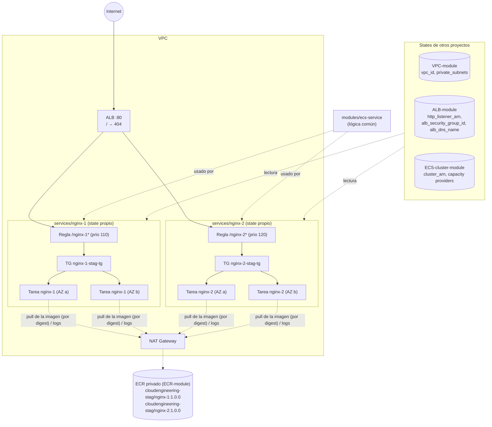

# 🧩 AWS ECS Services (tus aplicaciones) – Terraform

Este proyecto despliega **tus aplicaciones** (contenedores) como **servicios de Amazon ECS**, publicadas en Internet a través del [ALB](../ALB-module/README.md).

**Cada servicio vive en su propio directorio** (`services/<nombre>/`), con su **propio proyecto Terraform y su propio state**. Así cada aplicación se despliega, actualiza o elimina **por separado**, sin tocar a las demás.

Toda la lógica común está en un **módulo reutilizable** (`modules/ecs-service/`); cada servicio solo describe sus datos en un archivo `service.auto.tfvars`.

Incluye **dos servicios de prueba**, `nginx-1` y `nginx-2`, cada uno en su propia ruta del ALB. Cada servicio puede ejecutarse con **AWS Fargate** (por defecto) o en **instancias EC2** del cluster.

Las imágenes se guardan en tu registro privado [**ECR**](../ECR-module/README.md) y se despliegan **fijadas por su digest**. Un servicio también puede usar cualquier otra imagen (ECR Public, Docker Hub...).

| 🧭 Ficha rápida | |
|---|---|
| **Paso en el despliegue** | **5** – siempre el último ([guía](../README.md#guía-de-despliegue-paso-a-paso)) |
| **Depende de** | VPC, ALB, cluster ECS y, si usa `ecr_repository`, ECR con la imagen subida |
| **Lo usan** | Tus usuarios, a través del ALB (`http://<dns del ALB>/<ruta>`) |
| **Recursos (`plan`)** | 17 por servicio |
| **Tiempo de despliegue** | 2–5 min por servicio (hasta que las tareas pasan el health check) |
| **Costo principal** | Tareas Fargate: por vCPU y GB de memoria por segundo |

> 🗺️ Vista general de toda la plataforma: [README de Terraform](../README.md).

---

## Índice

1. 📦 [¿Qué se crea?](#qué-se-crea)
2. 📚 [Conceptos básicos](#conceptos-básicos)
3. 🗺️ [Diagrama](#diagrama)
4. 🔍 [Cómo funciona](#cómo-funciona)
5. 🔗 [¿De qué depende? (remote state)](#de-qué-depende-remote-state)
6. 📁 [Estructura de archivos](#estructura-de-archivos)
7. 🏷️ [Versiones](#versiones)
8. ⚙️ [Variables](#variables)
9. 📤 [Outputs](#outputs)
10. 🧪 [Cómo probarlo sin crear nada (plan)](#cómo-probarlo-sin-crear-nada-plan)
11. 🚀 [Cómo desplegarlo paso a paso](#cómo-desplegarlo-paso-a-paso)
12. ➕ [Cómo añadir una aplicación nueva](#cómo-añadir-una-aplicación-nueva)
13. 🩺 [Comprobar y depurar un servicio](#comprobar-y-depurar-un-servicio)
14. 🔒 [Seguridad](#seguridad)
15. 💰 [Costos](#costos)
16. 🛠️ [Problemas frecuentes](#problemas-frecuentes)

---

## ¿Qué se crea?

Hay dos servicios de prueba, cada uno con **2 tareas** Fargate de 0.25 vCPU / 0.5 GB en las subredes privadas. Cada uno muestra una página con su nombre:

| Servicio | Directorio | URL | Prioridad en el ALB |
|---|---|---|---|
| `nginx-1` | [`services/nginx-1/`](services/nginx-1/manifests/) | `http://<dns del ALB>/nginx-1/` | 110 |
| `nginx-2` | [`services/nginx-2/`](services/nginx-2/manifests/) | `http://<dns del ALB>/nginx-2/` | 120 |

La raíz `http://<dns del ALB>/` sigue respondiendo `404`, porque ningún servicio la atiende.

📦 **Por cada servicio** se crean **17 recursos**:

| Recurso | Cantidad | Ejemplo (`nginx-1`) | ¿Para qué sirve? |
|---|---|---|---|
| **Target group** | 1 | `nginx-1-stag-tg` | Grupo de IPs de las tareas al que el ALB envía el tráfico. Incluye el health check |
| **Listener rule** | 1 | `/nginx-1`, `/nginx-1/*` → prioridad 110 | "Las peticiones a esta ruta van a este target group" (en el listener :80 del ALB) |
| **Task definition** | 1 | `CloudEngineering-stag-nginx-1` | La "receta" del contenedor: imagen, CPU, memoria, puerto, comando, logs |
| **Servicio ECS** | 1 | `CloudEngineering-stag-nginx-1` | Mantiene siempre N tareas corriendo y las registra en el target group |
| **Security Group** + 2 reglas | 3 | | Entrada: solo el puerto de la app y solo desde el ALB. Salida: todo |
| **Roles IAM** + políticas + attachments | 6 | `nginx-1-stag-exec-…`, `nginx-1-stag-task-…` | Rol de *ejecución* (descargar la imagen, escribir logs) y rol de la *tarea* (ECS Exec) |
| **Log group** de CloudWatch | 1 | | Logs del contenedor (`stdout`/`stderr`), con 7 días de retención |
| **Autoscaling** (target + 2 políticas) | 3 | mín. 2 / máx. 4 | Añade o quita tareas según CPU y memoria |

> 💡 **Analogía:** si el ALB es la recepción del edificio, cada servicio es un **departamento con su propia oficina** (su directorio).
> - Cada departamento le dice a recepción "envíame a quien pregunte por `/nginx-1`" (listener rule).
> - Tiene su propio personal (tareas) y su propio archivo de papeles (state).
> - Reorganizar un departamento no afecta a los demás.

---

## Conceptos básicos

| Término | Qué significa en palabras simples |
|---|---|
| **Imagen** | El paquete de tu aplicación. Se guarda en tu **ECR privado** ([`ECR-module`](../ECR-module/README.md)) o en otro registro (ECR Public, Docker Hub...). |
| **Digest** | Huella única de una imagen (`sha256:…`). Los servicios despliegan las imágenes del ECR **fijadas por su digest**: siempre exactamente la imagen revisada. |
| **Task definition** | La ficha técnica del contenedor: qué imagen, cuánta CPU y memoria, qué puerto, comando, variables de entorno y dónde van los logs. |
| **Task (tarea)** | Una copia de tu aplicación en ejecución. |
| **Service (servicio)** | Mantiene corriendo `desired_count` tareas, las reemplaza si fallan y las registra en el ALB. |
| **Módulo reutilizable** | Código Terraform que se escribe una vez (`modules/ecs-service/`) y se usa en cada servicio con distintos valores, como una plantilla. |
| **State por servicio** | Cada `services/<nombre>/manifests/` guarda su propio `terraform.tfstate`. Un `apply` o `destroy` solo afecta a ese servicio. |
| **`awsvpc`** | Modo de red en el que **cada tarea tiene su propia IP privada y su propio Security Group** (en Fargate y en EC2). |
| **Target group tipo `ip`** | El ALB envía el tráfico directamente a la IP de cada tarea. |
| **Health check** | El ALB pide `health_check_path` a cada tarea. Si no responde `200`, deja de enviarle tráfico y ECS la reemplaza. |
| **Listener rule priority** | Orden en que el ALB evalúa las reglas: el número más bajo va primero. **Debe ser único** en todo el ALB. |
| **Capacity provider strategy** | Dónde se ejecutan las tareas: `FARGATE`, `FARGATE_SPOT` o `ec2` (el ASG del cluster). |
| **ECS Exec** | Abrir una terminal dentro de un contenedor en ejecución (`aws ecs execute-command`). |

---

## Diagrama



---

## Cómo funciona

Cada servicio llama al módulo en [`service.tf`](services/nginx-1/manifests/service.tf), pasándole sus datos y los valores leídos de los states:

```hcl
module "service" {
  source = "../../../modules/ecs-service"

  service_name           = var.service.name
  image                  = local.container_image    # ECR: "<repo_url>@<digest>"  |  o var.service.image
  path_patterns          = var.service.path_patterns
  listener_rule_priority = var.service.listener_rule_priority
  ...
  vpc_id                     = data.terraform_remote_state.vpc.outputs.vpc_id
  listener_arn               = data.terraform_remote_state.alb.outputs.http_listener_arn
  cluster_arn                = data.terraform_remote_state.ecs_cluster.outputs.cluster_arn
  cluster_capacity_providers = local.cluster_capacity_providers
}
```

El módulo ([`modules/ecs-service/main.tf`](modules/ecs-service/main.tf)) crea:

| Recurso | Detalle |
|---|---|
| `aws_lb_target_group` | `target_type = "ip"`, health check configurable. Tiene las **`precondition`** que comprueban el modo del cluster y `autoscaling_max ≥ desired_count` |
| `aws_lb_listener_rule` | Regla `path_pattern` con la prioridad del servicio en el listener :80 del ALB |
| `module "ecs_service"` (oficial `terraform-aws-modules/ecs/aws//modules/service` 7.6.1) | Task definition, servicio, Security Group, roles IAM, log group y autoscaling |

📌 **Detalles importantes:**
- **Fargate o EC2:**
  - `capacity_provider_strategy` se calcula según `launch_type`.
  - `requires_compatibilities = [launch_type]` y `network_mode = "awsvpc"` en ambos modos.
- **Orden de creación:** el ARN del target group se toma **de la listener rule**. Así el servicio se crea después de que el target group esté enganchado al ALB, como exige ECS.
- **Nombres de los roles IAM cortos** (`<servicio>-<entorno>-exec` / `-task`): AWS limita el prefijo del nombre de un rol a 38 caracteres, y el nombre por defecto (`CloudEngineering-stag-nginx-1-task-exec-`) lo superaba.
- **Red:**
  - Tareas en las subredes privadas, sin IP pública (salen por el NAT Gateway).
  - SG que solo acepta el puerto de la app desde el SG del ALB.
- **Operación:**
  - `enable_execute_command = true`, para ECS Exec.
  - Autoscaling por CPU y memoria entre `desired_count` y `autoscaling_max`.

### Fargate o EC2 por servicio (launch_type)

| | `launch_type = "FARGATE"` (por defecto) | `launch_type = "EC2"` |
|---|---|---|
| ¿Quién pone los servidores? | AWS | Tú: el Auto Scaling Group del cluster |
| Capacity provider usado | `FARGATE` (`base = 1`) + `FARGATE_SPOT` si `fargate_spot_weight > 0` | `ec2` (variable `ec2_capacity_provider_name`) |
| Modo del cluster necesario | `fargate` | `ec2` |
| Límite práctico | Ninguno relevante | Con `awsvpc`, cada `t3.medium` admite **máximo 2 tareas** (en total, sumando todos los servicios) |

El cluster ([`ECS-cluster-module`](../ECS-cluster-module/README.md)) tiene activo **un solo modo**, que se cambia con `switch-launch-type.sh`. Cada servicio **comprueba en el `plan`** que el modo coincide. Si no coincide, falla con este mensaje:

```text
Error: Resource precondition failed
El servicio "nginx-1" usa launch_type EC2 y necesita los capacity providers
[ec2], pero el cluster ECS solo tiene [FARGATE, FARGATE_SPOT]. Cambia el modo
del cluster con ECS-cluster-module/switch-launch-type.sh (y aplica) o cambia
el launch_type del servicio.
```

🔄 **Pasar los servicios de Fargate a EC2:**
1. En `ECS-cluster-module`, ejecuta `./switch-launch-type.sh ec2` y luego `terraform apply`.
2. En **cada** `services/<nombre>/manifests/service.auto.tfvars`, pon `launch_type = "EC2"`.
3. Aplica cada servicio: `terraform apply` en su `manifests/`.
4. Revisa que `ecs_asg_max_size × 2 ≥` el total de tareas de **todos** los servicios.

💸 **Usar Fargate Spot para ahorrar:** `fargate_spot_weight = 3` deja 1 tarea fija en `FARGATE` (base) y reparte el resto en proporción 1 `FARGATE` : 3 `FARGATE_SPOT`.

---

## ¿De qué depende? (remote state)

Cada servicio lee los states locales de otros módulos en [`remote-state-datasource.tf`](services/nginx-1/manifests/remote-state-datasource.tf). Las rutas son relativas a `services/<nombre>/manifests/`, por eso suben 4 niveles:

| State | Ruta por defecto (variable) | Valores que usa | ¿Cuándo? |
|---|---|---|---|
| VPC | `vpc_state_path` → `../../../../VPC-module/manifests/terraform.tfstate` | `vpc_id`, `private_subnets` | Siempre |
| ALB | `alb_state_path` → `../../../../ALB-module/manifests/terraform.tfstate` | `http_listener_arn`, `alb_security_group_id`, `alb_dns_name` | Siempre |
| Cluster ECS | `ecs_cluster_state_path` → `../../../../ECS-cluster-module/manifests/terraform.tfstate` | `cluster_arn` y los capacity providers (`cluster_capacity_providers` o `capacity_providers`) | Siempre |
| ECR | `ecr_state_path` → `../../../../ECR-module/manifests/terraform.tfstate` | `repository_urls`, `repository_names` | **Solo** si el servicio usa `ecr_repository` |

Si el servicio usa `ecr_repository`, también se consulta en AWS la **imagen** con `data "aws_ecr_image"`, para obtener su **digest**. Si ese `image_tag` no está subido, el `plan` falla en ese punto.

Por eso los servicios son lo **último** que se despliega: VPC → ALB → Cluster → ECR + **imagen subida** → **Servicios**.

---

## Estructura de archivos

```
ECS-services-module/
├── README.md
├── modules/
│   └── ecs-service/                 # MÓDULO REUTILIZABLE (lógica común a todos los servicios)
│       ├── versions.tf              #   provider AWS requerido
│       ├── variables.tf             #   entradas + validaciones
│       ├── main.tf                  #   target group + listener rule + servicio ECS (Fargate/EC2)
│       └── outputs.tf               #   URL, nombre, ARNs, SG, log group
└── services/
    ├── nginx-1/                     # UN PROYECTO TERRAFORM POR SERVICIO
    │   └── manifests/
    │       ├── versions.tf          #   Terraform + provider AWS
    │       ├── generic-variables.tf #   región, entorno, división
    │       ├── terraform.tfvars     #   us-east-1 / stag / CloudEngineering
    │       ├── local-values.tf      #   nombres, tags, capacity providers del cluster
    │       ├── remote-state-datasource.tf  # states de la VPC, el ALB, el cluster y (opcional) el ECR + imagen
    │       ├── service-variables.tf #   variable "service" + rutas de los states
    │       ├── service.tf           #   module "service" { source = "../../../modules/ecs-service" }
    │       ├── service-outputs.tf   #   url + datos del servicio
    │       └── service.auto.tfvars  #   ← LOS DATOS DE ESTE SERVICIO (lo único que cambia)
    └── nginx-2/
        └── manifests/               #   mismos archivos; solo cambia service.auto.tfvars
```

| Pieza | Qué contiene | ¿Cuándo se toca? |
|---|---|---|
| [`modules/ecs-service/`](modules/ecs-service/) | Toda la lógica: target group, regla del ALB, servicio ECS, Fargate/EC2, validaciones, `precondition` | Solo para mejorar **todos** los servicios a la vez |
| `services/<nombre>/manifests/*.tf` | El "pegamento": provider, lectura de los states y llamada al módulo. **Es igual en todos los servicios** | Casi nunca |
| `services/<nombre>/manifests/service.auto.tfvars` | Los datos del servicio: imagen, puerto, rutas, prioridad, tamaño... | Cada vez que cambias esa aplicación |

> ℹ️ **Ventajas de un directorio y un state por servicio:**
> - Desplegar `nginx-2` no puede romper `nginx-1`.
> - Los `plan` son pequeños y fáciles de revisar.
> - Cada equipo puede ser dueño de su carpeta.
> - Se puede dar acceso o automatizar el despliegue por servicio.

---

## Versiones

| Componente | Versión |
|---|---|
| Terraform | `>= 1.16` (probado con v1.16.5) |
| Provider `hashicorp/aws` | `~> 6.67` |
| Módulo `terraform-aws-modules/ecs/aws//modules/service` | `7.6.1` (la misma versión que el cluster), usado dentro de `modules/ecs-service` |

---

## Variables

Cada servicio tiene sus valores en `services/<nombre>/manifests/`:

| Archivo | Qué contiene |
|---|---|
| `terraform.tfvars` | Generales: `aws_region`, `environment`, `business_divsion`. Deben coincidir con los demás módulos |
| `service.auto.tfvars` | La variable `service`: los datos de tu aplicación. Ver [Cómo se define un servicio](#cómo-se-define-un-servicio-serviceautotfvars) |

Otras variables, con valor por defecto, que normalmente no se tocan:

| Variable | Valor por defecto | Descripción |
|---|---|---|
| `ec2_capacity_provider_name` | `ec2` | Capacity provider del cluster en modo EC2 |
| `vpc_state_path` | `../../../../VPC-module/manifests/terraform.tfstate` | Ruta al state de la VPC |
| `alb_state_path` | `../../../../ALB-module/manifests/terraform.tfstate` | Ruta al state del ALB |
| `ecs_cluster_state_path` | `../../../../ECS-cluster-module/manifests/terraform.tfstate` | Ruta al state del cluster |
| `ecr_state_path` | `../../../../ECR-module/manifests/terraform.tfstate` | Ruta al state del ECR (solo con `ecr_repository`) |

### Cómo se define un servicio (service.auto.tfvars)

Ejemplo real de [`services/nginx-1/manifests/service.auto.tfvars`](services/nginx-1/manifests/service.auto.tfvars):

```hcl
# Subir la imagen ANTES del plan:
#   cd ../../../../ECR-module && ./push-image.sh nginx-1 1.0.0 --from public.ecr.aws/nginx/nginx:stable-alpine
service = {
  name                   = "nginx-1"
  ecr_repository         = "nginx-1"                       # repositorio de ECR-module
  image_tag              = "1.0.0"                         # se despliega fijada por su digest
  launch_type            = "FARGATE"                       # FARGATE o EC2
  container_port         = 80
  cpu                    = 256                             # 0.25 vCPU
  memory                 = 512                             # 0.5 GB
  desired_count          = 2
  autoscaling_max        = 4
  path_patterns          = ["/nginx-1", "/nginx-1/*"]      # rutas del ALB
  listener_rule_priority = 110                             # ÚNICA en todo el ALB
  health_check_path      = "/"

  # Crea /nginx-1/index.html con el nombre del servicio y arranca nginx
  command = ["/bin/sh", "-c", "mkdir -p /usr/share/nginx/html/nginx-1 && echo '<h1>nginx-1</h1>...' > .../index.html && exec nginx -g 'daemon off;'"]
}
```

> ℹ️ **¿Por qué el `command`?** El ALB **no recorta la ruta**: una petición a `/nginx-1/` llega a nginx como `/nginx-1/`. El comando crea esa carpeta con una página propia, así cada servicio muestra su nombre y se puede comprobar que el ALB enruta bien. Tus aplicaciones reales normalmente no lo necesitan: atienden sus propias rutas (por ejemplo `/api/...`).

📝 **Todos los campos de `service`:**

| Campo | Obligatorio | Por defecto | Descripción |
|---|---|---|---|
| `name` | **Sí** | — | Nombre del servicio y del contenedor. 1–20 caracteres: minúsculas, números y `-`. Se usa en los nombres de AWS. **Debe ser igual al nombre del directorio** (`services/<name>/`) |
| `ecr_repository` + `image_tag` | **Sí** (o `image`) | — | Imagen de tu **ECR privado**: nombre corto del repositorio de [`ECR-module`](../ECR-module/README.md) (`"nginx-1"`) y tag subido con `push-image.sh` (`"1.0.0"`). Se despliega como `…/repo@sha256:<digest>`. `latest` no se permite |
| `image` | **Sí** (o `ecr_repository` + `image_tag`) | — | Cualquier otra imagen (`public.ecr.aws/…`, Docker Hub…), usada tal cual. No lee el state de ECR |
| `listener_rule_priority` | **Sí** | — | Prioridad de la regla (1–50000). **Única en todo el ALB**: ver [prioridades en uso](#cómo-añadir-una-aplicación-nueva) |
| `launch_type` | No | `"FARGATE"` | `"FARGATE"` o `"EC2"` |
| `fargate_spot_weight` | No | `0` | Solo Fargate: si es mayor que 0, reparte tareas también en Fargate Spot |
| `container_port` | No | `80` | Puerto en el que escucha tu aplicación |
| `cpu` | No | `256` | 256, 512, 1024, 2048, 4096, 8192 o 16384 (1024 = 1 vCPU) |
| `memory` | No | `512` | MiB. En Fargate debe ser una [combinación válida con `cpu`](https://docs.aws.amazon.com/AmazonECS/latest/developerguide/fargate-tasks-services.html#fargate-tasks-size) |
| `desired_count` | No | `1` | Tareas al desplegar y mínimo del autoscaling |
| `autoscaling_max` | No | `4` | Máximo de tareas (≥ `desired_count`) |
| `path_patterns` | No | `["/*"]` | Rutas que el ALB envía a este servicio |
| `health_check_path` | No | `"/"` | Ruta del health check del ALB (debe responder `200`) |
| `health_check_matcher` | No | `"200"` | Códigos HTTP considerados sanos, por ejemplo `"200-299"` |
| `command` | No | — | Comando del contenedor (sustituye el `CMD` de la imagen) |
| `environment` | No | `{}` | Variables de entorno: `{ APP_ENV = "stag" }`. **Nunca secretos** |
| `readonly_root_filesystem` | No | `false` | `true` es más seguro, pero nginx necesita escribir en disco |

✔️ **Validaciones automáticas** (el `plan` falla con un mensaje claro):
- `name` debe ser válido y **coincidir con el nombre del directorio** del servicio. Así, si copias un servicio y olvidas cambiar el nombre, el `plan` falla en lugar de crear recursos duplicados.
- La imagen se define de **una sola forma**: `ecr_repository` + `image_tag`, **o** `image`.
- `image_tag` no puede ser `latest`.
- Si usas ECR, la imagen debe estar **subida**.
- `launch_type` debe ser `FARGATE` o `EC2`.
- La prioridad debe estar entre 1 y 50000.
- `cpu` debe ser uno de los valores válidos.
- `desired_count` ≥ 1 y `autoscaling_max` ≥ `desired_count`.
- El modo del cluster debe coincidir con el del servicio.

---

## Outputs

En cada `services/<nombre>/manifests/`:

| Output | Ejemplo (`nginx-1`) |
|---|---|
| `url` | `http://CloudEngineering-stag-alb-….elb.amazonaws.com/nginx-1/` |
| `service.service_name` | `CloudEngineering-stag-nginx-1` |
| `service.image` | `<cuenta>.dkr.ecr.us-east-1.amazonaws.com/cloudengineering-stag/nginx-1@sha256:…` |
| `service.launch_type` / `service.capacity_providers` | `FARGATE` / `["FARGATE"]` |
| `service.task_definition_arn` | `arn:aws:ecs:…:task-definition/CloudEngineering-stag-nginx-1:1` |
| `service.target_group_arn` / `service.listener_rule_arn` | ARNs en el ALB |
| `service.security_group_id` | SG de las tareas |
| `service.log_group` | Log group del contenedor |

```bash
terraform output -raw url
terraform output -json service | jq -r '.log_group'
```

---

## Cómo probarlo sin crear nada (plan)

En el directorio del servicio:

```bash
cd Serverless/ECS-Fargate/Terraform/ECS-services-module/services/nginx-1/manifests
terraform init
terraform validate
terraform plan          # necesita los states de la VPC, el ALB y el cluster
```

Si los otros proyectos aún no están aplicados, se pueden usar **states ficticios** con `-var vpc_state_path=... -var alb_state_path=... -var ecs_cluster_state_path=...` (y `-var ecr_state_path=...` si usa ECR). Ver la [técnica en el README general](../README.md#probar-sin-crear-nada).

> ⚠️ El módulo **consulta en AWS las subredes**, así que el state ficticio de la VPC debe usar **IDs de subred reales**, por ejemplo los de la VPC por defecto. Con IDs inventados, el `plan` falla con `no matching EC2 Subnet found`.

✅ **Resultados verificados** (states simulados, sin `apply`):

| Escenario | Resultado |
|---|---|
| `nginx-1` con el cluster en modo `fargate` | `Plan: 17 to add`. TG `nginx-1-stag-tg`, prioridad 110, rutas `/nginx-1` y `/nginx-1/*`, 2 tareas (autoscaling 2–4), roles `nginx-1-stag-exec-`/`-task-`, URL `…/nginx-1/` |
| `nginx-2` con el cluster en modo `fargate` | `Plan: 17 to add`. TG `nginx-2-stag-tg`, prioridad 120, rutas `/nginx-2*`, URL `…/nginx-2/` |
| `nginx-1` con `launch_type = "EC2"` y el cluster en modo `ec2` | `Plan: 17 to add` con estrategia `ec2` |
| `launch_type = "EC2"` con el cluster en modo `fargate` | **Falla** con la `precondition` |
| Nombre de servicio inválido (`Nginx_2`) | **Falla** con la validación |
| `nginx-2/` con `name = "nginx-1"` (copia sin renombrar) | **Falla**: `must be equal to the service directory name` |
| `ecr_repository` + `image_tag` con la imagen **sin subir** (tfvars actual) | **Falla** con `reading ECR Images: couldn't find resource`: es lo esperado hasta subirla con `push-image.sh` |
| `ecr_repository` sin el ECR aplicado | **Falla** con `Unable to find remote state` |
| `image = "public.ecr.aws/…"` | `Plan: 17 to add`, sin leer el state de ECR |
| `image` y `ecr_repository` a la vez, `ecr_repository` sin `image_tag`, o `image_tag = "latest"` | **Falla** con la validación |

> ℹ️ Las pruebas de servicios de la tabla anterior usan `-var service={... image = "public.ecr.aws/..."}`, porque los tfvars actuales apuntan al ECR y la imagen no está subida. El camino con ECR (imagen subida → digest) solo puede probarse después de aplicar `ECR-module` y ejecutar `push-image.sh`.

---

## Cómo desplegarlo paso a paso

### Requisitos previos

1. **Aplicados, en este orden:** `VPC-module` (con NAT Gateway), `ALB-module`, `ECS-cluster-module` y `ECR-module`.
2. **Imagen subida** al ECR con el `image_tag` del servicio:
   ```bash
   cd Serverless/ECS-Fargate/Terraform/ECR-module
   ./push-image.sh nginx-1 1.0.0 --from public.ecr.aws/nginx/nginx:stable-alpine
   ./push-image.sh nginx-2 1.0.0 --from public.ecr.aws/nginx/nginx:stable-alpine
   ```
3. **El cluster en el modo que usan los servicios** (`fargate` por defecto). Compruébalo con `ECS-cluster-module/switch-launch-type.sh status`.
4. **Credenciales de AWS** (perfil `default` o `AWS_PROFILE`). Compruébalas con `aws sts get-caller-identity`.

### Pasos

**Un servicio:**

```bash
cd Serverless/ECS-Fargate/Terraform/ECS-services-module/services/nginx-1/manifests
terraform init
terraform plan            # 17 to add
terraform apply           # escribe "yes"
curl -s "$(terraform output -raw url)"     # → <h1>nginx-1</h1>
```

**Todos los servicios**, uno tras otro:

```bash
cd Serverless/ECS-Fargate/Terraform/ECS-services-module/services
for s in */; do
  (cd "$s/manifests" && terraform init -input=false && terraform apply) || break
done
```

Las tareas tardan unos 1–2 minutos en arrancar y pasar el health check. Después:

```bash
curl -s http://<dns del ALB>/nginx-1/     # <h1>nginx-1</h1>
curl -s http://<dns del ALB>/nginx-2/     # <h1>nginx-2</h1>
curl -i http://<dns del ALB>/             # 404 del ALB: ningún servicio atiende "/"
```

### Eliminar

En el `manifests/` de **cada** servicio, **antes** que el cluster, el ALB y la VPC:

```bash
terraform destroy
```

---

## Cómo añadir una aplicación nueva

1. **Crea su repositorio en ECR y sube la imagen** (ver [ECR-module](../ECR-module/README.md)):
   ```bash
   cd Serverless/ECS-Fargate/Terraform/ECR-module
   # añade  mi-api = {}  a manifests/ecr.auto.tfvars  y aplica:
   terraform -chdir=manifests apply
   ./push-image.sh mi-api 1.0.0 --build ~/proyectos/mi-api
   ```
2. **Copia el directorio de un servicio existente.** Copia solo los `.tf` y `.tfvars`: **nunca** `.terraform/`, que apunta al state del servicio original.
   ```bash
   cd ../ECS-services-module/services
   mkdir -p mi-api/manifests
   cp nginx-1/manifests/*.tf nginx-1/manifests/*.tfvars mi-api/manifests/
   ```
3. **Edita `mi-api/manifests/service.auto.tfvars`** con los datos de tu aplicación:
   ```hcl
   service = {
     name                   = "mi-api"       # igual que el directorio
     ecr_repository         = "mi-api"       # repositorio de ECR-module
     image_tag              = "1.0.0"        # tag subido con push-image.sh
     container_port         = 8080
     cpu                    = 512
     memory                 = 1024
     desired_count          = 2
     path_patterns          = ["/api/*"]
     listener_rule_priority = 130            # una que nadie más use
     health_check_path      = "/api/health"
     environment            = { APP_ENV = "stag" }
   }
   ```
   El campo `command` de nginx no hace falta: bórralo.
4. **Despliega:**
   ```bash
   cd mi-api/manifests
   terraform init
   terraform plan        # 17 recursos nuevos; los demás servicios no aparecen
   terraform apply
   ```
5. **Prueba:** `curl http://<dns del ALB>/api/health`.

🔄 **Publicar una versión nueva:**
1. Sube un tag nuevo con `./push-image.sh mi-api 1.0.1 --build …`.
2. Cambia `image_tag = "1.0.1"` en el `service.auto.tfvars`.
3. Ejecuta `terraform apply` en `mi-api/manifests`.

Ver [ECR-module](../ECR-module/README.md#publicar-una-versión-nueva-de-tu-aplicación).

⚠️ **Prioridades en uso.** Cada servicio es un proyecto independiente, así que Terraform **no puede comprobar** que dos servicios tengan la misma prioridad. Si se repite, AWS lo rechaza en el `apply` con `PriorityInUse`. Mantén esta tabla actualizada:

| Prioridad | Servicio | Rutas |
|---|---|---|
| 110 | `nginx-1` | `/nginx-1`, `/nginx-1/*` |
| 120 | `nginx-2` | `/nginx-2`, `/nginx-2/*` |
| — | *(libre)* | Las rutas más específicas necesitan una prioridad **menor** (número más bajo) que las genéricas como `/*` |

➖ **Quitar un servicio:** **primero** `terraform destroy` en su `manifests/` y **después** borra su directorio. Al revés, sus recursos quedarían en AWS sin que nadie los gestione.

---

## Comprobar y depurar un servicio

```bash
CLUSTER=CloudEngineering-stag-ecs-cluster
SERVICE=CloudEngineering-stag-nginx-1
cd Serverless/ECS-Fargate/Terraform/ECS-services-module/services/nginx-1/manifests

# Estado del servicio: tareas deseadas / corriendo / eventos recientes
aws ecs describe-services --cluster $CLUSTER --services $SERVICE \
  --query 'services[0].{desired:desiredCount,running:runningCount,events:events[0:5].message}'

# ¿Las tareas están sanas para el ALB?
aws elbv2 describe-target-health --target-group-arn "$(terraform output -json service | jq -r '.target_group_arn')"

# Logs del contenedor (últimos 10 minutos)
aws logs tail "$(terraform output -json service | jq -r '.log_group')" --since 10m --follow

# Entrar al contenedor (ECS Exec; requiere el plugin de Session Manager)
TASK=$(aws ecs list-tasks --cluster $CLUSTER --service-name $SERVICE --query 'taskArns[0]' --output text)
aws ecs execute-command --cluster $CLUSTER --task "$TASK" --container nginx-1 --interactive --command "/bin/sh"
```

---

## Seguridad

- **Las tareas no tienen IP pública:** solo se llega a ellas a través del ALB.
- **SG encadenados:** el SG de cada servicio solo acepta su puerto desde el SG del ALB.
- **Aislamiento por servicio:** cada servicio tiene su propio SG, sus propios roles IAM y su propio state. Si tu app necesita acceso a S3, DynamoDB, etc., da permisos **solo** al rol de la tarea de ese servicio.
- **Secretos:** **no pongas contraseñas en `environment`**: quedan en texto plano en la task definition y en el state. Usa AWS Secrets Manager o SSM Parameter Store (ver [oportunidades de mejora](../README.md#oportunidades-de-mejora-devsecops)).
- **ECS Exec queda registrado** en el log group del cluster.

---

## Costos

| Recurso | Costo |
|---|---|
| **Tareas Fargate** | Por vCPU y GB **por segundo** mientras corren. Los 2 servicios de prueba: 4 × (0.25 vCPU + 0.5 GB) |
| Tareas Fargate Spot | Hasta ~70 % más barato que Fargate (interrumpible) |
| Tareas en EC2 | Sin costo extra: se paga la instancia del cluster |
| CloudWatch Logs | Por GB ingerido/almacenado (7 días de retención) |
| NAT Gateway (VPC) | Por GB: la descarga de imágenes pasa por él |
| Target group, listener rule, roles, SG | Gratis |

💡 Para el laboratorio:
- Usa `desired_count = 1` en los servicios de prueba.
- Usa `fargate_spot_weight`.
- Ejecuta `terraform destroy` al terminar.

---

## Problemas frecuentes

| Síntoma | Causa probable | Solución |
|---|---|---|
| `Resource precondition failed … usa launch_type EC2 … el cluster ECS solo tiene [FARGATE, FARGATE_SPOT]` | El servicio y el cluster están en modos distintos | Cambia el modo del cluster (`switch-launch-type.sh` + `apply`) o el `launch_type` del servicio |
| `PriorityInUse` al aplicar | Otro servicio (otro directorio) ya usa esa `listener_rule_priority` | Elige una libre y actualiza la [tabla de prioridades](#cómo-añadir-una-aplicación-nueva) |
| `Unable to find remote state` | Falta aplicar la VPC, el ALB o el cluster, o una ruta es incorrecta (desde `services/<nombre>/manifests/` se suben **4** niveles) | Aplica en orden o corrige `*_state_path` |
| `must be equal to the service directory name` | El `name` de `service.auto.tfvars` no coincide con el directorio (típico al copiar un servicio) | Pon `name` igual al nombre del directorio |
| `expected length of name_prefix to be in the range (1 - 38)` | Un nombre de rol IAM demasiado largo | El módulo ya usa nombres cortos. Si cambias el patrón, mantenlo por debajo de 38 caracteres |
| `no matching EC2 Subnet found` | El state de la VPC tiene subredes que no existen | Aplica la VPC real o usa IDs reales en el state ficticio |
| Copié un servicio y `plan` quiere **destruir** el original | Se copió también el `terraform.tfstate` | Borra el `terraform.tfstate` del directorio nuevo: copia solo `*.tf` y `*.tfvars` |
| Tareas en `PENDING` → `STOPPED` con `CannotPullContainerError` | Sin salida a Internet o la imagen no existe | Revisa el NAT Gateway y el nombre y tag de la imagen |
| `plan`: `reading ECR Images: couldn't find resource` | El `image_tag` no está subido en el repositorio `ecr_repository` | Súbelo: `ECR-module/push-image.sh <repo> <tag> …` |
| `plan`: `Unable to find remote state` y el servicio usa ECR | `ECR-module` no está aplicado o `ecr_state_path` es incorrecta | Aplica `ECR-module` o corrige la ruta |
| `plan`: `Define the image in ONE way` | Hay `image` y `ecr_repository` a la vez, o falta `image_tag` | Usa `ecr_repository` + `image_tag`, **o** `image` |
| La tarea falla con `exec format error` | La imagen es ARM y Fargate usa x86_64 | Súbela con `--platform linux/amd64` (valor por defecto de `push-image.sh`) |
| `503 Service Temporarily Unavailable` | No hay tareas sanas en el target group | `describe-target-health`; revisa `health_check_path`, `container_port` y los logs |
| `curl …/nginx-1` (sin `/` final) devuelve `301` | nginx redirige a `/nginx-1/` | Es normal; usa `/nginx-1/` o `curl -L` |
| `/nginx-1/` responde `404` de nginx (no del ALB) | El `command` no creó la página, o la ruta no coincide con la carpeta | Revisa el `command` y los logs del contenedor |
| Tareas reiniciándose (`unhealthy`) | Health check incorrecto, la app tarda en arrancar o el puerto no coincide | Ajusta `health_check_path`/`matcher` y `container_port` |
| Servicios EC2 en `PENDING` con `RESOURCE:ENI` | Límite de tareas `awsvpc` por instancia (sumando todos los servicios) | Sube `ecs_asg_max_size` o usa una instancia mayor |
