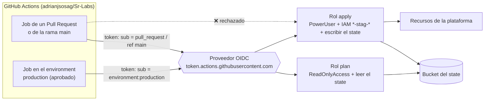

# 🔐 GitHub OIDC (acceso del pipeline a AWS) – Terraform

Este proyecto da al **pipeline de GitHub Actions** ([`.github/workflows/terraform.yml`](../../../../.github/workflows/terraform.yml)) acceso a tu cuenta de AWS **sin guardar claves en GitHub**. Crea el proveedor **OIDC** de GitHub y dos roles IAM: uno de **plan** (solo lectura) y otro de **apply** (solo con aprobación manual).

Se aplica **una sola vez y a mano**, después del bucket del state y antes de usar el pipeline. **El pipeline nunca lo aplica**: así no puede cambiar sus propios permisos.

| 🧭 Ficha rápida | |
|---|---|
| **Paso en el despliegue** | **0b** – solo si usas el pipeline, después del bucket del state ([guía](../README.md#pipeline-cicd-github-actions)) |
| **Depende de** | Bucket del state ([`S3-tfstate-backend-module`](../S3-tfstate-backend-module/README.md)) |
| **Lo usan** | El workflow `.github/workflows/terraform.yml` (variables `AWS_PLAN_ROLE_ARN` y `AWS_APPLY_ROLE_ARN`) |
| **Recursos (`plan`)** | 8 |
| **Tiempo de despliegue** | Menos de 1 min |
| **Costo principal** | Ninguno: IAM y OIDC no tienen costo |

> ⚠️ **Antes de desplegar este módulo debe existir el bucket S3 del state** ([`S3-tfstate-backend-module`](../S3-tfstate-backend-module/README.md)): su `backend.tf` guarda el state ahí. Si no existe, `terraform init` falla con `NoSuchBucket`.

> 🗺️ Vista general de toda la plataforma: [README de Terraform](../README.md).

---

## Índice

1. 📦 [¿Qué se crea?](#qué-se-crea)
2. 📚 [Conceptos básicos](#conceptos-básicos)
3. 🗺️ [Diagrama](#diagrama)
4. 🔍 [Cómo funciona](#cómo-funciona)
5. 🔗 [¿De qué depende? (remote state)](#de-qué-depende-remote-state)
6. 📁 [Estructura de archivos](#estructura-de-archivos)
7. 🏷️ [Versiones](#versiones)
8. ⚙️ [Variables](#variables)
9. 📤 [Outputs](#outputs)
10. 🧪 [Cómo probarlo sin crear nada (plan)](#cómo-probarlo-sin-crear-nada-plan)
11. 🚀 [Cómo desplegarlo paso a paso](#cómo-desplegarlo-paso-a-paso)
12. 🔒 [Seguridad](#seguridad)
13. 💰 [Costos](#costos)
14. 🛠️ [Problemas frecuentes](#problemas-frecuentes)

---

## ¿Qué se crea?

| Recurso | Nombre | ¿Para qué sirve? |
|---|---|---|
| **Proveedor OIDC** | `token.actions.githubusercontent.com` | Hace que AWS confíe en los tokens que GitHub firma para cada job. Solo puede haber uno por cuenta |
| **Rol de plan** + 2 políticas | `cloudengineering-stag-github-plan` | Lo usan los jobs de **plan** (Pull Requests y rama `main`): **solo lectura** de AWS y del state |
| **Rol de apply** + 3 políticas | `cloudengineering-stag-github-apply` | Lo usa el job de **apply**, y **solo** si corre en el environment `production` de GitHub, que exige aprobación |

> 💡 **Analogía:** el pipeline es un **contratista** que viene a trabajar al edificio.
> - En lugar de darle una copia de la llave maestra (access keys que podrían robarse), recepción comprueba su **credencial del día** (token OIDC firmado por GitHub).
> - Con la **tarjeta de visitante** (rol de plan) solo puede mirar.
> - La **tarjeta de obra** (rol de apply) se la entregan únicamente cuando el responsable firma la orden de trabajo (aprobación del environment).

---

## Conceptos básicos

| Término | Qué significa en palabras simples |
|---|---|
| **OIDC** (OpenID Connect) | Un estándar para que un servicio (GitHub) demuestre a otro (AWS) quién es, con un **token firmado** de corta duración. No hay contraseñas ni claves guardadas. |
| **Token de GitHub** | GitHub genera uno por cada job. Incluye de qué repositorio, rama, PR o environment viene: es el campo **`sub`**. |
| **`AssumeRoleWithWebIdentity`** | La llamada con la que el job cambia su token por **credenciales temporales** de AWS (1 hora) para un rol. |
| **Trust policy** | La "lista de invitados" del rol: qué `sub` pueden asumirlo. |
| **Environment de GitHub** | Una etapa (`production`) con **revisores obligatorios**: el job que la usa espera a que alguien pulse *Approve*. |
| **`PowerUserAccess`** | Política de AWS que permite casi todo excepto IAM, Organizations y la gestión de la cuenta. |

---

## Diagrama



---

## Cómo funciona

[`github-oidc.tf`](manifests/github-oidc.tf) crea el proveedor y los dos roles. La clave está en el campo `sub` de cada *trust policy*:

| Rol | `sub` aceptados | Permisos |
|---|---|---|
| **plan** | `repo:adrianjsosag/Sr-Labs:pull_request` y `repo:adrianjsosag/Sr-Labs:ref:refs/heads/main` | `ReadOnlyAccess` + leer el state + crear y borrar el bloqueo `*.tflock` |
| **apply** | **Solo** `repo:adrianjsosag/Sr-Labs:environment:production` | `PowerUserAccess` + IAM **acotado** + leer y escribir el state |

📌 **Detalles importantes:**
- **IAM acotado del rol de apply:** solo puede crear o modificar roles, políticas e instance profiles cuyo nombre contenga `-stag-`, que son los que crean los módulos (`nginx-1-stag-exec…`, `CloudEngineering-stag-…`).
  - `iam:PassRole` solo hacia `ecs-tasks` y `ec2`.
  - Puede crear *service-linked roles*.
- **No puede cambiar sus propios permisos:** sus roles (`cloudengineering-stag-github-*`) también encajan con `*-stag-*`, así que un **`Deny` explícito** (`DenyPipelineRolesChanges`) le prohíbe modificarlos.
- **Proveedor OIDC único:** si la cuenta ya lo tiene (por ejemplo, otro proyecto lo creó), pon `create_github_oidc_provider = false` y se reutiliza.

---

## ¿De qué depende? (remote state)

Guarda su state en el [bucket S3](../S3-tfstate-backend-module/README.md), con la clave `GitHub-OIDC-module/terraform.tfstate`. **No lee el state de ningún otro módulo:** solo necesita el nombre del bucket (que calcula igual que `S3-tfstate-backend-module`) para dar permisos sobre él.

Lo usa el workflow [`.github/workflows/terraform.yml`](../../../../.github/workflows/terraform.yml), a través de las *repository variables* `AWS_PLAN_ROLE_ARN` y `AWS_APPLY_ROLE_ARN`.

---

## Estructura de archivos

```
GitHub-OIDC-module/
├── README.md
└── manifests/
    ├── versions.tf              # Terraform + provider AWS
    ├── backend.tf               # State en el bucket S3 (clave GitHub-OIDC-module/terraform.tfstate)
    ├── generic-variables.tf     # región, entorno, división
    ├── terraform.tfvars         # us-east-1 / stag / CloudEngineering
    ├── local-values.tf          # nombres, etiquetas, bucket del state, repositorio
    ├── oidc-variables.tf        # repositorio, rama, environment, proveedor OIDC
    ├── oidc.auto.tfvars         # adrianjsosag / Sr-Labs / main / production
    ├── github-oidc.tf           # proveedor OIDC + roles plan y apply + políticas
    └── oidc-outputs.tf          # ARNs de los roles para las variables de GitHub
```

---

## Versiones

| Componente | Versión |
|---|---|
| Terraform | `>= 1.16` (probado con v1.16.5) |
| Provider `hashicorp/aws` | `~> 6.67` |

---

## Variables

| Variable | Tipo | Valor actual | Descripción |
|---|---|---|---|
| `aws_region` / `environment` / `business_divsion` | texto | `us-east-1` / `stag` / `CloudEngineering` | Generales; deben coincidir con los demás módulos |
| `github_owner` | texto | `adrianjsosag` | Usuario u organización de GitHub |
| `github_repository` | texto | `Sr-Labs` | Nombre del repositorio |
| `github_main_branch` | texto | `main` | Rama cuyos push (merges) pueden usar el rol de plan |
| `github_environment` | texto | `production` | Environment de GitHub cuyos jobs pueden usar el rol de apply. **Debe existir en GitHub con revisores** |
| `create_github_oidc_provider` | sí/no | `true` | `false` si la cuenta ya tiene el proveedor OIDC de GitHub |
| `state_bucket` | texto | `null` → `cloudengineering-stag-tfstate-<account_id>` | Bucket del state. Solo hace falta si tiene otro nombre |

---

## Outputs

| Output | ¿Para qué? |
|---|---|
| `plan_role_arn` | Variable de GitHub **`AWS_PLAN_ROLE_ARN`** |
| `apply_role_arn` | Variable de GitHub **`AWS_APPLY_ROLE_ARN`** |
| `aws_region` | Variable de GitHub **`AWS_REGION`** |
| `github_oidc_subjects` | Los `sub` aceptados por cada rol. Útil para depurar errores de `AssumeRoleWithWebIdentity` |

---

## Cómo probarlo sin crear nada (plan)

```bash
cd ~/Sr-Labs/Serverless/ECS-Fargate/Terraform/GitHub-OIDC-module/manifests
terraform init          # necesita el bucket del state
terraform validate
terraform plan
```

Sin bucket todavía, usa un `backend_override.tf` local: ver [Probar sin crear nada](../README.md#probar-sin-crear-nada).

✅ **Resultado verificado** (sin `apply`, con backend local temporal): `Plan: 8 to add, 0 to change, 0 to destroy.`
- Roles `cloudengineering-stag-github-plan` y `cloudengineering-stag-github-apply`.
- `sub` exactos: `pull_request`, `ref:refs/heads/main` y `environment:production`.
- Ningún permiso `iam:*` sobre `*`, y con el `Deny` sobre los roles del pipeline.

---

## Cómo desplegarlo paso a paso

> 🔐 **Siempre a mano:** el pipeline no aplica este módulo, para no poder cambiar sus propios permisos.

### Requisitos previos

1. **El bucket del state creado** ([`S3-tfstate-backend-module`](../S3-tfstate-backend-module/README.md)): es lo primero que se despliega.
2. **Credenciales de AWS con permisos de IAM** (administrador): crea un proveedor OIDC y roles. Compruébalas con `aws sts get-caller-identity`.
3. **El repositorio en GitHub** (`adrianjsosag/Sr-Labs`). Si cambia de dueño o de nombre, ajusta `oidc.auto.tfvars`.

### Pasos

```bash
cd ~/Sr-Labs/Serverless/ECS-Fargate/Terraform/GitHub-OIDC-module/manifests
terraform init
terraform plan          # 8 to add
terraform apply         # escribe "yes"
terraform output        # anota plan_role_arn, apply_role_arn y aws_region
```

Después termina la configuración en GitHub (environment `production`, variables del repositorio y protección de `main`): ver [Puesta en marcha del pipeline](../../../../.github/README.md#puesta-en-marcha-una-sola-vez).

### Eliminar

Si dejas de usar el pipeline:

```bash
terraform destroy
```

Destruye antes que el bucket del state, porque su propio state vive en él.

---

## Seguridad

| Control | Estado |
|---|---|
| **Sin claves de AWS en GitHub:** credenciales temporales de 1 hora por OIDC | ✅ |
| **Dos roles:** los PR solo pueden leer | ✅ |
| **El rol de apply exige aprobación:** solo lo asumen jobs del environment `production` | ✅ (configura revisores en GitHub) |
| **IAM acotado** a recursos `*-stag-*` y `PassRole` limitado | ✅ |
| **El pipeline no puede modificar sus propios roles** (`Deny` explícito) | ✅ |
| *Permissions boundary* obligatoria para los roles que crea el pipeline | ⏳ Pendiente: hoy podría crear un rol `*-stag-*` con cualquier política; la protección es la revisión del PR y la aprobación |
| Un par de roles por entorno o cuenta | ⏳ Pendiente (hoy solo existe `stag`) |

> ⚠️ **Configura revisores en el environment `production`.** Sin revisores, el job de apply no espera aprobación y la protección se pierde.

---

## Costos

IAM y los proveedores OIDC **no tienen costo**.

---

## Problemas frecuentes

| Síntoma | Causa probable | Solución |
|---|---|---|
| `EntityAlreadyExists: Provider with url https://token.actions.githubusercontent.com already exists` | La cuenta ya tiene el proveedor OIDC de GitHub | `create_github_oidc_provider = false` en `oidc.auto.tfvars` |
| En el pipeline: `Not authorized to perform sts:AssumeRoleWithWebIdentity` | El `sub` del token no coincide: otro repositorio u owner, workflow lanzado desde otra rama, o environment con otro nombre | Compara `terraform output github_oidc_subjects` con el repositorio y el environment reales. Ajusta `oidc.auto.tfvars` y aplica |
| En el pipeline: `AccessDenied` al crear un rol IAM | El nombre del rol no contiene `-stag-` | Usa la convención de nombres `<división>-<entorno>-…` o amplía `apply_iam` en `github-oidc.tf` |
| El job de apply no espera aprobación | El environment `production` no tiene revisores | GitHub → *Settings → Environments → production → Required reviewers* |
| `NoSuchBucket` / `S3 bucket does not exist` en `terraform init` | Aún no existe el bucket del state, o el `bucket` de `backend.tf` no coincide | Aplica antes [`S3-tfstate-backend-module`](../S3-tfstate-backend-module/README.md) |
