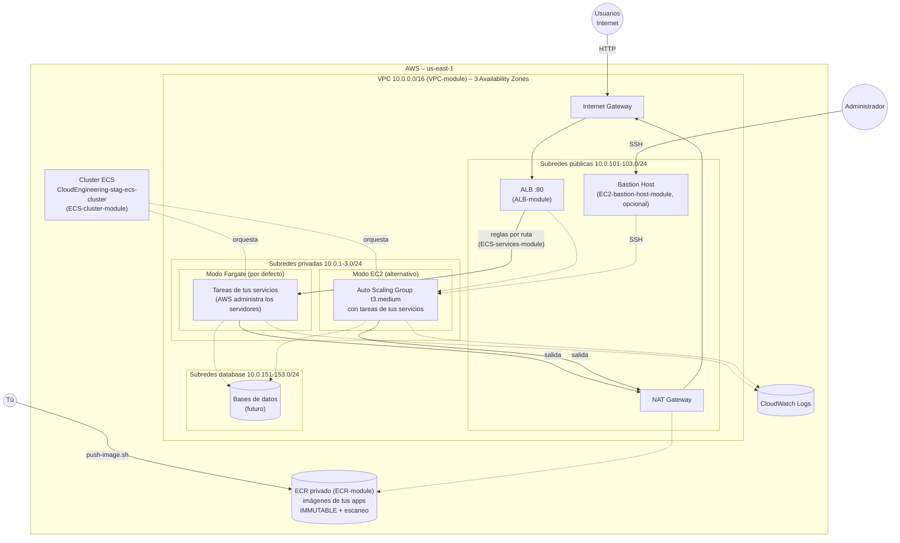
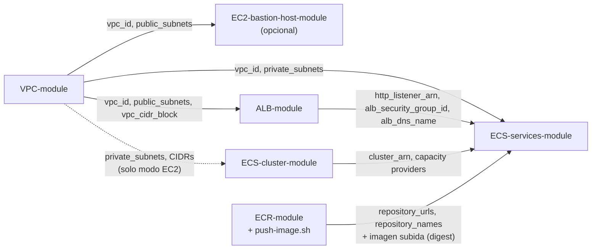
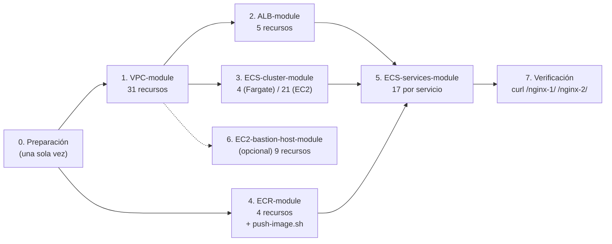
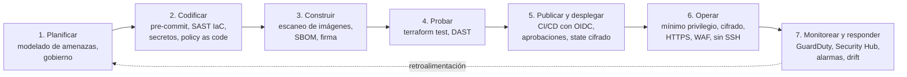
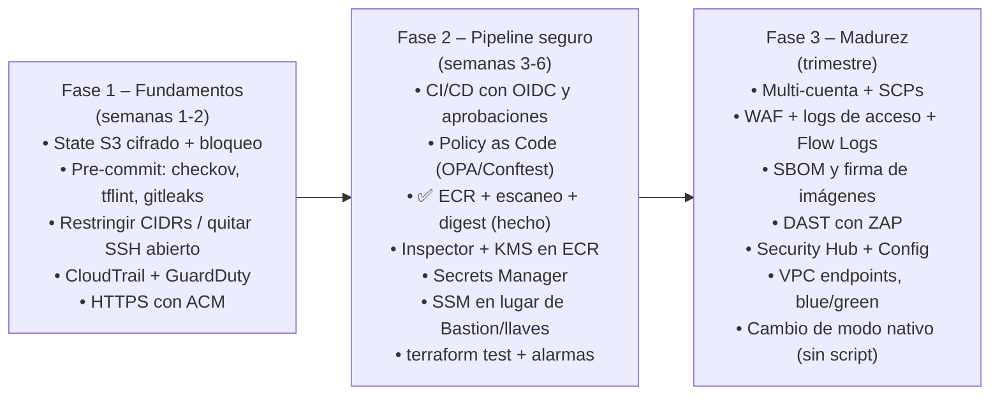

# 🐳 Plataforma de contenedores en AWS (ECS) – Terraform

Este directorio contiene la **infraestructura completa, escrita en Terraform, para desplegar tus aplicaciones en contenedores en AWS** con Amazon ECS.

Las aplicaciones pueden ejecutarse de dos formas:
- **AWS Fargate:** AWS administra los servidores; tú solo defines los contenedores. Es la opción **por defecto**.
- **Instancias EC2:** servidores propios en un Auto Scaling Group que administra el cluster.

La plataforma está dividida en **6 proyectos (módulos) independientes** que se despliegan **a mano** con Terraform, desde tu terminal. Cada uno tiene su propio README con todos los detalles; este documento explica **cómo encajan** y **cómo usarlos juntos**.

---

## Índice

1. 💡 [¿Qué es y para qué sirve?](#qué-es-y-para-qué-sirve)
2. 🗺️ [Arquitectura](#arquitectura)
3. 🧱 [Los módulos](#los-módulos)
4. 📖 [Cómo está organizada la documentación](#cómo-está-organizada-la-documentación)
5. 🔗 [Dependencias y orden de despliegue](#dependencias-y-orden-de-despliegue)
6. 🔄 [Dos formas de ejecutar tus aplicaciones: Fargate o EC2](#dos-formas-de-ejecutar-tus-aplicaciones-fargate-o-ec2)
7. 🚀 [Guía de despliegue paso a paso](#guía-de-despliegue-paso-a-paso)
8. 📲 [Guía: desplegar mi aplicación](#guía-desplegar-mi-aplicación)
9. 📏 [Convenciones comunes](#convenciones-comunes)
10. 📋 [Requisitos](#requisitos)
11. 🧪 [Probar sin crear nada](#probar-sin-crear-nada)
12. 💰 [Costos](#costos)
13. 🔒 [Seguridad](#seguridad)
14. 📈 [Oportunidades de mejora (DevSecOps)](#oportunidades-de-mejora-devsecops)
15. 🛠️ [Problemas frecuentes](#problemas-frecuentes)

---

## ¿Qué es y para qué sirve?

Imagina que quieres publicar una aplicación web (una API, una página, un microservicio) empaquetada como **imagen de contenedor** (Docker). Para que funcione en AWS de forma segura y escalable necesitas:

1. **Una red privada** con zonas públicas y privadas → [`VPC-module`](VPC-module/README.md).
2. **Una puerta de entrada web** que reparta el tráfico → [`ALB-module`](ALB-module/README.md).
3. **Un lugar donde corran los contenedores** (Fargate o EC2) → [`ECS-cluster-module`](ECS-cluster-module/README.md).
4. **Un almacén privado para tus imágenes Docker**, con escaneo de vulnerabilidades → [`ECR-module`](ECR-module/README.md).
5. **Tus aplicaciones**, descritas en unas pocas líneas → [`ECS-services-module`](ECS-services-module/README.md).
6. *(Opcional)* **Una puerta de servicio** para administrar por SSH → [`EC2-bastion-host-module`](EC2-bastion-host-module/README.md).

> 💡 **Analogía: un edificio de oficinas.**
>
> | Pieza del edificio | Módulo |
> |---|---|
> | El **edificio**, con zonas abiertas al público y zonas privadas | VPC |
> | La **recepción** que recibe a los visitantes y los dirige a cada departamento | ALB |
> | La **gestión de espacios de oficina** | Cluster ECS |
> | El **almacén**, con cajas selladas y revisadas: las versiones de tus aplicaciones | ECR |
> | Los **departamentos**: tus aplicaciones | Servicios |
> | La **portería de servicio** para el personal técnico | Bastion |
>
> El cluster puede gestionar los espacios de dos formas:
> - **Fargate:** se alquila un escritorio por trabajo, solo mientras dura.
> - **EC2:** se compran escritorios propios y se mantienen.

---

## Arquitectura



🧭 **Cómo viaja una petición:**
1. Un usuario abre `http://<dns del ALB>/`.
2. La petición entra por el **Internet Gateway** y llega al **ALB**, en las subredes públicas.
3. El ALB revisa las **reglas** que crearon los servicios (por ruta: `/`, `/api/*`...) y elige el servicio.
4. Envía la petición a una **tarea sana** de ese servicio, en las **subredes privadas**.
5. La tarea responde. Si necesita salir a Internet (descargar su imagen del **ECR**, llamar a una API externa), lo hace por el **NAT Gateway**.

📦 **Cómo llega tu aplicación hasta ahí:**
1. Subes la imagen al ECR con `push-image.sh`, que la etiqueta, la sube y la escanea.
2. El servicio la referencia por `ecr_repository` + `image_tag`.
3. ECS la despliega **fijada por su digest**.

---

## Los módulos

| Módulo | Qué crea | Lee el state de | Recursos (`plan`) | Documentación |
|---|---|---|---|---|
| [`VPC-module`](VPC-module/) | VPC, 9 subredes (pública, privada y database × 3 AZs), Internet Gateway, NAT Gateway, tablas de rutas, DB subnet group | — | 31 | [README](VPC-module/README.md) |
| [`EC2-bastion-host-module`](EC2-bastion-host-module/) | Bastion EC2 (Amazon Linux 2023) en una subred pública, Elastic IP, Security Group, key pair propio | VPC | 9 | [README](EC2-bastion-host-module/README.md) |
| [`ALB-module`](ALB-module/) | Application Load Balancer público, su Security Group y el listener HTTP :80 (404 por defecto) | VPC | 5 | [README](ALB-module/README.md) |
| [`ECS-cluster-module`](ECS-cluster-module/) | Cluster ECS en **modo Fargate** (`FARGATE` + `FARGATE_SPOT`) o **modo EC2** (ASG + capacity provider), con el script `switch-launch-type.sh` | VPC *(solo modo EC2)* | 4 (Fargate) / 21 (EC2) | [README](ECS-cluster-module/README.md) |
| [`ECR-module`](ECR-module/) | Repositorios privados de imágenes Docker (uno por aplicación): tags **inmutables**, escaneo al subir, cifrado y ciclo de vida. Incluye el script **`push-image.sh`** para construir o copiar, subir y escanear imágenes | — | 2 por repositorio (4 hoy) | [README](ECR-module/README.md) |
| [`ECS-services-module`](ECS-services-module/) | Tus aplicaciones: **un directorio y un state por servicio** (`services/<nombre>/`), que usan el módulo común `modules/ecs-service`. Cada servicio tiene target group, regla del ALB, task definition, servicio ECS, SG, IAM, logs y autoscaling. Incluye **`nginx-1`** y **`nginx-2`** de prueba, con su imagen en el ECR | VPC, ALB, Cluster, ECR *(si usa `ecr_repository`)* | 17 por servicio | [README](ECS-services-module/README.md) |

---

## Cómo está organizada la documentación

Este README explica la **plataforma completa**: cómo encajan los módulos y en qué orden se despliegan. Cada módulo tiene además su propio README, y **todos siguen la misma estructura**: si sabes dónde está algo en uno, sabes dónde está en todos.

**Al inicio de cada README de módulo:**
1. Un párrafo que explica qué es el módulo.
2. Una **🧭 Ficha rápida**: paso en el despliegue, de qué depende, quién lo usa, recursos que crea, tiempo y costo principal.
3. El **índice**.

**Secciones, siempre en este orden:**

| # | Sección | Qué responde |
|---|---|---|
| 1 | 📦 ¿Qué se crea? | Qué recursos aparecen en AWS y para qué sirve cada uno, con una analogía |
| 2 | 📚 Conceptos básicos | Glosario de los términos que se usan |
| 3 | 🗺️ Diagrama | Cómo se relacionan las piezas |
| 4 | 🔍 Cómo funciona | El código principal explicado, y los detalles propios del módulo |
| 5 | 🔗 ¿De qué depende? (remote state) | Qué states de otros módulos lee y quién lee el suyo |
| 6 | 📁 Estructura de archivos | Qué hay en cada archivo de `manifests/` |
| 7 | 🏷️ Versiones | Terraform, provider y módulos usados |
| 8 | ⚙️ Variables | Qué puedes configurar y dónde |
| 9 | 📤 Outputs | Qué devuelve el módulo y quién lo usa |
| 10 | 🧪 Cómo probarlo sin crear nada (plan) | Cómo revisarlo sin crear nada, y el resultado verificado |
| 11 | 🚀 Cómo desplegarlo paso a paso | Siempre en tres partes: **Requisitos previos**, **Pasos** y **Eliminar** |
| — | *Secciones de uso del módulo* | Por ejemplo: conectarse al Bastion, cambiar el cluster de modo, subir imágenes, añadir una aplicación |
| 12 | 🔒 Seguridad | Controles que aplica y lo que queda pendiente |
| 13 | 💰 Costos | Qué cobra AWS y cómo no pagar de más |
| 14 | 🛠️ Problemas frecuentes | Tabla de síntoma, causa probable y solución |

> 💡 **Para desplegar por primera vez**, sigue la [Guía de despliegue paso a paso](#guía-de-despliegue-paso-a-paso) de este README. Ve a los README de cada módulo cuando quieras entender o cambiar algo en detalle.

---

## Dependencias y orden de despliegue

Cada módulo es un proyecto Terraform **independiente**, con su propio `terraform.tfstate` (local, en su carpeta `manifests/`). Se conectan entre sí **leyendo los outputs del state de otro módulo** con `terraform_remote_state`, sin copiar IDs a mano:



🔢 **Orden de despliegue:**

| # | Módulo | Notas |
|---|---|---|
| 1 | `VPC-module` | Siempre el primero |
| 2 | `ALB-module` | Necesita la VPC |
| 3 | `ECS-cluster-module` | En modo Fargate no depende de nada; en modo EC2 necesita la VPC |
| 4 | `ECR-module` + `push-image.sh` | No depende de nada, pero las **imágenes deben estar subidas antes de los servicios** |
| 5 | `ECS-services-module` | Siempre el último: necesita VPC, ALB, cluster y sus imágenes en el ECR |
| — | `EC2-bastion-host-module` | Opcional; en cualquier momento después de la VPC |

🧹 **Orden de destrucción:** el **inverso**: Servicios → ECR → Cluster → ALB → Bastion → VPC.

> ⚠️ **Los states son archivos locales** (`<módulo>/manifests/terraform.tfstate`). Los demás módulos los leen por ruta relativa, así que **ejecuta todo desde la misma copia del proyecto** y no borres ni muevas esos archivos mientras la infraestructura exista. Sin ellos, Terraform "olvida" lo que creó.

> ⚠️ Si destruyes un módulo del que otros dependen, AWS impedirá borrar recursos todavía en uso. Por ejemplo, no se puede borrar el listener del ALB si aún tiene reglas de servicios.

Los comandos exactos de cada paso, qué comprobar y cómo destruir están en la [Guía de despliegue paso a paso](#guía-de-despliegue-paso-a-paso).

---

## Dos formas de ejecutar tus aplicaciones: Fargate o EC2

| | **Fargate** (por defecto) | **EC2** |
|---|---|---|
| ¿Quién administra los servidores? | AWS: no ves ningún servidor | Tú: un Auto Scaling Group de `t3.medium` |
| Parches del sistema operativo | AWS | Tú (la AMI ECS-optimized se renueva al crear instancias nuevas) |
| Cómo pagas | Por vCPU y GB de cada tarea, por segundo | Por hora de cada instancia, tenga o no tareas |
| Escalado | Cada tarea tiene su capacidad; solo escalas tareas | ECS añade o quita instancias (managed scaling) además de tareas |
| Acceso para depurar | ECS Exec (terminal en el contenedor) | ECS Exec, SSM o SSH vía Bastion con la llave del cluster |
| Ahorro extra | **Fargate Spot** (hasta ~70 % menos, interrumpible) | Instancias más grandes o reservadas, Spot (no configurado) |
| Límites | Combinaciones fijas de CPU/memoria por tarea | Con `awsvpc`, un `t3.medium` admite como máximo 2 tareas |
| **Cuándo elegirlo** | Por defecto. Cargas variables, pocos servicios, sin ganas de administrar servidores | Carga constante y alta, necesidad de GPU, acceso al host o daemons propios |

### Cómo se elige el modo

El modo se configura en **dos sitios** que deben coincidir:

1. **El cluster** ([`ECS-cluster-module`](ECS-cluster-module/README.md)) tiene activo **un modo a la vez**:
   ```bash
   cd ECS-cluster-module
   ./switch-launch-type.sh status        # ver el modo actual
   ./switch-launch-type.sh ec2           # o: ./switch-launch-type.sh fargate
   cd manifests && terraform plan && terraform apply
   ```
   El script comenta o descomenta los bloques `# >>> [FARGATE]` / `# >>> [EC2]` del código. Ver [su documentación](ECS-cluster-module/README.md#el-script-switch-launch-typesh-uso-y-funcionamiento).

2. **Cada servicio** ([`ECS-services-module`](ECS-services-module/README.md)) indica su `launch_type` en `services/<nombre>/manifests/service.auto.tfvars`:
   ```hcl
   service = {
     name        = "nginx-1"
     ...
     launch_type = "FARGATE"     # o "EC2"
   }
   ```

Si no coinciden, el `plan` de servicios **falla con un mensaje claro** antes de crear nada.

### Pasar mis aplicaciones de Fargate a EC2 (o al revés)

1. **Cluster:** ejecuta `./switch-launch-type.sh ec2` en `ECS-cluster-module` y luego `terraform apply`. Se crean el ASG, las instancias, la llave y el rol IAM.
2. **Servicios:** cambia `launch_type = "EC2"` en el `service.auto.tfvars` de **cada** servicio (`ECS-services-module/services/<nombre>/manifests/`) y ejecuta `terraform apply` en cada uno.
3. **Capacidad:** revisa que `ecs_asg_max_size` × 2 ≥ el total de tareas de todos tus servicios.

Para volver a Fargate, haz lo mismo al revés **empezando por los servicios**: pásalos a `FARGATE` y aplica. Después ejecuta `./switch-launch-type.sh fargate` en el cluster y aplica. Así ECS no tiene que retirar instancias que todavía tienen tareas.

---

## Guía de despliegue paso a paso

Esta guía despliega **toda la plataforma** en tu cuenta de AWS con los módulos actuales, en el **orden correcto**:
- La red y el balanceador.
- El cluster.
- El registro de imágenes (ECR), con las imágenes de nginx subidas.
- Los dos servicios de prueba (`nginx-1` y `nginx-2`).

| | Valor |
|---|---|
| **Dónde se ejecuta** | Terminal de **WSL / Ubuntu**, en `~/Sr-Labs/Serverless/ECS-Fargate/Terraform/` |
| **Tiempo aproximado** | 25–35 minutos en total (lo que más tarda es el NAT Gateway, el ALB y el arranque de las tareas) |
| **Recursos que se crean** | Modo Fargate: 31 (VPC) + 5 (ALB) + 4 (cluster) + 4 (ECR) + 17 × 2 (servicios) = **78**, +9 con el Bastion |
| **Costo** | Empieza a cobrarse en cuanto se crea el NAT Gateway (paso 1). Ver [Costos](#costos) |



> ⚠️ **Regla de oro:** en cada paso, **lee el `plan`** que muestra `terraform apply` antes de escribir `yes`. Comprueba que el número de recursos coincide con el de esta guía y que dice **`0 to destroy`**.

### Paso 0: Preparación (una sola vez)

```bash
cd ~/Sr-Labs/Serverless/ECS-Fargate/Terraform

# 1. Herramientas y credenciales
terraform version                      # >= 1.16
aws sts get-caller-identity            # debe mostrar tu cuenta y tu usuario
docker info > /dev/null && echo "Docker OK"   # necesario para subir imágenes al ECR (paso 4)

# 2. Rol de servicio de ECS. Evita que el primer cluster falle con
#    "Unable to assume the service linked role". Si ya existe, el comando avisa y no pasa nada.
aws iam create-service-linked-role --aws-service-name ecs.amazonaws.com

# 3. Modo del cluster (por defecto: fargate)
./ECS-cluster-module/switch-launch-type.sh status
```

📋 **Revisa antes de empezar:**
- **Variables generales:** `terraform.tfvars` tiene los **mismos valores** en todos los módulos (`aws_region`, `environment`, `business_divsion`).
- **Recomendado: restringe el acceso a tu IP** mientras pruebas. Averíguala con `curl -s https://checkip.amazonaws.com`:
  - `ALB-module/manifests/alb.auto.tfvars` → `alb_allowed_cidrs = ["<tu-ip>/32"]`.
  - `EC2-bastion-host-module/manifests/ec2bastion.auto.tfvars` → `bastion_ssh_allowed_cidrs = ["<tu-ip>/32"]`.

### Paso 1: Red (`VPC-module`)

Es la base de todo; **siempre va primero**.

```bash
cd VPC-module/manifests
terraform init
terraform apply          # plan esperado: 31 to add, 0 to change, 0 to destroy
cd ../..
```

| Qué se crea | Tiempo aprox. | Comprobar |
|---|---|---|
| VPC, 9 subredes en 3 AZs, Internet Gateway, **NAT Gateway**, tablas de rutas, DB subnet group | 3–5 min | `terraform -chdir=VPC-module/manifests output vpc_id` |

🔎 **Qué debe quedar:** `VPC-module/manifests/terraform.tfstate` existe y tiene, entre otros, los outputs `vpc_id`, `public_subnets`, `private_subnets` y `public_subnets_cidr_blocks`, que leen los demás módulos.

### Paso 2: Balanceador (`ALB-module`)

Necesita la VPC.

```bash
cd ALB-module/manifests
terraform init
terraform apply          # plan esperado: 5 to add
curl -i "$(terraform output -raw alb_url)/"   # espera 2-3 min: HTTP/1.1 404 "no hay ningun servicio en esta ruta"
cd ../..
```

| Qué se crea | Tiempo aprox. | Comprobar |
|---|---|---|
| ALB público en las 3 subredes públicas, su Security Group y el listener HTTP :80 (404 por defecto) | 2–4 min | El `curl` devuelve **404**: es lo correcto mientras no haya servicios |

### Paso 3: Cluster ECS (`ECS-cluster-module`)

Decide el **modo** antes de aplicar: Fargate (por defecto) o EC2. Ver [cómo se elige el modo](#cómo-se-elige-el-modo).

```bash
cd ECS-cluster-module
./switch-launch-type.sh status           # "Modo actual: fargate"  (o ejecuta ./switch-launch-type.sh ec2)
cd manifests
terraform init
terraform apply          # plan esperado: 4 to add (fargate) | 21 to add (ec2)
cd ../..
```

| Modo | Qué se crea | Tiempo aprox. | Comprobar |
|---|---|---|---|
| **fargate** | Cluster + capacity providers `FARGATE`/`FARGATE_SPOT` + log group | ~1 min | `aws ecs describe-clusters --clusters CloudEngineering-stag-ecs-cluster --query 'clusters[0].capacityProviders'` → `["FARGATE","FARGATE_SPOT"]` |
| **ec2** | Lo anterior + ASG de `t3.medium`, launch template, IAM, Security Groups, key pair | 3–5 min | `aws ecs list-container-instances --cluster CloudEngineering-stag-ecs-cluster` → 2 instancias (tardan 2–3 min en registrarse) |

> ℹ️ En modo Fargate el cluster **no depende de la VPC**, así que este paso puede ejecutarse antes o en paralelo con el paso 2. En modo EC2 necesita la VPC (paso 1).

### Paso 4: Registro de imágenes (`ECR-module`) y subida de las imágenes

Crea los repositorios privados y **sube las imágenes** que usarán los servicios. El ECR no depende de ningún otro módulo, pero **debe tener las imágenes antes del paso 5**: si no, el `plan` de los servicios falla.

```bash
cd ECR-module/manifests
terraform init
terraform apply          # plan esperado: 4 to add (2 repositorios + 2 lifecycle policies)
cd ..

# Copiar la imagen oficial de nginx a cada repositorio (tag inmutable 1.0.0)
./push-image.sh nginx-1 1.0.0 --from public.ecr.aws/nginx/nginx:stable-alpine
./push-image.sh nginx-2 1.0.0 --from public.ecr.aws/nginx/nginx:stable-alpine
cd ..
```

| Qué se crea | Tiempo aprox. | Comprobar |
|---|---|---|
| Repositorios `cloudengineering-stag/nginx-1` y `/nginx-2`: IMMUTABLE, escaneo al subir, ciclo de vida | ~1 min + 1–2 min por imagen | El script termina con `OK Escaneo sin vulnerabilidades de nivel CRITICAL…` y muestra el **digest** |

> ℹ️ Con tus propias aplicaciones, usa `--build <directorio>` en lugar de `--from`. Detalle del script: [ECR-module](ECR-module/README.md#subir-imágenes-script-push-imagesh).

### Paso 5: Servicios (`ECS-services-module`)

Siempre **los últimos**: necesitan la VPC, el ALB, el cluster y las imágenes en el ECR. **Cada servicio es un proyecto independiente** con su propio state, y se despliegan uno por uno:

```bash
# nginx-1
cd ECS-services-module/services/nginx-1/manifests
terraform init
terraform apply          # plan esperado: 17 to add
cd ../../../..

# nginx-2
cd ECS-services-module/services/nginx-2/manifests
terraform init
terraform apply          # plan esperado: 17 to add
cd ../../../..
```

O todos los servicios seguidos (se detiene si alguno falla):

```bash
for s in ECS-services-module/services/*/; do
  echo "=== $s ===" && (cd "$s/manifests" && terraform init -input=false && terraform apply) || break
done
```

| Qué se crea (por servicio) | Tiempo aprox. | Comprobar |
|---|---|---|
| Target group, regla del ALB, task definition, servicio ECS (2 tareas), Security Group, roles IAM, log group y autoscaling | 2–5 min, hasta que las tareas pasan el health check | `terraform output -raw url` en el `manifests/` del servicio |

> ⚠️ El `plan` de cada servicio **falla antes de crear nada** si:
> - El `launch_type` (`service.auto.tfvars`) no coincide con el modo del cluster.
> - La imagen (`ecr_repository` + `image_tag`) no está subida al ECR.
>
> En ambos casos el mensaje de error explica qué ocurre. Cuando todo está bien, la imagen se despliega **fijada por su digest** (`…/nginx-1@sha256:…`).

### Paso 6 (opcional): Bastion (`EC2-bastion-host-module`)

Solo si necesitas entrar por SSH a instancias privadas, por ejemplo en modo EC2. Se puede desplegar **en cualquier momento después de la VPC**.

```bash
cd EC2-bastion-host-module/manifests
terraform init
terraform apply          # plan esperado: 9 to add
terraform output -raw ssh_command
cd ../..
```

> ⚠️ Al crearse, Terraform se conecta **por SSH (puerto 22) desde tu PC** al Bastion para copiar la llave. Si tu red bloquea la salida por el puerto 22, ese paso fallará. El resto de la plataforma no depende del Bastion.

### Paso 7: Verificación final

```bash
ALB=$(terraform -chdir=ALB-module/manifests output -raw alb_dns_name)

curl -s  "http://$ALB/nginx-1/"     # → <h1>nginx-1</h1><p>Servicio de prueba en Amazon ECS</p>
curl -s  "http://$ALB/nginx-2/"     # → <h1>nginx-2</h1><p>Servicio de prueba en Amazon ECS</p>
curl -si "http://$ALB/" | head -1   # → HTTP/1.1 404  (ningún servicio atiende "/")

# Estado de los servicios en ECS: deben tener running = desired = 2
aws ecs describe-services --cluster CloudEngineering-stag-ecs-cluster \
  --services CloudEngineering-stag-nginx-1 CloudEngineering-stag-nginx-2 \
  --query 'services[].{servicio:serviceName,deseadas:desiredCount,corriendo:runningCount}' --output table
```

✅ **Despliegue correcto si:**
- Las dos URLs muestran **su propio nombre**.
- La raíz devuelve **404**.
- Cada servicio tiene **2 tareas corriendo**.

Si algo falla, revisa los [problemas frecuentes](#problemas-frecuentes) y los de [servicios](ECS-services-module/README.md#problemas-frecuentes).

### Despliegue en modo EC2 (en lugar de Fargate)

El orden es **el mismo**; solo cambian dos cosas:

| Paso | Cambio |
|---|---|
| **3. Cluster** | Antes del `apply`, ejecuta `./switch-launch-type.sh ec2` en `ECS-cluster-module`. El plan pasa a **21** recursos (ASG, instancias `t3.medium`, key pair, SG, IAM) |
| **5. Servicios** | En el `service.auto.tfvars` de **cada** servicio, pon `launch_type = "EC2"`. Comprueba la capacidad: cada `t3.medium` admite 2 tareas, así que 2 servicios × 2 tareas necesitan **2 instancias** (`ecs_asg_desired_capacity = 2`) |

### Resumen rápido (todo seguido)

Cuando ya conoces el proceso, desde `~/Sr-Labs/Serverless/ECS-Fargate/Terraform/`:

```bash
# Orden: VPC -> ALB -> Cluster -> ECR (+ imágenes) -> Servicios  (cada apply pide confirmación "yes")
for d in VPC-module ALB-module ECS-cluster-module ECR-module; do
  echo "=== $d ===" && (cd "$d/manifests" && terraform init -input=false && terraform apply) || break
done
for r in nginx-1 nginx-2; do
  ECR-module/push-image.sh "$r" 1.0.0 --from public.ecr.aws/nginx/nginx:stable-alpine || break
done
for s in ECS-services-module/services/*/; do
  echo "=== $s ===" && (cd "$s/manifests" && terraform init -input=false && terraform apply) || break
done
# Opcional: (cd EC2-bastion-host-module/manifests && terraform init && terraform apply)
```

### Actualizar después del primer despliegue

Cada cambio se aplica **solo en el módulo afectado**:

| Quiero… | Dónde cambio | Dónde ejecuto `terraform apply` |
|---|---|---|
| Publicar una versión nueva de una app | 1. `ECR-module/push-image.sh <repo> <tag-nuevo> --build …`<br/>2. `image_tag` en `services/<nombre>/manifests/service.auto.tfvars` | Solo en ese servicio. ECS reemplaza las tareas de forma gradual, sin cortar el servicio |
| Crear un repositorio para una app nueva | `repositories` en `ECR-module/manifests/ecr.auto.tfvars` | `ECR-module` |
| Cambiar el tamaño o el número de tareas de una app | `cpu`, `memory`, `desired_count`, `autoscaling_max` en su `service.auto.tfvars` | Solo en ese servicio |
| Añadir una aplicación nueva | Nuevo directorio en `services/` (ver la [guía](#guía-desplegar-mi-aplicación)) | Solo en el servicio nuevo |
| Restringir quién accede al ALB | `alb_allowed_cidrs` en `alb.auto.tfvars` | `ALB-module` |
| Pasar de Fargate a EC2 (o al revés) | Script del cluster + `launch_type` de los servicios | Cluster y servicios, en el orden de [esta sección](#pasar-mis-aplicaciones-de-fargate-a-ec2-o-al-revés) |
| Cambiar la red (CIDRs, NAT por AZ...) | `vpc.auto.tfvars` | `VPC-module`. ⚠️ **Revisa bien el plan**: cambiar CIDRs o subredes puede **recrear** recursos de los que dependen todos los demás módulos |

> ℹ️ Si cambias los outputs de un módulo, por ejemplo añadiendo uno nuevo, los módulos que lo leen solo verán el cambio después de aplicar ese módulo.

### Destruir todo (orden inverso)

Para dejar de pagar, destruye en el **orden inverso** al del despliegue. Cada `destroy` muestra lo que va a borrar y pide confirmación (`yes`).

```bash
cd ~/Sr-Labs/Serverless/ECS-Fargate/Terraform

# 1. Servicios (uno por uno)
for s in ECS-services-module/services/*/; do
  echo "=== $s ===" && (cd "$s/manifests" && terraform destroy) || break
done
# 2. Registro de imágenes (borra también las imágenes: ecr_force_delete = true en el laboratorio)
(cd ECR-module/manifests && terraform destroy)
# 3. Cluster
(cd ECS-cluster-module/manifests && terraform destroy)
# 4. Balanceador
(cd ALB-module/manifests && terraform destroy)
# 5. Bastion (solo si lo desplegaste)
(cd EC2-bastion-host-module/manifests && terraform destroy)
# 6. Red (siempre la última)
(cd VPC-module/manifests && terraform destroy)
```

> ℹ️ `destroy` usa el `terraform.tfstate` de cada `manifests/`. Ejecútalo en la **misma copia del proyecto** donde hiciste el `apply`: en otra copia sin esos archivos, Terraform no sabe qué borrar.

🧹 **Comprobación final** (no debe quedar nada que cobre):

```bash
aws elbv2 describe-load-balancers --query 'LoadBalancers[].LoadBalancerName'            # []
aws ec2 describe-nat-gateways --filter Name=state,Values=available --query 'NatGateways[].NatGatewayId'  # []
aws ec2 describe-addresses --query 'Addresses[].PublicIp'                                 # []
aws ecs list-clusters                                                                     # sin CloudEngineering-stag-ecs-cluster
aws ecr describe-repositories --query 'repositories[].repositoryName'                     # sin cloudengineering-stag/*
```

> ⚠️ **Si un `destroy` falla con recursos "en uso"**, casi siempre es porque se saltó el orden. Por ejemplo, el ALB no se puede borrar mientras tenga reglas de servicios. Destruye primero el módulo que depende de él y repite.

🔢 **Resumen del orden:**

| | 1 | 2 | 3 | 4 | 5 | 6 |
|---|---|---|---|---|---|---|
| **Desplegar** | VPC | ALB | Cluster | ECR + `push-image.sh` | Servicios | Bastion *(opcional, cuando quieras tras la VPC)* |
| **Destruir** | Servicios | ECR | Cluster | ALB | Bastion | VPC |

---

## Guía: desplegar mi aplicación

1. **Crea su repositorio en ECR y sube la imagen** con [`ECR-module`](ECR-module/README.md):
   ```bash
   cd ECR-module
   # a) añade el repositorio en manifests/ecr.auto.tfvars:   mi-api = {}
   terraform -chdir=manifests apply                       # 2 recursos nuevos (repo + lifecycle)
   # b) construye y sube la imagen (tag inmutable; escaneo de vulnerabilidades incluido)
   ./push-image.sh mi-api 1.0.0 --build ~/proyectos/mi-api
   cd ..
   ```
2. **Crea su directorio** copiando uno existente. Copia solo los `.tf` y `.tfvars`: **nunca** el `terraform.tfstate` ni `.terraform/`.
   ```bash
   cd ECS-services-module/services
   mkdir -p mi-api/manifests
   cp nginx-1/manifests/*.tf nginx-1/manifests/*.tfvars mi-api/manifests/
   ```
3. **Descríbela** en `ECS-services-module/services/mi-api/manifests/service.auto.tfvars`:
   ```hcl
   service = {
     name                   = "mi-api"
     ecr_repository         = "mi-api"           # repositorio de ECR-module
     image_tag              = "1.0.0"            # tag subido con push-image.sh (se despliega por digest)
     launch_type            = "FARGATE"          # o "EC2" si el cluster está en modo EC2
     container_port         = 8080               # puerto en el que escucha tu app
     cpu                    = 512                # 0.5 vCPU
     memory                 = 1024               # 1 GB
     desired_count          = 2
     autoscaling_max        = 6
     path_patterns          = ["/api/*"]         # rutas del ALB para tu app
     listener_rule_priority = 130                # ÚNICA en todo el ALB (nginx-1 = 110, nginx-2 = 120)
     health_check_path      = "/api/health"      # debe responder 200
     environment            = { APP_ENV = "stag" }
   }
   ```
   El campo `command` que traen los nginx de prueba no hace falta: bórralo.
4. **Revisa y aplica** en el directorio de tu servicio:
   ```bash
   cd mi-api/manifests
   terraform init      # su state será mi-api/manifests/terraform.tfstate
   terraform plan      # 17 recursos nuevos; los otros servicios no aparecen (tienen su propio state)
   terraform apply
   ```
   > ⚠️ El `name` del servicio **debe ser igual al nombre de su directorio** (`mi-api`). Si no, el `plan` falla: así se evita que una copia sin renombrar intente crear recursos que ya existen.
5. **Prueba:** `curl http://<dns del ALB>/api/health`.
6. **Para publicar una versión nueva:**
   1. Sube un tag nuevo: `ECR-module/push-image.sh mi-api 1.0.1 --build …`.
   2. Cambia `image_tag = "1.0.1"`.
   3. Ejecuta `terraform apply` en el directorio del servicio. ECS reemplaza las tareas de forma gradual, sin cortar el servicio.

   **Rollback:** vuelve a `image_tag = "1.0.0"` y aplica.

Todos los campos disponibles y la tabla de prioridades en uso: [README de servicios](ECS-services-module/README.md#cómo-se-define-un-servicio-serviceautotfvars).

---

## Convenciones comunes

Todos los módulos siguen el mismo patrón, así que si entiendes uno, entiendes todos:

| Convención | Detalle |
|---|---|
| **Estructura** | `<Módulo>/README.md` + `<Módulo>/manifests/`, que contiene todos los `.tf` y `.tfvars`. Los comandos de Terraform se ejecutan **dentro de `manifests/`** |
| **Archivos comunes** | `versions.tf` (versiones y provider), `generic-variables.tf` + `terraform.tfvars` (región, entorno, división), `local-values.tf` (nombres y etiquetas) |
| **Valores propios** | `*.auto.tfvars` de cada módulo (`vpc.auto.tfvars`, `alb.auto.tfvars`, `service.auto.tfvars` de cada servicio...) |
| **Servicios** | Un directorio y un state por servicio en `ECS-services-module/services/<nombre>/`. La lógica común está en el módulo `ECS-services-module/modules/ecs-service/` |
| **Nombres** | `<business_divsion>-<environment>-<recurso>` → `CloudEngineering-stag-...` |
| **Etiquetas** | Todos los recursos llevan `owners = CloudEngineering` y `environment = stag` |
| **Variables generales** | `aws_region = us-east-1`, `environment = stag`, `business_divsion = CloudEngineering`. **Deben coincidir en todos los módulos** |
| **Versiones** | Terraform `>= 1.16`, provider AWS `~> 6.67`, módulos de `terraform-aws-modules` con **versión fija** |
| **State** | **Local**: `terraform.tfstate` en el `manifests/` de cada proyecto. Los proyectos se leen entre sí con `terraform_remote_state` (backend `local`) mediante las variables `*_state_path`, con rutas relativas |
| **Llaves SSH** | Se generan con Terraform y se guardan en `manifests/private-key/`. Bastion y cluster EC2 usan llaves **distintas** |
| **Git** | El [`.gitignore`](../../../.gitignore) de la raíz ignora `.terraform/`, `*.tfstate`, `*.pem`, `private-key/` y las copias de seguridad del script. **Sí** se suben `.terraform.lock.hcl` y los `.tfvars` |

---

## Requisitos

| Herramienta | Versión | Comprobar |
|---|---|---|
| WSL / Ubuntu (o Linux) | Probado en Ubuntu 26.04 | `cat /etc/os-release` |
| Terraform | `>= 1.16` (probado con 1.16.5) | `terraform version` |
| AWS CLI | v2 | `aws --version` |
| Credenciales AWS | Cadena por defecto: perfil `default`, `AWS_PROFILE=<perfil>` o variables de entorno | `aws sts get-caller-identity` |
| Plugin de Session Manager | Opcional (ECS Exec / SSM) | `session-manager-plugin` |
| Docker (con `buildx`) | **Necesario** para subir imágenes al ECR (`push-image.sh`). Docker Engine en WSL o Docker Desktop con integración WSL | `docker info` |

Permisos en AWS para crear VPC, EC2, ELB, ECS, IAM, CloudWatch Logs y Application Auto Scaling.

---

## Probar sin crear nada

`terraform init`, `validate` y `plan` **no crean nada** en AWS. Son la forma segura de revisar cualquier cambio.

```bash
cd <Módulo>/manifests
terraform init
terraform fmt -check
terraform validate
terraform plan
```

🧪 **Módulos que dependen de otros que aún no existen.** El `plan` necesita los states de esos otros módulos. Para probar sin desplegarlos, crea **states ficticios** (un JSON con solo los outputs que se leen) **fuera** de las carpetas `manifests/`, y pásalos con las variables `*_state_path`:

| Proyecto | Variables |
|---|---|
| `ALB-module`, `EC2-bastion-host-module`, `ECS-cluster-module` (modo EC2) | `vpc_state_path` |
| `ECS-services-module/services/<nombre>` | `vpc_state_path`, `alb_state_path`, `ecs_cluster_state_path` y, si usa ECR, `ecr_state_path` |

Ejemplo de state ficticio de la VPC (`/tmp/states-de-prueba/vpc.tfstate`):

```json
{
  "version": 4, "terraform_version": "1.16.5", "serial": 1, "lineage": "fake-vpc",
  "outputs": {
    "vpc_id":          { "value": "vpc-0abc...",                    "type": "string" },
    "vpc_cidr_block":  { "value": "10.0.0.0/16",                    "type": "string" },
    "public_subnets":  { "value": ["subnet-...", "subnet-..."],     "type": ["list", "string"] },
    "private_subnets": { "value": ["subnet-...", "subnet-..."],     "type": ["list", "string"] }
  },
  "resources": []
}
```

```bash
cd ALB-module/manifests
terraform plan -var vpc_state_path=/tmp/states-de-prueba/vpc.tfstate
```

> - **No copies los states ficticios a las rutas reales** (`<módulo>/manifests/terraform.tfstate`): Terraform los tomaría como el state de verdad de ese proyecto.
> - **Nunca hagas `apply` con un state ficticio:** los IDs no existen y el `apply` fallaría a medias.
> - `ECS-services-module` consulta las subredes en AWS. Para él, usa **IDs de subred reales**, por ejemplo los de la VPC por defecto.

✅ **Resultados verificados** (sin `apply`, Terraform 1.16.5, AWS provider 6.67.0). Se probó con una copia del proyecto con states ficticios en las rutas por defecto, ejecutando `terraform init` y `terraform plan` sin `-var`, en el orden de despliegue:

| Módulo | `validate` | `plan` |
|---|---|---|
| `VPC-module` | OK | 31 recursos |
| `EC2-bastion-host-module` | OK | 9 recursos (VPC simulada) |
| `ALB-module` | OK | 5 recursos (VPC simulada) |
| `ECS-cluster-module` | OK | 4 (Fargate) / 21 (EC2, VPC simulada) |
| `ECR-module` | OK | 4 recursos (2 repositorios IMMUTABLE con escaneo + 2 lifecycle policies). `push-image.sh` valida los argumentos (sin `docker push` real) |
| `ECS-services-module` (`nginx-1`, `nginx-2`) | OK | 17 por servicio, en Fargate, Fargate Spot y EC2. La `precondition` y las validaciones fallan cuando deben. Con `ecr_repository` y la imagen sin subir, el `plan` **falla** como debe |

---

## Costos

Aproximados, en la región `us-east-1`. **Lo que cobra por hora aunque no haya tráfico** está en negrita.

| Módulo | Recursos con costo | Comentario |
|---|---|---|
| VPC | **NAT Gateway** (hora + GB), **IPv4 pública** del NAT | El costo fijo más alto de la plataforma |
| Bastion | **EC2 `t3.micro`**, EBS, **Elastic IP** | Destrúyelo si no lo usas |
| ALB | **ALB** (hora + LCU), **IPv4 públicas** (una por AZ) | |
| Cluster | Fargate: gratis. EC2: **instancias `t3.medium`** y EBS | En modo Fargate el cluster vacío no cuesta |
| ECR | Almacenamiento por GB al mes. El escaneo básico es gratis | El ciclo de vida conserva solo las 10 últimas imágenes por repositorio |
| Servicios | Fargate: vCPU y GB **por segundo** de cada tarea. EC2: incluido en las instancias. Logs | nginx: 2 servicios × 2 tareas × (0.25 vCPU + 0.5 GB) |

💡 **Consejos para el laboratorio:**
- Ejecuta `terraform destroy` (en orden inverso) al terminar el día.
- Usa `desired_count = 1` y `fargate_spot_weight`.
- Despliega el Bastion solo si lo necesitas.
- Deja `vpc_single_nat_gateway = true`.

---

## Seguridad

- **Capas de red:**
  - Solo el ALB, el NAT y el Bastion están en subredes públicas.
  - Las aplicaciones y las bases de datos están en subredes **privadas**, sin IP pública.
- **Security Groups encadenados:**
  - Internet → ALB (puerto 80).
  - ALB → tareas (solo el puerto de cada app, solo desde el SG del ALB).
  - Bastion → instancias EC2 (SSH desde las subredes públicas).
- **Llaves separadas:** la llave del Bastion no abre las instancias del cluster.
- **Los states contienen secretos:** las llaves privadas generadas por Terraform quedan en `terraform.tfstate` **sin cifrar**. No los subas a git (ya están en el `.gitignore`), haz copia de seguridad en un lugar privado y considera un backend remoto cifrado.
- **Restringe los accesos:** `alb_allowed_cidrs` y `bastion_ssh_allowed_cidrs` están en `0.0.0.0/0` para el laboratorio. Ponlos en tu IP (`x.x.x.x/32`) mientras pruebas.
- **No pongas secretos en `environment`:** usa AWS Secrets Manager o SSM Parameter Store.
- **IMDSv2 obligatorio y discos cifrados** en las instancias EC2.

> 🧪 Esta configuración es adecuada para un **laboratorio**. Para llevarla a producción, sigue las recomendaciones de [Oportunidades de mejora (DevSecOps)](#oportunidades-de-mejora-devsecops).

---

## Oportunidades de mejora (DevSecOps)

La plataforma funciona y es razonablemente segura **para un laboratorio**. Esta sección reúne lo que falta para llevarla a un nivel **productivo y alineado con DevSecOps**. Cada mejora parte de una **limitación real del código actual** e indica **dónde** aplicarla.

🛡️ **¿Qué es DevSecOps?** Es integrar la **seguridad en todas las fases** del ciclo de vida del software y la infraestructura, en lugar de revisarla solo al final. Se apoya en controles **automáticos**, y la seguridad pasa a ser responsabilidad compartida de desarrollo, operaciones y seguridad.



### Principios que guían las recomendaciones

| Principio | Qué significa aquí |
|---|---|
| **Shift-left** | Detectar problemas de seguridad lo antes posible: en el editor y en el PR, no en producción |
| **Todo como código** | Infraestructura, políticas de seguridad y pipelines versionados en git y revisados por pares |
| **Mínimo privilegio** | Cada persona, pipeline y servicio tiene solo los permisos que necesita |
| **Sin credenciales de larga duración** | Nada de claves de acceso estáticas ni llaves SSH: identidades temporales (OIDC, roles, SSM) |
| **Artefactos inmutables y verificables** | Imágenes fijadas por digest, escaneadas, con SBOM y firmadas |
| **Defensa en profundidad** | Varias capas: WAF → ALB → Security Groups → tareas sin IP pública → cifrado |
| **Trazabilidad y auditoría** | Cada cambio tiene autor, revisión, `plan` aprobado y registro en CloudTrail |
| **Automatizar antes que documentar** | Un control que se ejecuta en el pipeline vale más que una regla escrita en un README |

🗂️ **Leyenda:**
- **Prioridad:** 🔴 Alta · 🟠 Media · 🟢 Baja.
- **Esfuerzo:** **S** = horas · **M** = días · **L** = semanas.
- **Marco de referencia:**
  - **WA-SEC / REL / OPS / COST:** AWS Well-Architected, pilares de Seguridad, Fiabilidad, Excelencia operativa y Costos.
  - **CIS:** CIS AWS Foundations Benchmark.
  - **OWASP:** OWASP Top 10 / DevSecOps Guideline.
  - **SLSA:** seguridad de la cadena de suministro.
  - **SSDF:** NIST Secure Software Development Framework.

### Próximos pasos recomendados

Las 6 mejoras con **mayor impacto en seguridad** para empezar:

| # | Mejora | Por qué primero |
|---|---|---|
| 1 | **State remoto en S3 cifrado con KMS, versionado y con bloqueo** | Hoy el state es local y contiene **llaves privadas sin cifrar**. Un state perdido o filtrado compromete toda la plataforma |
| 2 | **Pipeline CI/CD con OIDC + escáneres de IaC y de secretos** | Elimina la necesidad de credenciales locales de larga duración y bloquea configuraciones inseguras antes de aplicarlas |
| 3 | **HTTPS (ACM + Route 53) y AWS WAF en el ALB** | Hoy el tráfico viaja **sin cifrar** por HTTP :80, sin protección frente a ataques web |
| 4 | **SSM Session Manager en lugar de SSH y llaves** | Elimina el puerto 22, las llaves en el state y la llave copiada en `/tmp` del Bastion |
| 5 | **Secretos en AWS Secrets Manager** | Evita poner credenciales en `environment` (texto plano en la task definition y en el state) |
| 6 | **Detección continua: CloudTrail, GuardDuty, Security Hub y Config** | Hoy no hay auditoría ni detección de amenazas o configuraciones no conformes |

### 1. Planificar y gobernar

| Mejora | Situación actual | Cómo implementarlo | Dónde | Prio. | Esf. | Marco |
|---|---|---|---|---|---|---|
| **Modelado de amenazas** | No existe un análisis formal de riesgos de la arquitectura | Sesión STRIDE sobre el flujo Internet → ALB → tareas → NAT → registros. Revisarla en cada cambio de arquitectura | Documento en el repo | 🟠 | S | SSDF PO.1, OWASP |
| **Multi-cuenta y multi-entorno** | Un solo entorno (`stag`) y una sola cuenta. Las variables generales están repetidas en 5 `terraform.tfvars` | AWS Organizations con cuentas `dev`/`stag`/`prod`, **SCPs** (por ejemplo, "denegar regiones no usadas", "denegar desactivar CloudTrail") y tfvars por entorno | Todos los módulos | 🟠 | L | WA-SEC 1, CIS |
| **Etiquetado obligatorio** | Solo `owners` y `environment`, añadidos recurso por recurso | `default_tags` en el bloque `provider "aws"` + **Tag Policies** de Organizations. Añadir `data-classification`, `cost-center` y `repository` | `versions.tf` de cada módulo | 🟢 | S | WA-OPS, COST |
| **Definition of Done de seguridad** | No hay criterios mínimos de seguridad para aceptar un cambio | Checklist en la plantilla de PR: escáneres en verde, `plan` revisado, sin secretos, documentación actualizada | `.github/pull_request_template.md` | 🟢 | S | SSDF PO.3 |

### 2. Codificar (infraestructura como código segura)

| Mejora | Situación actual | Cómo implementarlo | Dónde | Prio. | Esf. | Marco |
|---|---|---|---|---|---|---|
| **Hooks de pre-commit** | Las validaciones se ejecutan a mano | [pre-commit-terraform](https://github.com/antonbabenko/pre-commit-terraform): `terraform_fmt`, `terraform_validate`, `terraform_tflint` (ruleset AWS), `terraform_checkov` o `terraform_trivy`, `terraform_docs`, y **gitleaks** para secretos | `.pre-commit-config.yaml` en la raíz | 🔴 | S | SSDF PW.7, OWASP |
| **SAST de IaC** (checkov / trivy) | Nadie revisa automáticamente configuraciones inseguras. Hoy se detectarían: ALB sin HTTPS, `0.0.0.0/0`, logs sin cifrado KMS, ALB sin logs de acceso | Ejecutar en pre-commit **y** en el pipeline, con fallo en hallazgos `HIGH`/`CRITICAL`. Excepciones documentadas con `#checkov:skip=...` y su justificación | Pipeline + pre-commit | 🔴 | S | CIS, WA-SEC |
| **Escaneo de secretos** | Nada impide subir por error un `.pem`, un `.tfstate` o una clave (solo el `.gitignore`) | **gitleaks** en pre-commit y en el pipeline. Activar *secret scanning* y *push protection* del proveedor de git | Repo | 🔴 | S | SSDF PS.1 |
| **Policy as Code** | Las reglas ("nada de SSH abierto", "ALB solo HTTPS") solo están escritas en los README | **OPA/Conftest** sobre `terraform show -json plan.tfplan`, con políticas versionadas en `policies/`. Ejemplos: denegar `0.0.0.0/0` en el puerto 22, exigir tags y cifrado, exigir `readonlyRootFilesystem` | `policies/` + pipeline | 🟠 | M | SSDF PW.1, WA-SEC |
| **Protección de ramas y revisión** | Sin flujo de revisión | Rama `main` protegida, **revisión obligatoria** (con CODEOWNERS para seguridad), **commits firmados** y checks del pipeline como requisito para el merge | Configuración del repo | 🔴 | S | SSDF PS.1, SLSA |
| **Eliminar duplicación de código** | `versions.tf`, `generic-variables.tf` y `local-values.tf` están copiados en 5 módulos, con riesgo de que diverjan | Módulo local compartido (`modules/common`) o **Terragrunt** (`root.hcl` con provider, backend y variables comunes) | Todos los módulos | 🟠 | M | WA-OPS |
| **Cambio de modo nativo en el cluster** | `switch-launch-type.sh` comenta y descomenta código. Funciona, pero el código activo depende de un script externo y es difícil de revisar en un PR | Variable `launch_type_mode = "fargate" \| "ec2"` con `count`/`for_each` condicionales en el ASG, el key pair y los SG, y `capacity_providers` dinámico. El cambio pasa a ser **una línea en tfvars**, revisable y testeable | `ECS-cluster-module` | 🟠 | M | WA-OPS |

### 3. Construir (cadena de suministro de software)

| Mejora | Situación actual | Cómo implementarlo | Dónde | Prio. | Esf. | Marco |
|---|---|---|---|---|---|---|
| ✅ **Repositorios ECR propios con escaneo** *(implementado)* | **Hecho:** `ECR-module` con un repositorio por aplicación, tags **inmutables**, *scan on push*, AES256 y ciclo de vida. `push-image.sh` bloquea `latest`, no permite reutilizar tags y falla con vulnerabilidades ≥ `--fail-on` | **Pendiente:** escaneo **mejorado** con **Amazon Inspector** (continuo, librerías de lenguajes) y cifrado con **KMS CMK** | `ECR-module` | 🟠 | S | SLSA, WA-SEC |
| ✅ **Imágenes fijadas por digest** *(implementado)* | **Hecho:** los servicios con `ecr_repository` + `image_tag` resuelven el digest en el `plan` (`data "aws_ecr_image"`) y despliegan `repo@sha256:…`. Si la imagen no existe, el `plan` falla | **Pendiente:** que el pipeline CI/CD actualice `image_tag` automáticamente tras construir | `ECS-services-module` | 🟢 | S | SLSA L2 |
| **Escaneo de vulnerabilidades en el pipeline** | No se revisan las imágenes antes de desplegar | **trivy image** / Grype en el build. Fallar si hay CVE `CRITICAL` con parche disponible | Pipeline de cada app | 🔴 | S | OWASP A06, SSDF |
| **SBOM y firma de imágenes** | No hay inventario de componentes ni garantía de origen | Generar **SBOM** (Syft, CycloneDX/SPDX), **firmar** con Cosign o AWS Signer y **verificar la firma** antes del despliegue (admission/pipeline) | Pipeline | 🟠 | M | SLSA L3, SSDF PS.3 |
| **Contenedores endurecidos** | nginx corre como root y con `readonlyRootFilesystem = false` | Imágenes mínimas/*distroless*, `user` no root, `readonlyRootFilesystem = true` con volúmenes temporales (`/var/cache/nginx`, `/var/run`), `linuxParameters.capabilities.drop = ["ALL"]` | `ECS-services-module/modules/ecs-service/main.tf` (nuevos campos en `service.auto.tfvars`) | 🟠 | M | CIS Docker, WA-SEC |

### 4. Probar

| Mejora | Situación actual | Cómo implementarlo | Dónde | Prio. | Esf. | Marco |
|---|---|---|---|---|---|---|
| **Pruebas de Terraform automatizadas** | Se prueba a mano con *states ficticios* (JSON) y `plan` | **`terraform test`** con `mock_provider` y `override_data`: casos para Fargate, EC2, Spot, `precondition` y validaciones, sin credenciales de AWS | `tests/*.tftest.hcl` en cada módulo | 🟠 | M | SSDF PW.8 |
| **Pruebas del script** | `switch-launch-type.sh` se probó a mano (gawk/mawk) y con ShellCheck | **bats** (round-trip `ec2` ↔ `fargate`, idempotencia, errores de marcadores) + **ShellCheck** en el pipeline | `ECS-cluster-module/tests/` | 🟢 | S | SSDF PW.8 |
| **DAST** (pruebas dinámicas) | Las aplicaciones publicadas no se prueban frente a ataques web | **OWASP ZAP** (baseline scan) contra la URL del ALB en un entorno efímero o de `stag` después de cada despliegue | Pipeline | 🟠 | M | OWASP Top 10 |
| **Entornos efímeros por PR** | Solo existe `stag` | Desplegar el stack con un `environment` por PR, probar y destruir automáticamente | Pipeline + multi-entorno | 🟢 | L | WA-OPS |

### 5. Publicar y desplegar

| Mejora | Situación actual | Cómo implementarlo | Dónde | Prio. | Esf. | Marco |
|---|---|---|---|---|---|---|
| **Pipeline CI/CD de infraestructura** | `apply` manual desde un portátil | GitHub Actions / GitLab CI / CodePipeline. En el PR: `fmt`, `validate`, `tflint`, checkov, `plan` (comentado en el PR y guardado como artefacto). En el merge: `apply` del **mismo** plan tras **aprobación manual** en entornos protegidos | `.github/workflows/` | 🔴 | M | SSDF PS, WA-OPS |
| **Autenticación OIDC sin claves** | Se usan credenciales locales de larga duración (perfil de `~/.aws/credentials`) | **OIDC** del proveedor de CI → `AssumeRoleWithWebIdentity`. Rol de **plan** (solo lectura) separado del rol de **apply**, uno por entorno | IAM + pipeline | 🔴 | M | CIS 1.x, WA-SEC 2 |
| **State remoto seguro** | `terraform.tfstate` local, sin cifrar, sin bloqueo ni versionado, con llaves privadas dentro | Bucket S3 con **SSE-KMS (CMK)**, versionado, *Block Public Access*, política que exige TLS y solo permite los roles del pipeline, y bloqueo nativo (`use_lockfile = true`). `terraform_remote_state` con `backend = "s3"` | Todos los módulos | 🔴 | S | CIS, WA-SEC 8 |
| **Desacoplar módulos** | Cada módulo lee el **state completo** de otros, que incluye datos sensibles | Publicar solo los valores necesarios en **SSM Parameter Store** (`/platform/stag/alb/listener_arn`) y leerlos con `data "aws_ssm_parameter"`. Así se aplica mínimo privilegio sobre el state | Outputs → SSM | 🟠 | M | WA-SEC |
| **Orquestación del orden** | El orden VPC → ALB → Cluster → ECR → Servicios se sigue a mano | Terragrunt (`dependency`) o pipeline por etapas con dependencias explícitas | Pipeline | 🟢 | M | WA-OPS |
| **Despliegues seguros de aplicaciones** | Despliegue *rolling* por defecto | `deployment_circuit_breaker` con **rollback** explícito. Despliegues **blue/green** o canary (soportados por el módulo de servicios) y alarmas que detengan el despliegue | `ECS-services-module/modules/ecs-service/main.tf` | 🟠 | M | WA-REL |

### 6. Operar (endurecimiento en ejecución)

| Mejora | Situación actual | Cómo implementarlo | Dónde | Prio. | Esf. | Marco |
|---|---|---|---|---|---|---|
| **HTTPS de extremo a extremo** | ALB solo en HTTP :80, sin cifrar | Certificado **ACM** + dominio en **Route 53**, listener 443 con política TLS 1.2/1.3 y redirección 80 → 443. Opcionalmente, HSTS | `ALB-module` | 🔴 | S | WA-SEC 9, OWASP A02 |
| **AWS WAF** | El ALB está expuesto sin filtrado | Web ACL con reglas administradas (Core Rule Set/OWASP, Known Bad Inputs, IP reputation) y *rate limiting*, con logs | `ALB-module` | 🔴 | S | OWASP, WA-SEC 6 |
| **Acceso sin SSH** | El Bastion abre el puerto 22 a `0.0.0.0/0`. Las llaves privadas viven en el state y la del Bastion se copia en `/tmp` | **SSM Session Manager** para las instancias (ya tienen `AmazonSSMManagedInstanceCore`) y **ECS Exec** para los contenedores. Retirar el Bastion y los key pairs, o como mínimo restringir `bastion_ssh_allowed_cidrs` | `EC2-bastion-host-module`, `ECS-cluster-module` | 🔴 | S | CIS 5.x, WA-SEC 2 |
| **Gestión de secretos** | Solo existe `environment` (texto plano) | **Secrets Manager** / SSM SecureString con rotación, campo `secrets` en el `service.auto.tfvars` de cada servicio y permiso solo al rol de *ejecución* de ese servicio | `ECS-services-module` | 🔴 | S | OWASP A02, WA-SEC 8 |
| **Cifrado con llaves propias (KMS CMK)** | Se usa el cifrado por defecto de AWS (o ninguno, en CloudWatch Logs) | CMK con rotación para state, CloudWatch Logs, EBS, ECR y Secrets Manager | Todos los módulos | 🟠 | M | CIS, WA-SEC 8 |
| **Restringir accesos de red** | `alb_allowed_cidrs` y `bastion_ssh_allowed_cidrs` en `0.0.0.0/0`. SSH del cluster abierto a las subredes públicas | CIDRs explícitos por entorno, o CloudFront delante del ALB. Quitar el SG de SSH del cluster si se usa SSM | `*.auto.tfvars` | 🔴 | S | CIS 5.2 |
| **VPC Endpoints** | Todo el tráfico a ECR, S3, Logs y SSM sale por el NAT Gateway | Interface Endpoints (ECR api/dkr, Logs, SSM, Secrets Manager) + Gateway Endpoint de S3, con políticas de endpoint. Reduce exposición **y** costo del NAT | `VPC-module` | 🟠 | M | WA-SEC 5, COST |
| **Mínimo privilegio en IAM** | Los roles de tarea los crea el módulo con permisos genéricos. No se revisan | Políticas por servicio (campo `task_iam_statements` en `service.auto.tfvars`), **IAM Access Analyzer** (*unused access*) y *permissions boundaries* para los roles creados por el pipeline | `ECS-services-module` + cuenta | 🟠 | M | CIS 1.x, WA-SEC 3 |
| **Alta disponibilidad de la red** | `vpc_single_nat_gateway = true`: si cae esa AZ, las tareas pierden la salida a Internet | Un NAT por AZ en `prod` (o VPC endpoints para depender menos del NAT) | `VPC-module` | 🟠 | S | WA-REL |
| **Protección de recursos críticos** | `alb_enable_deletion_protection = false`. El Bastion se recrea si sale una AMI nueva | `deletion_protection` en `prod` y `prevent_destroy` en recursos críticos. En el Bastion, `ignore_ami_changes = true` y parches vía **SSM Patch Manager** | `ALB-module`, `EC2-bastion-host-module` | 🟢 | S | WA-REL |

### 7. Monitorear y responder

| Mejora | Situación actual | Cómo implementarlo | Dónde | Prio. | Esf. | Marco |
|---|---|---|---|---|---|---|
| **Auditoría con CloudTrail** | No está definido en el proyecto | Trail **multi-región** con validación de integridad de logs, cifrado KMS y bucket protegido (idealmente en una cuenta de *log archive*) | Nuevo módulo `security-baseline` | 🔴 | S | CIS 3.x |
| **Detección de amenazas** | No hay detección | **Amazon GuardDuty** con **ECS Runtime Monitoring**, S3 y malware protection. Hallazgos → EventBridge → SNS/Slack | `security-baseline` | 🔴 | S | WA-SEC 4 |
| **Postura y cumplimiento continuo** | No se mide el cumplimiento | **AWS Security Hub** (estándares CIS y *AWS Foundational Security Best Practices*) + **AWS Config** con reglas administradas. Revisión periódica de hallazgos | `security-baseline` | 🟠 | M | CIS, WA-SEC 4 |
| **Logs de red y de acceso** | Sin VPC Flow Logs ni logs de acceso del ALB | VPC Flow Logs (`enable_flow_log` del módulo VPC) y `access_logs` del ALB a S3 cifrado, con retención según política | `VPC-module`, `ALB-module` | 🟠 | S | CIS 3.x, WA-SEC 4 |
| **Observabilidad de aplicaciones** | Container Insights `disabled`, sin alarmas ni dashboards. Retención de logs fija en 7 días | Container Insights, **alarmas CloudWatch + SNS** (5xx del ALB, `UnHealthyHostCount`, CPU/memoria, tareas detenidas), dashboard por servicio, trazas con **X-Ray/OpenTelemetry**, retención configurable | `ECS-cluster-module`, `ECS-services-module` | 🟠 | M | WA-OPS, REL |
| **Detección de drift** | Los cambios manuales en la consola pasan desapercibidos | `terraform plan -detailed-exitcode` programado (diario) en el pipeline, con alerta si hay diferencias | Pipeline | 🟠 | S | WA-OPS, SSDF |
| **Respuesta a incidentes** | No hay procedimientos | Runbooks (credencial filtrada, imagen vulnerable, tarea comprometida: aislar SG, *snapshot*, rotar secretos) y automatizaciones con EventBridge/SSM Automation | Documentación + `security-baseline` | 🟢 | M | WA-SEC 10, SSDF RV |
| **FinOps** | Sin presupuestos ni visibilidad del costo de cada cambio | **AWS Budgets** con alertas, **Infracost** en el PR, apagado programado del laboratorio (servicios a 0 tareas fuera de horario), Fargate Spot y **Graviton** (`runtime_platform` ARM64) | Pipeline + servicios | 🟢 | S | WA-COST |

### Hoja de ruta sugerida



### Métricas para medir la madurez

| Métrica | Objetivo orientativo |
|---|---|
| % de PRs con todos los escáneres (IaC, secretos, imágenes) en verde antes del merge | 100 % |
| Hallazgos `CRITICAL`/`HIGH` abiertos (checkov, Inspector, Security Hub) | 0 críticos, con tendencia descendente |
| Tiempo medio de remediación de vulnerabilidades críticas (MTTR) | < 7 días |
| Credenciales de larga duración en uso (claves IAM, llaves SSH) | 0 |
| Recursos con drift detectado | 0 |
| % de cumplimiento del estándar CIS en Security Hub | > 90 % |
| Métricas **DORA**: frecuencia de despliegue, tiempo de entrega, tasa de fallos y tiempo de recuperación | Mejora continua |

> 🔭 **Además del alcance de seguridad:** la VPC ya tiene listo el **DB subnet group**, así que el siguiente bloque funcional natural es un módulo de **bases de datos** (RDS/Aurora) en las subredes `database`. Debería seguir estas mismas prácticas: cifrado KMS, credenciales en Secrets Manager con rotación y acceso solo desde el SG de los servicios.

---

## Problemas frecuentes

| Síntoma | Causa probable | Solución |
|---|---|---|
| `Unable to find remote state` | Un módulo del que depende no está aplicado (no existe su `manifests/terraform.tfstate`), o una ruta `*_state_path` es incorrecta | Aplica los módulos [en orden](#dependencias-y-orden-de-despliegue), desde la misma copia del proyecto |
| `Backend configuration changed` / `Backend initialization required` al hacer `terraform init` | Ese `manifests/` se inicializó antes con otro backend (por ejemplo S3) | `terraform init -reconfigure` |
| `Unsupported attribute "…"` al leer un remote state | El state del otro módulo es de una versión anterior, sin ese output | Ejecuta `terraform apply` en el otro módulo para actualizar sus outputs |
| Los nombres no coinciden entre módulos | `environment`, `business_divsion` o `aws_region` distintos en algún `terraform.tfvars` | Usa los mismos valores en todos |
| `curl` al ALB responde `404: no hay ningun servicio en esta ruta` | No hay servicios desplegados o la ruta no coincide | Despliega `ECS-services-module` o revisa `path_patterns` |
| `503 Service Temporarily Unavailable` | Las tareas del servicio no están sanas | Ver [servicios: problemas frecuentes](ECS-services-module/README.md#problemas-frecuentes) |
| `precondition failed … usa launch_type EC2 …` | El servicio y el cluster están en modos distintos | Ver [cómo se elige el modo](#cómo-se-elige-el-modo) |
| `destroy` falla con recursos "en uso" | Se está destruyendo en el orden incorrecto | Destruye en orden inverso: Servicios → ECR → Cluster → ALB → Bastion → VPC |
| `plan` de un servicio: `reading ECR Images: couldn't find resource` | La imagen (`image_tag`) no está subida al ECR | Súbela con `ECR-module/push-image.sh` (ver [ECR](ECR-module/README.md#problemas-frecuentes)) |
| `Permission denied` / `bash\r` con `switch-launch-type.sh` | El permiso de ejecución se perdió o el archivo tiene finales CRLF | Ver [problemas del cluster](ECS-cluster-module/README.md#problemas-frecuentes) |

Cada módulo tiene su propia sección de problemas frecuentes en su README.
