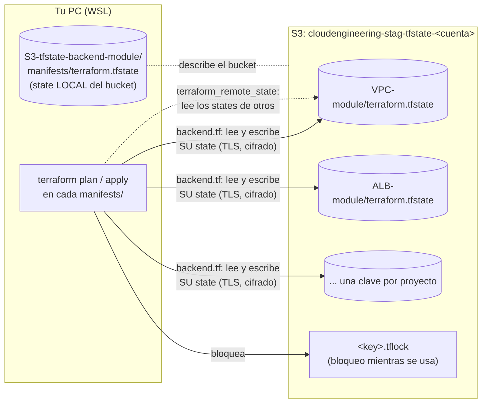

# 🪣 AWS S3 State Backend (state de Terraform) – Terraform

Este proyecto crea el **bucket de Amazon S3 donde se guarda el state de Terraform** de todos los demás proyectos de la plataforma: VPC, ALB, cluster ECS, ECR, servicios y Bastion.

Se aplica **una sola vez, antes que todo lo demás**. Es el único proyecto cuyo state queda **local** (`manifests/terraform.tfstate`), porque no puede guardar su state en un bucket que todavía no existe.

> ⚠️ **Es lo primero que se crea.** Ningún otro proyecto (VPC, ALB, cluster, ECR, servicios, Bastion) puede hacer `terraform init` sin este bucket: todos guardan su state en él.

| 🧭 Ficha rápida | |
|---|---|
| **Paso en el despliegue** | **0** – una sola vez, antes que todo ([guía](../README.md#guía-de-despliegue-paso-a-paso)) |
| **Depende de** | Ningún otro módulo |
| **Lo usan** | Los 7 proyectos de la plataforma: guardan su state en este bucket (`backend.tf`) y leen el de los demás (`terraform_remote_state`) |
| **Recursos (`plan`)** | 7 |
| **Tiempo de despliegue** | Menos de 1 min |
| **Costo principal** | Prácticamente nada: almacenamiento S3 de unos pocos KB y peticiones |

> 🗺️ Vista general de toda la plataforma: [README de Terraform](../README.md).

---

## Índice

1. 📦 [¿Qué se crea?](#qué-se-crea)
2. 📚 [Conceptos básicos](#conceptos-básicos)
3. 🗺️ [Diagrama](#diagrama)
4. 🔍 [Cómo funciona](#cómo-funciona)
5. 🔗 [¿De qué depende? (remote state)](#de-qué-depende-remote-state)
6. 📁 [Estructura de archivos](#estructura-de-archivos)
7. 🏷️ [Versiones](#versiones)
8. ⚙️ [Variables](#variables)
9. 📤 [Outputs](#outputs)
10. 🧪 [Cómo probarlo sin crear nada (plan)](#cómo-probarlo-sin-crear-nada-plan)
11. 🚀 [Cómo desplegarlo paso a paso](#cómo-desplegarlo-paso-a-paso)
12. 🔄 [Migrar states locales al bucket](#migrar-states-locales-al-bucket)
13. 🔒 [Seguridad](#seguridad)
14. 💰 [Costos](#costos)
15. 🛠️ [Problemas frecuentes](#problemas-frecuentes)

---

## ¿Qué se crea?

Un bucket S3 privado llamado **`cloudengineering-stag-tfstate-<account_id>`** (con la cuenta actual: `cloudengineering-stag-tfstate-373716886058`). Cada proyecto guarda en él su state con una **clave** (ruta) propia:

```text
s3://cloudengineering-stag-tfstate-373716886058/
├── VPC-module/terraform.tfstate
├── ALB-module/terraform.tfstate
├── ECS-cluster-module/terraform.tfstate
├── ECR-module/terraform.tfstate
├── EC2-bastion-host-module/terraform.tfstate
└── ECS-services-module/services/
    ├── nginx-1/terraform.tfstate
    └── nginx-2/terraform.tfstate
```

| Recurso | Cantidad | ¿Para qué sirve? |
|---|---|---|
| **Bucket S3** | 1 | Guarda los states. `force_destroy = false`: no se puede borrar con states dentro |
| **Ownership controls** | 1 | `BucketOwnerEnforced`: sin ACLs; todos los objetos son del dueño del bucket |
| **Public access block** | 1 | Bloquea **todo** acceso público |
| **Versionado** | 1 | Cada `apply` conserva la versión anterior del state: se puede recuperar |
| **Cifrado por defecto** | 1 | **SSE-S3 (AES256)**: cada state se guarda cifrado |
| **Ciclo de vida** | 1 | Borra las versiones antiguas a los **90 días** y las subidas incompletas a los 7 |
| **Política del bucket** | 1 | **Deniega** cualquier acceso que no use TLS (HTTPS) |

> 💡 **Analogía:** el state es el **archivo de planos** del edificio: dice qué se construyó y dónde. Con el state local, cada arquitecto guardaba sus planos en su escritorio.
> - El bucket es la **caja fuerte común**: una sola copia oficial de cada plano.
> - Guarda el historial de versiones y está cerrada con llave (cifrado, sin acceso público).
> - Tiene un cartel de **"en uso"** (bloqueo) mientras alguien la consulta.

---

## Conceptos básicos

| Término | Qué significa en palabras simples |
|---|---|
| **State (`terraform.tfstate`)** | El archivo donde Terraform anota todo lo que creó: IDs, IPs, etc. Es la "memoria" de un proyecto. **Contiene datos sensibles**, como las llaves SSH que genera Terraform. |
| **Backend** | Dónde guarda Terraform el state: `local` (un archivo en tu PC) o `s3` (un bucket). Se configura en `backend.tf`. |
| **Key (clave)** | La ruta del state dentro del bucket, por ejemplo `ALB-module/terraform.tfstate`. **Cada proyecto debe tener una distinta.** |
| **Bloqueo (lock)** | Mientras alguien ejecuta `plan` o `apply`, Terraform crea `<key>.tflock` en el bucket. Si otra persona lo intenta a la vez, espera o falla, en vez de corromper el state. |
| **`use_lockfile = true`** | Bloqueo **nativo de S3** (Terraform ≥ 1.10). Ya no hace falta una tabla de DynamoDB. |
| **Versionado** | S3 guarda las versiones anteriores de cada objeto. Si un state se estropea, se puede volver a una versión anterior. |
| **SSE-S3** | Cifrado del lado del servidor con llaves que administra S3 (AES256). Gratis y sin configuración. |
| **Migrar el state** | Copiar un state que estaba en local al bucket: `terraform init -migrate-state`. |

---

## Diagrama



👀 **Cómo leerlo:**
- **Flechas sólidas:** cada proyecto lee y escribe **su** state en su clave, y lo bloquea mientras trabaja.
- **Flecha punteada:** los proyectos que dependen de otros (ALB, servicios…) **leen** los states ajenos para obtener IDs.
- **El state del propio bucket** se queda en tu PC: guárdalo bien (ver [Seguridad](#seguridad)).

---

## Cómo funciona

[`tfstate-bucket.tf`](manifests/tfstate-bucket.tf) crea el bucket con recursos nativos de AWS (sin módulos de terceros):

```hcl
resource "aws_s3_bucket" "tfstate" {
  bucket        = local.state_bucket          # cloudengineering-stag-tfstate-<account_id>
  force_destroy = false
}
# + ownership_controls, public_access_block, versioning,
#   server_side_encryption_configuration (AES256), lifecycle_configuration y bucket_policy (solo TLS)
```

📌 **Detalles importantes:**
- **Nombre único global:** los nombres de bucket son únicos en todo AWS. Por eso incluyen el **ID de la cuenta**, que se lee con `data "aws_caller_identity"`.
- **Los demás proyectos lo usan de dos formas:**
  1. **`backend.tf`:** dónde guarda **su propio** state. Configuración completa, así que basta con `terraform init`:
     ```hcl
     terraform {
       backend "s3" {
         bucket       = "cloudengineering-stag-tfstate-373716886058"
         key          = "ALB-module/terraform.tfstate"   # una clave por proyecto
         region       = "us-east-1"
         encrypt      = true
         use_lockfile = true
       }
     }
     ```
  2. **`remote-state-datasource.tf`:** lee los states de **otros** proyectos (`backend = "s3"`). El nombre del bucket se calcula con la misma fórmula; la variable `state_bucket` permite cambiarlo.
- **Los backends no admiten variables.** El nombre del bucket está escrito en los 7 `backend.tf`. Si cambias de cuenta, de entorno o de división, actualízalos todos con un comando:
  ```bash
  cd ~/Sr-Labs/Serverless/ECS-Fargate/Terraform
  grep -rl 'cloudengineering-stag-tfstate-373716886058' --include=backend.tf . \
    | xargs sed -i 's/cloudengineering-stag-tfstate-373716886058/<nuevo-bucket>/'
  ```

---

## ¿De qué depende? (remote state)

**No depende de ningún otro módulo:** es lo primero que se despliega y su state es local.

Al revés, **todos** los proyectos dependen de él:

| Proyecto | Guarda su state en (`key`) | Lee los states de |
|---|---|---|
| [`VPC-module`](../VPC-module/README.md) | `VPC-module/terraform.tfstate` | — |
| [`ALB-module`](../ALB-module/README.md) | `ALB-module/terraform.tfstate` | VPC |
| [`ECS-cluster-module`](../ECS-cluster-module/README.md) | `ECS-cluster-module/terraform.tfstate` | VPC (solo modo EC2) |
| [`ECR-module`](../ECR-module/README.md) | `ECR-module/terraform.tfstate` | — |
| [`EC2-bastion-host-module`](../EC2-bastion-host-module/README.md) | `EC2-bastion-host-module/terraform.tfstate` | VPC |
| [`ECS-services-module`](../ECS-services-module/README.md) | `ECS-services-module/services/<nombre>/terraform.tfstate` | VPC, ALB, cluster y ECR |

---

## Estructura de archivos

```
S3-tfstate-backend-module/
├── README.md
└── manifests/
    ├── versions.tf              # Terraform + provider AWS (SIN backend: state local)
    ├── generic-variables.tf     # región, entorno, división
    ├── terraform.tfvars         # us-east-1 / stag / CloudEngineering
    ├── local-values.tf          # name, common_tags, state_bucket (nombre del bucket)
    ├── tfstate-variables.tf     # state_noncurrent_version_days
    ├── tfstate.auto.tfvars      # valores (90 días)
    ├── tfstate-bucket.tf        # bucket + versionado, cifrado, bloqueo público, ciclo de vida, política TLS
    └── tfstate-outputs.tf       # state_bucket, aws_region, backend_tf_example
```

> ⚠️ Después del `apply` aparece `manifests/terraform.tfstate`: **es el único state local de la plataforma**. Está en el `.gitignore`. Guarda una copia en un lugar seguro (ver [Seguridad](#seguridad)).

---

## Versiones

| Componente | Versión |
|---|---|
| Terraform | `>= 1.16` (probado con v1.16.5). El bloqueo nativo de S3 necesita `>= 1.10` |
| Provider `hashicorp/aws` | `~> 6.67` |

---

## Variables

| Variable | Tipo | Valor actual | Descripción |
|---|---|---|---|
| `aws_region` / `environment` / `business_divsion` | texto | `us-east-1` / `stag` / `CloudEngineering` | Generales. **Deben coincidir** con los demás módulos: con ellas se forma el nombre del bucket |
| `state_noncurrent_version_days` | número | `90` | Días que se conservan las versiones antiguas de cada state |

---

## Outputs

| Output | Ejemplo | ¿Para qué? |
|---|---|---|
| `state_bucket` | `cloudengineering-stag-tfstate-373716886058` | El valor de `bucket` en cada `backend.tf` |
| `aws_region` | `us-east-1` | El valor de `region` en cada `backend.tf` |
| `backend_tf_example` | Bloque `terraform { backend "s3" { ... } }` | Plantilla para el `backend.tf` de un proyecto nuevo (cambia la `key`) |

---

## Cómo probarlo sin crear nada (plan)

```bash
cd ~/Sr-Labs/Serverless/ECS-Fargate/Terraform/S3-tfstate-backend-module/manifests
terraform init
terraform validate
terraform plan        # solo lee la cuenta de AWS; no crea nada
```

✅ **Resultado verificado** (sin `apply`): `Plan: 7 to add, 0 to change, 0 to destroy.`, con el bucket `cloudengineering-stag-tfstate-373716886058`, `AES256`, versiones antiguas a 90 días y la política que deniega el acceso sin TLS.

---

## Cómo desplegarlo paso a paso

> 🔐 **Siempre a mano:** el pipeline no aplica este módulo, porque crea el bucket que el propio pipeline necesita.

### Requisitos previos

1. **Credenciales de AWS** (perfil `default` o `AWS_PROFILE`) con permisos para crear buckets S3. Compruébalas con `aws sts get-caller-identity`.
2. **Terraform 1.16 o superior.**

### Pasos

Antes, comprueba las herramientas y las credenciales: ver [Antes de empezar](../README.md#antes-de-empezar-herramientas-y-preparación).

```bash
cd ~/Sr-Labs/Serverless/ECS-Fargate/Terraform/S3-tfstate-backend-module/manifests
terraform init
terraform plan          # 7 to add
terraform apply         # escribe "yes"
terraform output state_bucket
```

🔎 **Comprobar el bucket:**

```bash
B=$(terraform output -raw state_bucket)
aws s3api get-bucket-versioning     --bucket "$B"   # "Status": "Enabled"
aws s3api get-bucket-encryption     --bucket "$B"   # "SSEAlgorithm": "AES256"
aws s3api get-public-access-block   --bucket "$B"   # todo en true
```

> ⚠️ Si el `output state_bucket` **no** es `cloudengineering-stag-tfstate-373716886058` (otra cuenta u otro entorno), actualiza el `bucket` de los 7 `backend.tf` con el comando de [Cómo funciona](#cómo-funciona) **antes** del `terraform init` de los demás proyectos.

Después, despliega el resto de la plataforma siguiendo la [guía](../README.md#guía-de-despliegue-paso-a-paso). Cada proyecto se inicializa con `terraform init` y su state se crea directamente en el bucket.

### Eliminar

Es **lo último** que se destruye, y solo si abandonas la plataforma: el bucket guarda el state de todos los proyectos.

1. Destruye primero todos los demás proyectos ([orden inverso](../README.md#destruir-todo-orden-inverso)).
2. Vacía el bucket, **incluidas todas las versiones**. `force_destroy = false` impide borrarlo si tiene contenido:
   ```bash
   B=$(terraform -chdir=manifests output -raw state_bucket)
   aws s3api list-object-versions --bucket "$B" --output json \
     --query '{Objects: [Versions, DeleteMarkers][][].{Key: Key, VersionId: VersionId}}' > /tmp/borrar.json
   aws s3api delete-objects --bucket "$B" --delete file:///tmp/borrar.json
   ```
3. `terraform destroy` en `manifests/`.

---

## Migrar states locales al bucket

Si un proyecto ya tenía un `terraform.tfstate` **local**, de antes de usar S3, el primer `terraform init` detecta el cambio de backend. Para **copiar** ese state al bucket:

```bash
cd ~/Sr-Labs/Serverless/ECS-Fargate/Terraform
for d in VPC-module ALB-module ECS-cluster-module ECR-module EC2-bastion-host-module \
         ECS-services-module/services/nginx-1 ECS-services-module/services/nginx-2; do
  echo "=== $d" && (cd "$d/manifests" && terraform init -migrate-state) || break
done
```

- Terraform pregunta `Do you want to copy existing state to the new backend?`: responde **`yes`**.
- **Comprueba** que cada proyecto ve lo mismo que antes:
  ```bash
  (cd VPC-module/manifests && terraform state list)              # mismos recursos que antes
  aws s3 ls s3://cloudengineering-stag-tfstate-373716886058 --recursive
  ```
- **Después**, borra los states locales, que ya no se usan. Los `.backup` pueden contener **llaves privadas** de despliegues anteriores:
  ```bash
  find . -path ./S3-tfstate-backend-module -prune -o \
       \( -name 'terraform.tfstate' -o -name 'terraform.tfstate.backup' \) -path '*/manifests/*' -print   # revisa la lista
  # y bórralos con -delete en lugar de -print cuando estés seguro
  ```
  ⚠️ **No borres** el de `S3-tfstate-backend-module/manifests/`: es el state del bucket.

> ℹ️ Si un proyecto **no** tenía state local, basta con `terraform init`: no hay nada que migrar.

---

## Seguridad

| Control | Estado |
|---|---|
| Bucket **privado**: acceso público bloqueado y sin ACLs | ✅ |
| **Cifrado en reposo** SSE-S3 (AES256) y `encrypt = true` en cada backend | ✅ |
| **Solo TLS**: la política deniega peticiones sin HTTPS | ✅ |
| **Versionado**: se puede recuperar un state anterior | ✅ |
| **Bloqueo** nativo (`use_lockfile`): sin `apply` simultáneos sobre el mismo state | ✅ |
| `force_destroy = false`: no se borra el bucket con states dentro | ✅ |
| Cifrado con **llave KMS propia** (control de quién descifra y auditoría en CloudTrail) | ⏳ Pendiente ([mejoras DevSecOps](../README.md#oportunidades-de-mejora-devsecops)) |
| Política del bucket que permita leer **solo** a usuarios o roles concretos | ⏳ Pendiente. Hoy puede leerlo cualquier identidad de la cuenta con permisos S3 |

> ⚠️ **Los states contienen las llaves privadas SSH** del Bastion y del cluster en modo EC2. Quien pueda leer el bucket puede leerlas: limita quién tiene permisos `s3:GetObject` sobre él.

**El state del propio bucket** (`S3-tfstate-backend-module/manifests/terraform.tfstate`) solo describe el bucket y no contiene secretos. Aun así, sin él no podrás modificar ni destruir el bucket con Terraform: haz una copia de seguridad.

---

## Costos

| Concepto | Costo aproximado |
|---|---|
| Almacenamiento | Por GB al mes. Los 7 states ocupan unos pocos KB, más las versiones de los últimos 90 días |
| Peticiones | Céntimos al mes: cada `plan`/`apply` hace unas pocas lecturas y escrituras, y crea/borra el `.tflock` |
| Versionado y cifrado SSE-S3 | Sin costo extra (solo el almacenamiento de las versiones) |

En la práctica, **menos de 1 USD al mes**.

---

## Problemas frecuentes

| Síntoma | Causa probable | Solución |
|---|---|---|
| `BucketAlreadyExists` | El nombre ya existe en otra cuenta (los nombres son globales) | Muy improbable, porque incluye el ID de la cuenta. Cambia `local.state_bucket`, los 7 `backend.tf` y pasa el nombre con la variable `state_bucket` |
| `BucketAlreadyOwnedByYou` | El bucket ya existe en tu cuenta, creado fuera de este state | Impórtalo (`terraform import aws_s3_bucket.tfstate <bucket>`) o bórralo si está vacío |
| En otro proyecto: `NoSuchBucket` / `S3 bucket does not exist` al hacer `terraform init` | Aún no se aplicó este módulo, o el `bucket` de `backend.tf` no coincide | Aplica este módulo y revisa `terraform output state_bucket` |
| `Backend configuration changed` | El proyecto se inicializó antes con otro backend (por ejemplo, local) | `terraform init -migrate-state` (copia el state) o `-reconfigure` (no copia nada) |
| `Error acquiring the state lock` | Otro `plan`/`apply` está usando ese state, o uno anterior se interrumpió | Espera. Si nadie lo usa: `terraform force-unlock <LOCK_ID>`, con el ID que muestra el error |
| `AccessDenied` al leer o escribir el state | Tu usuario no tiene permisos sobre el bucket, o la petición no usa TLS | Revisa tus permisos `s3:ListBucket`, `s3:GetObject`, `s3:PutObject` y `s3:DeleteObject` |
| `BucketNotEmpty` al destruir | El bucket aún tiene states o versiones | Ver [Eliminar](#eliminar) |
| Perdí `manifests/terraform.tfstate` de este módulo | Borrado local | El bucket sigue funcionando. Para volver a gestionarlo: `terraform import` de cada recurso, o crea uno nuevo |
