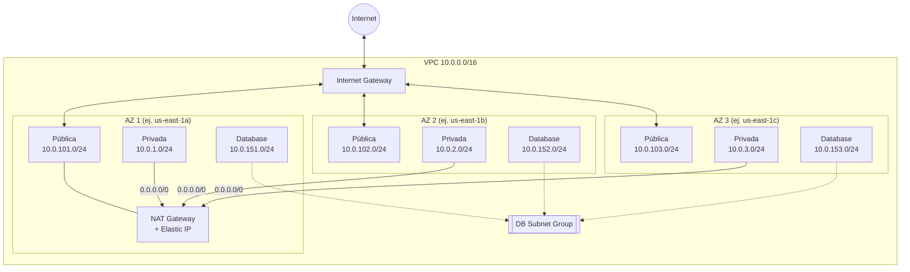

# 🌐 AWS VPC (red) – Terraform

Este proyecto crea en AWS la **red privada** sobre la que corre el laboratorio de ECS Fargate.
Usa [Terraform](https://developer.hashicorp.com/terraform), una herramienta que describe la infraestructura en archivos de texto, y el módulo oficial
[`terraform-aws-modules/vpc/aws`](https://registry.terraform.io/modules/terraform-aws-modules/vpc/aws/latest).
Así no hay que crear cada pieza de red a mano en la consola de AWS.

Es la **base de toda la plataforma**: el [Bastion](../EC2-bastion-host-module/README.md), el [ALB](../ALB-module/README.md), el [cluster ECS](../ECS-cluster-module/README.md) (en modo EC2) y los [servicios](../ECS-services-module/README.md) leen sus datos del state de esta VPC.

| 🧭 Ficha rápida | |
|---|---|
| **Paso en el despliegue** | **1** – el primero, después del bucket del state ([guía](../README.md#guía-de-despliegue-paso-a-paso)) |
| **Depende de** | Bucket del state ([`S3-tfstate-backend-module`](../S3-tfstate-backend-module/README.md)) |
| **Lo usan** | ALB, Bastion, cluster ECS (modo EC2) y servicios: leen su state |
| **Recursos (`plan`)** | 31 |
| **Tiempo de despliegue** | 3–5 min |
| **Costo principal** | NAT Gateway: por hora y por GB procesado |

> ⚠️ **Antes de desplegar este módulo debe existir el bucket S3 del state** ([`S3-tfstate-backend-module`](../S3-tfstate-backend-module/README.md)): su `backend.tf` guarda el state ahí. Si no existe, `terraform init` falla con `NoSuchBucket`.

> 🗺️ Vista general de toda la plataforma: [README de Terraform](../README.md).

---

## Índice

1. 📦 [¿Qué se crea?](#qué-se-crea)
2. 📚 [Conceptos básicos](#conceptos-básicos)
3. 🗺️ [Diagrama](#diagrama)
4. 🔍 [Cómo funciona](#cómo-funciona)
5. 🔗 [¿De qué depende? (remote state)](#de-qué-depende-remote-state)
6. 📁 [Estructura de archivos](#estructura-de-archivos)
7. 🏷️ [Versiones](#versiones)
8. ⚙️ [Variables](#variables)
9. 📤 [Outputs](#outputs)
10. 🧪 [Cómo probarlo sin crear nada (plan)](#cómo-probarlo-sin-crear-nada-plan)
11. 🚀 [Cómo desplegarlo paso a paso](#cómo-desplegarlo-paso-a-paso)
12. 🔒 [Seguridad](#seguridad)
13. 💰 [Costos](#costos)
14. 🛠️ [Problemas frecuentes](#problemas-frecuentes)

---

## ¿Qué se crea?

Se crea una red aislada en AWS (VPC) repartida en **3 centros de datos distintos** (Availability Zones).
En cada uno hay **3 tipos de subred**: pública, privada y de base de datos, así que en total son **9 subredes**.

| Capa | Cantidad | ¿Tiene Internet? | ¿Para qué se usa? |
|---|---|---|---|
| **Pública** | 3 | Sí, entrada y salida, a través del Internet Gateway | Balanceador de carga (ALB) y el NAT Gateway |
| **Privada** | 3 | Solo salida, a través del NAT Gateway | Contenedores de ECS Fargate (la aplicación) |
| **Database** | 3 | No (totalmente aislada) | Bases de datos RDS / Aurora |

> 💡 **Analogía:** piensa en la VPC como un edificio de oficinas.
> - Las **subredes públicas** son la recepción, abierta a la calle.
> - Las **privadas** son las oficinas: los empleados pueden salir, pero los visitantes no entran directamente.
> - Las de **base de datos** son la bóveda: solo se llega a ella desde dentro del edificio.

---

## Conceptos básicos

| Término | Qué significa en palabras simples |
|---|---|
| **VPC** (Virtual Private Cloud) | Tu propia red privada dentro de AWS, separada de las de otros clientes. |
| **Región** | Ubicación geográfica de AWS, por ejemplo `us-east-1` (Virginia). |
| **Availability Zone (AZ)** | Un centro de datos independiente dentro de una región (`us-east-1a`, `us-east-1b`, ...). Repartir los recursos en varias AZs evita que una falla en un centro de datos tumbe todo. |
| **CIDR** | La forma de escribir un rango de direcciones IP. `10.0.0.0/16` incluye unas 65 000 direcciones; `10.0.1.0/24` incluye 256, de las que AWS reserva 5. Mientras **más grande** es el número después de `/`, **más pequeño** es el rango. |
| **Subnet (subred)** | Un trozo del rango de la VPC que vive en **una sola** AZ. |
| **Internet Gateway (IGW)** | La "puerta principal" de la VPC hacia Internet. |
| **NAT Gateway** | Permite que los recursos privados **salgan** a Internet (por ejemplo, para descargar imágenes de contenedores o actualizaciones) sin que nadie de fuera pueda iniciar una conexión hacia ellos. |
| **Elastic IP** | Una IP pública fija. El NAT Gateway la usa para salir a Internet. |
| **Route table (tabla de rutas)** | Las "señales de tráfico" de cada subred: indican hacia dónde enviar los paquetes. |
| **DB Subnet Group** | Un grupo de subredes que se le entrega a RDS para que sepa en qué subredes puede crear la base de datos. |
| **Módulo de Terraform** | Un paquete reutilizable de código Terraform. Aquí usamos uno de la comunidad que ya sabe crear una VPC completa. |

---

## Diagrama



👀 **Cómo leerlo:**
- **Columnas:** cada recuadro "AZ" es un centro de datos distinto. Las tres AZs tienen la misma estructura, así que si una falla, las otras dos siguen funcionando.
- **Flechas sólidas:** muestran el tráfico de red.
- **Flecha punteada:** indica que las 3 subredes de base de datos forman parte del DB Subnet Group. No es tráfico.
- **NAT Gateway:** hay uno solo, en la AZ 1, para ahorrar costos. Ver [Costos](#costos).

---

## Cómo funciona

El núcleo del proyecto es [`vpc-module.tf`](manifests/vpc-module.tf): llama al módulo oficial `terraform-aws-modules/vpc/aws` (versión `6.7.3`) con los rangos de [`vpc.auto.tfvars`](manifests/vpc.auto.tfvars). El módulo crea la VPC, las 9 subredes, el Internet Gateway, el NAT Gateway, las tablas de rutas y el DB Subnet Group. Hay dos comportamientos que conviene entender:

### ¿Cómo viaja el tráfico?

Cada tipo de subred tiene su propia **tabla de rutas**:

| Subred | Regla principal | Qué significa |
|---|---|---|
| **Pública** | `0.0.0.0/0 → Internet Gateway` | Todo lo que no es tráfico interno va directo a Internet. Los recursos reciben una IP pública automáticamente (`map_public_ip_on_launch = true`). |
| **Privada** | `0.0.0.0/0 → NAT Gateway` | Pueden salir a Internet a través del NAT, pero nadie de fuera puede iniciar una conexión hacia ellas. |
| **Database** | Solo la ruta local `10.0.0.0/16` | Únicamente pueden hablar con otros recursos de la VPC. No tienen ningún camino hacia Internet. |

> ℹ️ `0.0.0.0/0` significa "cualquier destino". Todas las subredes tienen además una ruta "local" que les permite comunicarse entre sí dentro de la VPC.

🧭 **Ejemplo de una petición real:**

1. Un usuario abre la aplicación y la petición entra por el **Internet Gateway**.
2. Llega al **balanceador (ALB)** en una subred pública.
3. El ALB la reenvía a un **contenedor de Fargate** en una subred privada.
4. El contenedor consulta la **base de datos** en una subred de database, por la red interna.
5. Si el contenedor necesita descargar algo de Internet, sale por el **NAT Gateway**.

### Availability Zones automáticas

No hace falta escribir a mano qué AZs usar. En `vpc-module.tf` el proyecto **le pregunta a AWS** qué AZs están disponibles en la región:

```hcl
data "aws_availability_zones" "available" {
  state = "available"
  filter {
    name   = "opt-in-status"
    values = ["opt-in-not-required"]   # descarta Local Zones y Wavelength Zones
  }
}
```

Luego, en `local-values.tf`, se decide qué lista usar:

```hcl
azs = length(var.vpc_availability_zones) > 0 ? var.vpc_availability_zones : slice(data.aws_availability_zones.available.names, 0, 3)
```

En palabras: *"si el usuario indicó AZs, usa esas; si no, toma las 3 primeras disponibles"*.

- **Comportamiento por defecto:** `vpc_availability_zones` está vacía, así que se detectan automáticamente. En `us-east-1` normalmente serán `us-east-1a`, `us-east-1b` y `us-east-1c`.
- **Para elegirlas tú:** añade esta línea en `vpc.auto.tfvars` con exactamente 3 AZs:
  ```hcl
  vpc_availability_zones = ["us-east-1a", "us-east-1c", "us-east-1d"]
  ```
- **Ventaja:** si cambias `aws_region`, por ejemplo a `eu-west-1`, no tienes que tocar nada más.

---

## ¿De qué depende? (remote state)

**Solo necesita el [bucket del state](../S3-tfstate-backend-module/README.md)**, donde guarda su state (`VPC-module/terraform.tfstate`): es el primer módulo de la plataforma.

Al revés, varios módulos leen su state (clave `VPC-module/terraform.tfstate` del bucket S3) con `terraform_remote_state`:

| Módulo | Outputs de la VPC que lee |
|---|---|
| [`ALB-module`](../ALB-module/README.md) | `vpc_id`, `public_subnets`, `vpc_cidr_block` |
| [`EC2-bastion-host-module`](../EC2-bastion-host-module/README.md) | `vpc_id`, `public_subnets` |
| [`ECS-cluster-module`](../ECS-cluster-module/README.md) (solo modo EC2) | `vpc_id`, `vpc_cidr_block`, `private_subnets`, `public_subnets_cidr_blocks` |
| [`ECS-services-module`](../ECS-services-module/README.md) | `vpc_id`, `private_subnets` |

> ⚠️ Por eso **no borres** su state del bucket mientras la VPC exista, y destrúyela **la última** (solo el bucket del state va después).

---

## Estructura de archivos

```
VPC-module/
├── README.md                 # Este documento
└── manifests/
    ├── versions.tf           # Versión de Terraform, del provider AWS y la conexión con AWS
    ├── backend.tf            # Dónde se guarda el state: bucket S3, clave VPC-module/terraform.tfstate
    ├── generic-variables.tf  # Variables generales: región, entorno, división
    ├── local-values.tf       # Valores calculados: nombre, etiquetas (tags) y AZs a usar
    ├── vpc-variables.tf      # Variables de la VPC: rangos IP, AZs, NAT, base de datos
    ├── vpc-module.tf         # Consulta de AZs + creación de la VPC con el módulo
    ├── vpc-outputs.tf        # Datos que se muestran al terminar (IDs, IPs, ...)
    ├── terraform.tfvars      # Valores reales de las variables generales
    └── vpc.auto.tfvars       # Valores reales de las variables de la VPC
```

📝 **Notas sobre los archivos:**
- Los archivos `.tf` contienen el código y los archivos `.tfvars` contienen los **valores** que se usan.
- Para cambiar algo, por ejemplo los rangos IP, normalmente basta con editar los `.tfvars`.
- Terraform lee **todos** los `.tf` de la carpeta y los trata como uno solo. El nombre de cada archivo sirve solo para organizarse; no cambia el resultado.

| Archivo | Explicación |
|---|---|
| [`versions.tf`](manifests/versions.tf) | Define qué versión de Terraform y del *provider* de AWS se necesitan. El *provider* es el plugin que permite a Terraform hablar con AWS. Las credenciales salen de la cadena por defecto de AWS: `AWS_PROFILE`, variables de entorno o el perfil `default` de `~/.aws/credentials`. |
| [`backend.tf`](manifests/backend.tf) | Indica que el state se guarda en el **bucket S3** de [`S3-tfstate-backend-module`](../S3-tfstate-backend-module/README.md), con la clave `VPC-module/terraform.tfstate`, cifrado y con bloqueo. |
| [`generic-variables.tf`](manifests/generic-variables.tf) | Declara variables comunes a cualquier proyecto: región, entorno (`dev`, `stag`, `prod`...) y división de negocio. |
| [`local-values.tf`](manifests/local-values.tf) | Calcula valores a partir de otros: el prefijo del nombre (`CloudEngineering-stag`), las etiquetas comunes y la lista final de AZs. |
| [`vpc-variables.tf`](manifests/vpc-variables.tf) | Declara las variables de la red e incluye **validaciones**. Por ejemplo, Terraform da error si no hay exactamente 3 subredes de cada tipo. |
| [`vpc-module.tf`](manifests/vpc-module.tf) | Es el núcleo del proyecto: pregunta a AWS qué AZs hay disponibles y llama al módulo que crea la VPC, las subredes, los gateways y las tablas de rutas. |
| [`vpc-outputs.tf`](manifests/vpc-outputs.tf) | Lo que Terraform muestra al terminar. Otros proyectos, como el clúster de ECS, usan estos datos. |

---

## Versiones

| Componente | Versión | Comentario |
|---|---|---|
| Terraform | `>= 1.16` | Probado con v1.16.5 |
| Provider `hashicorp/aws` | `~> 6.67` | Acepta cualquier 6.x a partir de 6.67, pero no la 7.0 |
| Módulo `terraform-aws-modules/vpc/aws` | `6.7.3` | Versión fija para evitar cambios inesperados |

---

## Variables

Los valores **por defecto** están en los archivos `*-variables.tf`. Los valores **que realmente se usan** están en `terraform.tfvars` y `vpc.auto.tfvars`, que tienen prioridad sobre los valores por defecto.

### Generales (`generic-variables.tf`)

| Variable | Tipo | Por defecto | Valor actual (`.tfvars`) | Descripción |
|---|---|---|---|---|
| `aws_region` | texto | `us-east-1` | `us-east-1` | Región donde se crea todo |
| `environment` | texto | `dev` | `stag` | Entorno. Se usa en nombres y etiquetas |
| `business_divsion` | texto | `DevOps` | `CloudEngineering` | Área responsable. Se usa en nombres y etiquetas |

### VPC (`vpc-variables.tf`)

| Variable | Tipo | Valor actual | Descripción |
|---|---|---|---|
| `vpc_name` | texto | `my-sr-labs-vpc` | Parte final del nombre de la VPC |
| `vpc_cidr_block` | texto | `10.0.0.0/16` | Rango total de IPs de la VPC |
| `vpc_availability_zones` | lista | `[]` (automático) | AZs a usar. Vacía para autodetectar, o 3 AZs exactas |
| `vpc_public_subnets` | lista | `10.0.101.0/24`, `10.0.102.0/24`, `10.0.103.0/24` | Rangos de las subredes públicas (uno por AZ) |
| `vpc_private_subnets` | lista | `10.0.1.0/24`, `10.0.2.0/24`, `10.0.3.0/24` | Rangos de las subredes privadas (uno por AZ) |
| `vpc_database_subnets` | lista | `10.0.151.0/24`, `10.0.152.0/24`, `10.0.153.0/24` | Rangos de las subredes de base de datos (uno por AZ) |
| `vpc_create_database_subnet_group` | sí/no | `true` | Crea el DB Subnet Group para RDS |
| `vpc_create_database_subnet_route_table` | sí/no | `true` | Da a las subredes de base de datos su propia tabla de rutas, sin Internet |
| `vpc_enable_nat_gateway` | sí/no | `true` | Permite que las subredes privadas salgan a Internet |
| `vpc_single_nat_gateway` | sí/no | `true` | `true` crea un solo NAT (más barato); `false` crea uno por AZ (más resistente) |

✔️ **Reglas que valida Terraform automáticamente:**
- Cada lista de subredes debe tener **exactamente 3** rangos, uno por AZ.
- `vpc_availability_zones` debe estar vacía o tener **exactamente 3** AZs.
- Los rangos de las subredes deben estar **dentro** de `vpc_cidr_block` y **no deben solaparse** entre sí. Esto último lo comprueba AWS al crear los recursos.

### Nombres y etiquetas

- **Nombre de la VPC:** se forma como `<business_divsion>-<environment>-<vpc_name>`. Con los valores actuales es **`CloudEngineering-stag-my-sr-labs-vpc`**.
- **Etiquetas comunes:** todos los recursos llevan `owners` y `environment`, lo que ayuda a identificar costos y responsables.
- **Etiqueta de las subredes:** cada subred lleva además una etiqueta `Type`, con el valor `Public Subnets`, `Private Subnets` o `Private Database Subnets`.

---

## Outputs

Al terminar `terraform apply`, Terraform muestra estos datos. También puedes verlos después con `terraform output`.

| Output | Descripción | ¿Para qué lo necesitas? |
|---|---|---|
| `vpc_id` | ID de la VPC (`vpc-xxxx`) | Para crear grupos de seguridad, el ALB o el clúster ECS |
| `vpc_cidr_block` | Rango IP de la VPC | Para reglas de firewall internas |
| `public_subnets` | IDs de las 3 subredes públicas | Para el balanceador de carga (ALB) |
| `public_subnets_cidr_blocks` | Rangos IP de las 3 subredes públicas | El cluster ECS los usa para permitir SSH desde las subredes públicas, donde está el Bastion |
| `private_subnets` | IDs de las 3 subredes privadas | Para los servicios de ECS Fargate |
| `database_subnets` | IDs de las 3 subredes de base de datos | Para referencia o auditoría |
| `database_subnet_group_name` | Nombre del DB Subnet Group | Al crear una base de datos RDS |
| `nat_public_ips` | IP(s) pública(s) del NAT | Para que un servicio externo permita el tráfico de tu aplicación |
| `azs` | AZs usadas | Para confirmar dónde quedó cada recurso |

---

## Cómo probarlo sin crear nada (plan)

```bash
cd Serverless/ECS-Fargate/Terraform/VPC-module/manifests
terraform init
terraform validate
terraform plan        # solo consulta en AWS las AZs disponibles; no crea nada
```

La VPC no lee el state de ningún otro módulo, así que el `plan` funciona directamente. Solo necesita credenciales de AWS y el bucket del state (para el `terraform init`). Sin bucket, usa un `backend_override.tf` local: ver [Probar sin crear nada](../README.md#probar-sin-crear-nada).

✅ **Resultado verificado** (sin `apply`): `Plan: 31 to add, 0 to change, 0 to destroy.`

---

## Cómo desplegarlo paso a paso

### Requisitos previos

1. **El bucket del state creado** ([`S3-tfstate-backend-module`](../S3-tfstate-backend-module/README.md)): es lo primero que se despliega.
2. **Terraform 1.16 o superior.** En este equipo está instalado en WSL; puedes comprobarlo con `terraform version`.
3. **Credenciales de AWS** (perfil `default` o `AWS_PROFILE`). Puedes comprobarlas con:
   ```bash
   aws sts get-caller-identity
   ```
   Si no tienes credenciales configuradas, ejecuta `aws configure`.
4. Permisos en AWS para crear VPC, subredes, gateways, Elastic IPs y tablas de rutas.

### Pasos

Abre una terminal de WSL y ve a la carpeta `manifests/`:

```bash
cd Serverless/ECS-Fargate/Terraform/VPC-module/manifests
```

| # | Comando | Qué hace |
|---|---|---|
| 1 | `terraform init` | Descarga el provider de AWS y el módulo de VPC, y conecta con el state en S3 (`VPC-module/terraform.tfstate`). Se ejecuta una vez, o de nuevo al cambiar versiones (con `-upgrade`). |
| 2 | `terraform fmt` | Ordena el formato del código. Es opcional. |
| 3 | `terraform validate` | Comprueba que el código no tenga errores de sintaxis. |
| 4 | `terraform plan` | **Muestra** lo que se va a crear, sin crear nada todavía. |
| 5 | `terraform apply` | Crea los recursos en AWS. Pide confirmación: escribe `yes`. |
| 6 | `terraform output` | Muestra los outputs. |

🔎 **Qué deberías ver en el `plan`:**
- 1 VPC
- 9 subredes (3 públicas, 3 privadas y 3 de base de datos) repartidas en 3 AZs distintas
- 1 Internet Gateway
- 1 NAT Gateway y 1 Elastic IP
- Tablas de rutas (pública, privada y de base de datos)
- 1 DB Subnet Group

### Eliminar

```bash
terraform destroy
```

Pide confirmación (`yes`) y borra **todos** los recursos creados por este proyecto.

> ℹ️ Los archivos `.terraform/` y `.terraform.lock.hcl` se generan automáticamente en `manifests/`.
> - **El state** es la "memoria" de Terraform: registra qué recursos creó. Se guarda en el **bucket S3** (`VPC-module/terraform.tfstate`), no en tu PC. **No lo borres** mientras la infraestructura exista: el ALB, el Bastion, el cluster (modo EC2) y los servicios lo leen.
> - **`.terraform.lock.hcl`** conviene subirlo a git, porque fija las versiones exactas de los providers.

---

## Seguridad

- **Tres capas de red:**
  - Solo las subredes **públicas** tienen ruta directa a Internet.
  - Las **privadas** solo salen por el NAT Gateway: nadie de fuera puede iniciar una conexión hacia ellas.
  - Las de **base de datos** no tienen ningún camino hacia Internet.
- **IP pública automática solo en las subredes públicas** (`map_public_ip_on_launch`). Pon ahí solo lo que deba ser público: el ALB, el NAT y el Bastion.
- **Sin VPC Flow Logs:** hoy no se registra el tráfico de red. Activarlos es una [mejora pendiente](../README.md#oportunidades-de-mejora-devsecops).
- **Sin VPC Endpoints:** el tráfico hacia ECR, S3 o CloudWatch sale por el NAT Gateway. Ver las mismas mejoras.
- **El state contiene IDs e IPs de la red:** se guarda en el bucket S3 privado y cifrado del [`S3-tfstate-backend-module`](../S3-tfstate-backend-module/README.md). No descargues copias a git ni a carpetas sincronizadas.

---

## Costos

- **El NAT Gateway es lo único con costo relevante.** Se cobra por cada hora que está encendido y por cada GB que pasa por él. Al terminar el laboratorio ejecuta `terraform destroy`.
- La VPC, las subredes, las tablas de rutas y el Internet Gateway **no tienen costo**.
- **Un NAT o varios:**
  - Con `vpc_single_nat_gateway = true` hay un solo NAT. Si su AZ falla, las subredes privadas de las otras AZs pierden la salida a Internet.
  - En **producción** usa `false` para tener un NAT por AZ: cuesta unas 3 veces más, pero es tolerante a fallos.

---

## Problemas frecuentes

| Síntoma | Causa probable | Solución |
|---|---|---|
| `Module not installed` | No se ejecutó `terraform init` | Ejecuta `terraform init` |
| `NoSuchBucket` / `S3 bucket does not exist` en `terraform init` | Aún no existe el bucket del state, o el `bucket` de `backend.tf` no coincide | Aplica antes [`S3-tfstate-backend-module`](../S3-tfstate-backend-module/README.md) |
| `No valid credential sources found` | No hay credenciales de AWS | Ejecuta `aws configure` y comprueba el perfil `default` (o `AWS_PROFILE`) |
| `Invalid index` / error en `slice()` | La región tiene menos de 3 AZs disponibles | Usa otra región o define `vpc_availability_zones` manualmente |
| `must contain exactly 3 CIDR blocks` | Alguna lista de subredes no tiene 3 elementos | Revisa `vpc.auto.tfvars` |
| `InvalidSubnet.Conflict` / `InvalidSubnet.Range` | Rangos solapados o fuera de la VPC | Revisa que cada `/24` esté dentro de `10.0.0.0/16` y no se repita |
| `ElasticIP limit exceeded` | La cuenta llegó al límite de Elastic IPs (5 por región) | Libera IPs sin uso o solicita un aumento de cuota |
